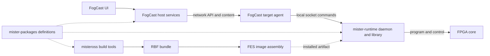

# FES component boundaries

FES means Fogger Entertainment System. This document distinguishes the
whole system from the narrower native build currently implemented in its
parent repository. The user agreed to the ownership direction below. Code
migrations and component revision changes remain separate implementation work.

## Ownership

| Repository | Responsibility | Output or contract |
| --- | --- | --- |
| fes | Select compatible component versions, check agreement, build and assemble the complete system, record integration evidence | Profiles, component pins, assembled images and manifests |
| mister-packages | Describe boards, SoCs, registers, system protocols and upstream core sources; generate consumer definitions | YAML, emitter, generated C++/Go definitions and reports |
| misteross | Build FPGA artifacts and validate their build provenance; maintain FPGA development tools and experiments | RBF bundles, simulations and compiler recipes |
| libmister-runtime | Execute the hardware lifecycle on the target: program FPGA, configure hardware, load media, handle input, stop and return to idle | Native library and daemon, runtime protocol |
| FogCast | Own the user-facing application, game library, launch selection, host services and target agent | UI, host binaries, agent and public APIs |
| Main_MiSTer | Original implementation and comparison/test reference | Reference behavior and optional test fixtures; not an FES production dependency |

An upstream core-source pin describes what to fetch; misteross owns fetching
and compiling it. FES selects component revisions and which resulting
artifacts belong in a system image. These are different responsibilities.

## FogCast agent, runtime and FPGA builder

The names obscure three distinct jobs:

- **FogCast target agent:** receives network requests from the host, manages
  transferred content and target-side request/session coordination, invokes
  the runtime, and reports results. It owns the network-facing API and
  bridges network input into the target's input path.
- **libmister-runtime:** contains both a C++ lifecycle library and the
  `mister-runtime` daemon. The daemon accepts local commands through
  `/run/mister-runtime.sock`. It owns actual hardware state: FPGA programming,
  reset ordering, media delivery, video setup, input delivery to the core,
  and return to idle. It has no game library or network transfer cache.
- **misteross:** runs on the development/build machine. It builds and tests
  FPGA designs and exports an RBF bundle. The resulting circuit executes on
  the FPGA; misteross itself is not a target daemon in the launch chain.

This diagram expresses the intended component graph, including package
integration that the current FES pins do not yet fully consume.

For a Sonic 2 launch, the host resolves the selected game and arranges its
content; the agent verifies/adopts the staged content and requests a native
launch; the runtime programs the selected RBF, performs the hardware reset
and transfer sequence, and confirms running state. A normal launch does not
invoke Quartus or misteross. Development loading follows the same separation:
builder produces a bundle, agent admits/transfers it, runtime loads it.

Keep transport/session state in the agent and physical lifecycle state in
the runtime. Some validation at both boundaries is useful, but reset recipes,
register values and hardware recovery decisions must not grow a second
implementation in the agent. The agent may request recovery and expose its
result; the runtime determines which physical transitions are possible.

Input similarly crosses a deliberate boundary: the agent accepts network
input and provides target input events; the runtime maps those events to the
running core's hardware protocol.

## Future FogCast review

FogCast contains UI, host services and target-agent software. Keep those as
three explicit architectural modules now; review whether separate repos are
useful after documenting their APIs, shared code, testing and release needs.
Do not equate a process boundary with a mandatory repository split.

The target agent is a candidate for later extraction if other host clients
need an independently released target service. UI extraction is useful only
if clients need independent development or release cycles. First remove
whole-system image ownership from the FogCast product boundary through the
separate migration below. Splitting repos before resolving that ownership
would distribute the existing coupling across more locations.

## Concrete gaps found

1. The parent includes FogCast, libmister-runtime and misteross but omits
   mister-packages. Its tested build therefore does not cover the entire
   intended FES dependency graph.
2. mister-packages owns `packages/source/megadrive_mister.yaml`, while
   misteross `cores.lock` identifies itself as a copied pin. FES currently
   does not test agreement between those files.
3. The local runtime checkout at `eafefd1` consumes generated HPS and
   Mega Drive headers. The parent pins `443b603`, whose inspected staged
   source has no `src/native/generated/` directory.
4. Local FogCast branch `feat/megadrive-launch-fields` at `c7944a1` consumes
   generated expected-core and cartridge-index definitions. The parent
   pins `cd85971`. The mister-packages README still says FogCast is not
   patched: branch implementation, integration and documentation need
   reconciling. This review does not establish that those branches merged.
5. FogCast currently owns Buildroot configuration, image scripts, native
   input locks and packaging. The parent temporarily overlays a core lock
   to package a source-built RBF. This works but leaves whole-system
   assembly responsibilities divided between FogCast and FES.

## Keep, combine, split and add

Keep the four component repositories. Their current responsibilities are
distinct; there is no demonstrated benefit to merging them now. Keep the
package schema and its small emitter together, and keep the runtime library
and daemon together. Keep the target agent with FogCast while they share an
API and release lifecycle.

Combine duplicated definitions under mister-packages authority, rather than
combining repositories. Retain checked-in generated consumer files so
standalone target builds do not need Go. FES should regenerate to temporary
files and compare them with the selected consumers, failing on drift.

Propose moving whole-system Buildroot/image configuration and final SD-card
assembly into FES, while each component retains its own compilation recipe.
Do this as a separate migration after defining artifact inputs. Do not copy
the scripts and leave two authoritative image builders. The existing
validated FogCast recipe remains authoritative until migration is complete.

Add an explicit artifact interface for final assembly: agent, runtime,
core bundle and package-derived definitions, with component identities and
installation destinations recorded. Start as a small documented interface,
not a new packaging framework or another repository.

Do not split individual cores, the emitter, or the target agent into more
repositories without a concrete independent development/release need.
Main_MiSTer and frozen Overlord resources belong only in reference/testing
documentation or an explicitly optional test setup.

## Next bounded implementation

1. Pin mister-packages in FES as a first-class component.
2. Check the live integration state of the generated-consumer branches.
   Select reviewed compatible consumers; preserve the existing tested
   profile until the replacement has equivalent evidence.
3. Add a parent consistency command that validates package YAML, compares
   generated C++ and Go with selected consumers, and compares the copied
   misteross source pin with the package source definition.
4. Run that command in lightweight CI, then validate the selected full
   native build. CI scope follows the component graph.
5. Separately migrate image assembly ownership and build the bootable FES
   layout, without adding Main_MiSTer to the production graph.

## Inspection evidence and limits

The review read mister-packages on the local Mac at `a29f631`, local runtime
and FogCast development checkouts, and the saved parent component sources.
Powerboat connectivity was restored for the follow-up. GitHub comparison
confirmed runtime `eafefd1` is an ancestor of current main `4398f41`.
FogCast `c7944a1` and current main `c1381c3` have diverged; ancestry alone
does not establish whether equivalent changes landed by another commit.
The pinned agent code in `internal/agent/coordinator.go` and
`internal/misterruntime/{runtime,client}.go` confirms the local socket
boundary. No component pins or production code changed during this review.
