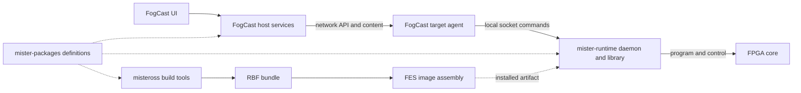

# FES component boundaries

FES means Fogger Entertainment System. This document distinguishes the
whole system from the narrower native build currently implemented in its
parent repository. The ownership direction below governs component work. The current integration
profile consumes the component graph; native image assembly lives in FES `image/`.

## Ownership

| Repository | Responsibility | Output or contract |
| --- | --- | --- |
| fes | Select compatible component versions, check agreement, build and assemble the complete system, record integration evidence | Profiles, component pins, assembled images and manifests |
| mister-packages | Describe boards, SoCs, registers, system protocols and upstream core sources; generate consumer definitions | YAML, emitter, generated C++/Go definitions and reports |
| misteross | Build FPGA artifacts and validate their build provenance; maintain FPGA development tools and experiments | RBF bundles, simulations and compiler recipes |
| libmister-runtime | Execute the hardware lifecycle on the target: program FPGA, configure hardware, load media, handle input, stop and return to idle | Native library and daemon, runtime protocol |
| FogCast | Own the user-facing application, game library, launch selection, host services and target agent | `ui/tenfoot`, `ui/kitlauncher`, host binaries, agent and public APIs |
| Main_MiSTer | Original implementation and comparison/test reference | Reference behavior and optional test fixtures; not an FES production dependency |

An upstream core-source pin describes what to fetch; misteross owns fetching
and compiling it. FES selects component revisions and which resulting
artifacts belong in a system image. These are different responsibilities.

Within FogCast, the application UI is explicitly under
`sources/FogCast/ui/tenfoot` and `sources/FogCast/ui/kitlauncher`. Their Go
package names remain `tenfoot` and `kitlauncher` for compatibility. Host
services and public API ownership stays with FogCast, while target HTTP/cache
coordination remains in the agent and physical lifecycle remains in
libmister-runtime. The UI does not own target handlers, runtime lifecycle,
image assembly, or FPGA builds.

## FogCast agent, runtime and FPGA builder

The names obscure three distinct jobs:

- **FogCast target agent:** receives network requests from the host, manages
  transferred content and target-side request/session coordination, invokes
  the runtime, and reports results. It owns the network-facing API and
  bridges network input into the target's input path.
- **libmister-runtime:** contains both a C++ lifecycle library and the
  `mister-runtime` daemon. The daemon accepts local commands through
  `/run/mister-runtime.sock`. It owns actual hardware state: FPGA programming,
  reset ordering, media delivery, video setup, input delivery to the core,
  and return to idle. It has no game library or network transfer cache.
- **misteross:** runs on the development/build machine. It builds and tests
  FPGA designs and exports an RBF bundle. The resulting circuit executes on
  the FPGA; misteross itself is not a target daemon in the launch chain.

This diagram expresses the intended component graph, including the package
integration checked by `make check`.

For a Sonic 2 launch, the host resolves the selected game and arranges its
content; the agent verifies/adopts the staged content and requests a native
launch; the runtime programs the selected RBF, performs the hardware reset
and transfer sequence, and confirms running state. A normal launch does not
invoke Quartus or misteross. Development loading follows the same separation:
builder produces a bundle, agent admits/transfers it, runtime loads it.

Keep transport/session state in the agent and physical lifecycle state in
the runtime. Some validation at both boundaries is useful, but reset recipes,
register values and hardware recovery decisions must not grow a second
implementation in the agent. The agent may request recovery and expose its
result; the runtime determines which physical transitions are possible.

Input similarly crosses a deliberate boundary: the agent accepts network
input and provides target input events; the runtime maps those events to the
running core's hardware protocol.

## Future FogCast review

FogCast contains UI, host services and target-agent software. Keep those as
three explicit architectural modules now; review whether separate repos are
useful after documenting their APIs, shared code, testing and release needs.
Do not equate a process boundary with a mandatory repository split.

The target agent is a candidate for later extraction if other host clients
need an independently released target service. UI extraction is useful only
if clients need independent development or release cycles. Whole-system image
ownership has already moved to FES `image/`. The next proposed boundary is a
shared appliance module followed by FES ownership of the boot executable;
see the [structure proposal](fes-structure.md).

## Integrated source set

The gitlinks select matching merged implementations of the FES host, runtime,
package and target-agent contracts. Exact revisions are recorded by git; the
current profile is package-only and installs the ordered closed
`fes.pong`, `fes.zx81`, `fes.coleco` and `fes.sg1000` set through the HIP/nextpnr route.

`make check` validates source identity and cleanliness, the FogCast runtime
lock, package YAML, fourteen generated consumer files and eleven shared fixture
copies. It regenerates to temporary files and never edits consumers. The package
definitions are the actual runtime C++ ABI/programming consumers and misteross
Verilog ABI consumer. FogCast uses the
negotiated runtime ABI registry, so no unused generated Go allowlist is added.

The old review's unmerged-consumer concern is resolved: FogCast main consumes
`generated.MegaDriveExpectedCore` and `generated.MegaDriveCartridgeIndex` through
PR126. No component source changes were needed for parent reconciliation.
The pinned mister-packages README still says “FogCast is not patched”; that
sentence is stale relative to the selected consumers and the regeneration check.

`native-integration-dev` uses FES's package-only interface and publishes the
ordered per-core selection records for `fes.pong`, `fes.zx81`, `fes.coleco` and `fes.sg1000`
plus its sealed `core-packages/` directory. Systems whose nextpnr route is not
implemented yet are checked explicitly with Quartus; that check is not an image
production route.

## Keep, combine, split and add

Keep all four component repositories. Keep the package schema and small emitter
together, and keep the runtime library and daemon together. Keep the target
agent with FogCast while they share an API and release lifecycle. Do not split
individual cores or introduce more repositories without an independent need.

Combine duplicated definitions under mister-packages authority. Retain checked-in
generated consumers so standalone target compilation does not require Go.
Changes to package definitions and affected consumers must land as one compatible
parent selection; `make check` detects drift.

Whole-system Buildroot/image configuration and final SD-card assembly live in
FES `image/`. Component compilation remains component-owned. FogCast keeps the
agent, kit, extra-core selector and native-runtime lock; FES invokes
`make -C image FOGCAST_DIR=...`. Do not restore FogCast `target-image-native`
as a second builder. The recipe list and operator path are in
[image assembly ownership](image-assembly.md).

Use a small artifact interface: agent, runtime, core bundle and package-derived
definitions with component identities, hashes and installation destinations.
The present bundle/selection manifests already supply the FPGA part. Extend the
existing evidence rather than inventing a package framework or coordinator.
Main_MiSTer and frozen Overlord resources remain references or optional tests.

## Work through the parent

All agents start with [AGENTS.md](../AGENTS.md) and
[the development guide](development.md), then specialise in a component worktree.
The integrator owns parent pins, shared-contract reconciliation and system builds.
Component workers own disjoint implementation scopes and return a short handoff.
This does not require a fixed agent team for every change.

## Next integration milestone

The current profile selects the ordered FES package set. It has package,
image and QEMU verification, but it does not inherit NES, four-core, or physical
hardware acceptance from the historical [Mega Drive, Pong, SNES and NES
catalog](multi-system-development.md). The selected NES image's exact
assembled-image video and session-lifecycle acceptance remains tied to its dated
historical artifact; later image or core revisions need their own evidence.
Exact assembled-artifact results must remain distinct from the earlier hardware
diagnostics.
Current development and assembly capabilities:

1. Use the incremental native development path for component integration; retain
   clean reproducibility checks at stabilized milestones. Extend its cache
   granularity only when measurements justify it.
2. Bootable native FES media and versioned appliance assembly are implemented;
   use the [media guide](bootable-media.md) and
   [appliance guide](appliance-releases.md) for their distinct validation gates.
3. Extend supported systems/ABIs or package tenfoot only as separately scoped work.
   The selected FES ZX81 package uses `fes.simple-computer`; remaining
   Quartus bring-up, nextpnr/mistral and physical acceptance evidence are
   separate from the package-only assembly. See [FES ZX81](fes-zx81.md).

The next ownership migration is described in [FES structure](fes-structure.md).
Earlier checks and limitations remain in the dated validation documents;
they describe their selected artifacts rather than the current profile.
