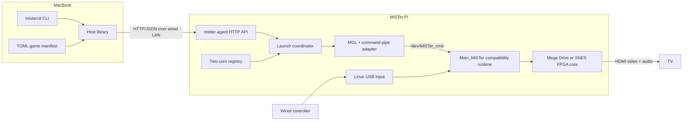
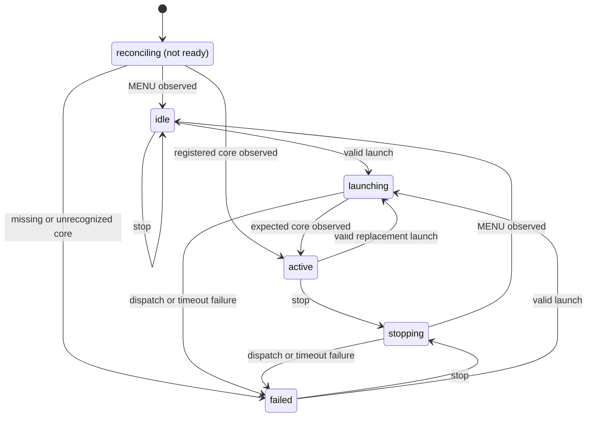

# MiSTer Remote POC 1 Design

**Date:** 2026-08-01

**Status:** Written specification approved on 2026-08-01

## Summary

POC 1 turns a dedicated MiSTer Pi into a network-driven FPGA game appliance. A macOS host owns the small game library and sends authenticated launch commands over wired Ethernet. A small sidecar daemon on the MiSTer validates each request, generates a transient MiSTer Game Launcher (MGL) description, and asks the existing `Main_MiSTer` runtime to load the selected core and ROM. FPGA video and audio go directly to the TV over HDMI, and a single wired Xbox-compatible USB controller remains connected to the MiSTer Pi.

The POC deliberately retains `Main_MiSTer` as a headless hardware compatibility runtime. It is responsible for FPGA programming, ROM transfer, controller mapping, video/audio setup, and the core lifecycle. The project replaces the user-facing workflow, not that proven hardware layer.

POC 1 has two sequential milestones:

- **POC 1A — behavior proof:** Install the control daemon beside the stock MiSTer software and prove reliable remote launch from the MacBook.
- **POC 1B — appliance proof:** Move the same daemon and contract onto a reproducible reduced Linux image without changing host behavior.

This split isolates application and protocol risks from boot, kernel, and root-filesystem risks.

## Product Direction

The long-term product is a host-driven game library that treats MiSTer as a TV-connected adapter rather than a standalone frontend. FPGA-compatible titles run natively on MiSTer cores. Titles outside the FPGA core set may later run on the host and stream video/audio to MiSTer while returning input from the same controller.

That wider product contains several independent subsystems and must not be implemented as one project increment. POC 1 covers only native FPGA launch. Host library discovery, NAS access, rich metadata, graphical interfaces, and streamed emulation require separate specifications and implementation plans after POC 1 is working.

## Feasibility Basis

The design builds on demonstrated MiSTer behavior rather than a new hardware protocol:

- `Main_MiSTer` provides the ARM-side runtime and accepts live commands through `/dev/MiSTer_cmd`. Existing software generates MGL descriptions and sends `load_core` commands through this pipe.
- The Mega Drive and SNES cores already load ordinary ROM files from SD-card paths.
- MiSTer software supports `/media/fat/linux/user-startup.sh`, allowing POC 1A to start a sidecar process without replacing the stock image.
- MiSTer Linux uses a read-only root image and persistent files on `/media/fat`, which fits the POC 1B appliance model.
- Groovy_MiSTer independently demonstrates the longer-term feasibility of Ethernet video/audio delivery and returning controller, keyboard, and mouse input. Streaming remains outside this POC.

Primary references are collected in [References](#references).

## Fixed Decisions

### Hardware

- Dedicated, fully configured Retro Remake MiSTer Pi development unit.
- Installed 128 MB SDRAM and USB hub.
- Wired Ethernet.
- microSD storage.
- HDMI connection to the main TV or a development display.
- One wired Xbox-compatible USB controller connected to the MiSTer Pi.
- The user's SuperStation One remains untouched as the known-good playing system.

POC 1 guarantees only this MiSTer Pi configuration. Original DE10-Nano and other clones may work but are not acceptance targets.

### Host

- Apple Silicon MacBook is the development and acceptance host.
- Host library internals remain portable, but Windows packaging and testing are excluded.
- Target address is configured explicitly. Device discovery and mDNS are excluded.

### Games

- Exactly one Mega Drive ROM and one SNES ROM are preloaded on the SD card.
- The ROMs are user-supplied lawful dumps or redistributable homebrew test software.
- No ROM data is stored in the source repository, build cache committed to version control, or produced image intended for distribution.
- POC 1 does not scan a NAS, mount network storage, copy ROMs, calculate a collection catalog, or scrape metadata.

### Interface

- Normal gameplay is driven entirely from the MacBook CLI.
- The MiSTer menu is not navigated during normal use.
- Idle TV output is stable black HDMI produced through the Menu core. The POC configuration sets `logo=0`, `fb_terminal=0`, `osd_timeout=5`, `video_off=1`, and `video_off_logo=0`.
- A brief boot-time transition before black idle is acceptable.

## Architecture



### Ownership Rule

- The host library owns the game catalog and user intent.
- `mister-agent` owns request validation, authentication, launch serialization, MGL creation, and bounded status reporting.
- `Main_MiSTer` owns hardware-facing behavior.
- Each layer talks only to the layer directly below it. The host never writes MiSTer files or invokes shell commands remotely, and the daemon never reimplements FPGA or controller handling.

The network contract remains unchanged between POC 1A and POC 1B. Only target packaging changes.

## Approaches Considered

### Selected: Sidecar Control Daemon

The MacBook talks to a purpose-built HTTP daemon, which adapts requests to MGL and `/dev/MiSTer_cmd`.

Advantages:

- Establishes the intended long-term API boundary immediately.
- Can be tested off-device with fake files and pipes.
- Avoids making SSH a product dependency.
- Moves from stock software to a reduced image without changing the host.
- Avoids an early `Main_MiSTer` fork.

Costs:

- Adds one small target process.
- Requires supervision and health checks for both the daemon and `Main_MiSTer`.

### Rejected: SSH-Driven Host

The CLI could generate MGL remotely and issue shell commands over SSH. This is useful as a manual diagnostic or throwaway spike, but shell quoting, credentials, weak status semantics, and the need to retain SSH in the appliance make it the wrong product interface.

### Rejected: Network API Inside `Main_MiSTer`

Adding the API directly to a `Main_MiSTer` fork would provide direct internal status and avoid the command-pipe adapter. It would also couple the POC to a large upstream codebase, increase the regression surface, slow the test loop, and create immediate fork maintenance. This can be reconsidered only if the sidecar boundary proves incapable of exposing a required hardware state.

### Deferred: Replacement ARM Runtime

Replacing `Main_MiSTer` would require recreating core loading, HPS-to-FPGA communications, controller handling, video/audio configuration, saves, and other compatibility behavior. It is a separate research program, not a POC 1 requirement.

## Components

### Shared Protocol Package

Defines versioned request, response, status, and error types used by the host and daemon. It contains no networking or platform code.

Responsibilities:

- API version constants.
- System identifiers: `megadrive` and `snes`.
- Launch state identifiers.
- Error codes and JSON envelopes.
- Validation rules that are identical on host and target where appropriate.

### Host Library

Provides a reusable macOS-facing library independent of the CLI.

Responsibilities:

- Load and validate the TOML game manifest.
- Resolve a game ID to a launch request.
- Call the daemon with a bounded timeout and bearer token.
- Convert daemon errors into typed host errors.
- Expose list, health, status, launch, and stop operations.

It does not access ROM contents or the MiSTer filesystem.

### `misterctl`

A thin command-line adapter over the host library.

Commands:

```text
misterctl games
misterctl health
misterctl status
misterctl launch <game-id>
misterctl stop
```

Rules:

- Human-readable output is the default.
- `--json` emits the stable protocol representation for automation.
- Failures write a concise actionable message to standard error and return non-zero.
- Configuration is loaded from `~/.config/mister-remote/config.toml` unless an explicit path is supplied.
- The default game manifest is the sibling file `~/.config/mister-remote/games.toml`; `manifest_path` may override it and is resolved relative to the connection configuration directory when not absolute.

### `mister-agent`

A small long-running daemon on the MiSTer Pi.

Responsibilities:

- Authenticate requests.
- Validate the system and ROM path.
- Permit only one state-changing operation at a time.
- Resolve a system through the two-core registry.
- Generate the transient MGL atomically.
- Send the corresponding `load_core` command with a bounded write timeout.
- Observe `/tmp/CORENAME` until the expected core or Menu core appears.
- Maintain current and last-error state in memory.
- Expose health and status without depending on SSH.

The daemon does not persist a game library and does not parse ROM contents.

### Core Registry

The daemon owns a fixed two-entry registry. Each entry supplies:

- System identifier.
- Expected MiSTer core name.
- Logical MGL RBF selector.
- Allowed ROM root.
- Case-insensitive extension allowlist.
- MGL file attributes required by the core.

The initial entries are:

| System | Expected core | RBF selector | ROM root | Extensions | MGL file |
|---|---|---|---|---|---|
| Mega Drive | `MegaDrive` | `_Console/MegaDrive` | `/media/fat/games/MegaDrive` | `.md`, `.gen`, `.bin` | delay `1`, type `f`, index `1` |
| SNES | `SNES` | `_Console/SNES` | `/media/fat/games/SNES` | `.sfc`, `.smc`, `.bin` | delay `2`, type `f`, index `0` |

The values are verified against the selected artifacts during POC 1A. The SD card contains exactly one RBF matching each logical selector. The implementation locks those resolved core binaries, the `Main_MiSTer` binary, kernel, MGL attributes, and SHA-256 digests in a versioned source lock file. The lock file is generated from the known-good POC 1A installation before POC 1B image work begins.

### MiSTer Adapter

The adapter is the only package aware of MiSTer runtime files.

Launch behavior:

1. Convert the validated absolute ROM path to a slash-separated path relative to the registered games root.
2. Render a complete MGL using the registered logical RBF selector, relative ROM path, and file attributes.
3. Write it to `/tmp/mister-remote/launch.mgl.new`.
4. Flush and close it.
5. Rename it to `/tmp/mister-remote/launch.mgl` on the same filesystem.
6. Send the newline-terminated command `load_core /tmp/mister-remote/launch.mgl` to `/dev/MiSTer_cmd` with a bounded timeout.
7. Observe `/tmp/CORENAME` for the expected core until the ten-second launch deadline.

Stop behavior sends `load_core /media/fat/menu.rbf` and observes `MENU` until the five-second stop deadline.

Generated MGL and logs are volatile. They are never written repeatedly to the SD card.

### Image Builder

POC 1B uses a pinned Linux build container on the Apple Silicon MacBook. This accommodates the x86_64-oriented MiSTer cross-compilation ecosystem and makes Buildroot and kernel builds reproducible.

Responsibilities:

- Fetch upstream inputs by immutable revision and verify SHA-256 digests.
- Build the ARMv7 hard-float root filesystem.
- Add only the required `Main_MiSTer` dynamic-library closure.
- Add BusyBox, device management, DHCP, the daemon, supervision, and development SSH.
- Assemble an SD artifact from a pinned MiSTer Pi-compatible base layout.
- Produce a manifest of every source and binary in the artifact.

No FPGA cores are compiled in POC 1. Pinned working RBF artifacts are used.

## Host Configuration and Game Manifest

Host connection configuration:

```toml
base_url = "http://192.0.2.10:8182"
token = "example-poc-token-not-valid"
request_timeout_seconds = 12
manifest_path = "games.toml"
```

`192.0.2.10` is documentation-only example data. The real development IP is supplied locally and is not committed.

Game manifest:

```toml
[[games]]
id = "megadrive-test"
title = "Mega Drive test game"
system = "megadrive"
rom_path = "/media/fat/games/MegaDrive/test.md"

[[games]]
id = "snes-test"
title = "SNES test game"
system = "snes"
rom_path = "/media/fat/games/SNES/test.sfc"
```

Manifest requirements:

- IDs are unique lowercase ASCII slugs.
- System is exactly `megadrive` or `snes`.
- ROM paths are absolute target paths.
- The host rejects duplicate IDs and unsupported systems before making a request.
- The target repeats all security-relevant validation and never trusts host validation.

Target daemon configuration at `/media/fat/mister-remote/agent.toml`:

```toml
listen_address = "0.0.0.0:8182"
token = "example-poc-token-not-valid"
mister_process_comm = "MiSTer"
command_pipe = "/dev/MiSTer_cmd"
core_name_file = "/tmp/CORENAME"
menu_rbf = "/media/fat/menu.rbf"
mgl_directory = "/tmp/mister-remote"
```

The production token is generated locally during installation and never committed. Runtime paths are explicit so the integration suite can substitute an isolated fake MiSTer filesystem. The two system registry entries remain code-owned POC constants rather than remotely supplied configuration.

## Network API

### Transport and Authentication

- HTTP/1.1 with JSON on configurable TCP port `8182`.
- Wired trusted LAN only.
- `Authorization: Bearer <token>` is required on every endpoint except `GET /v1/health`, which returns only non-sensitive readiness data.
- The bearer token is generated during installation and stored in local host configuration and the MiSTer Pi configuration.
- Token comparison is constant-time.
- TLS, user accounts, remote Internet exposure, and token rotation UI are excluded.

### `GET /v1/health`

Returns process and dependency readiness:

```json
{
  "api_version": "v1",
  "agent_version": "0.1.0",
  "ready": true,
  "mister_process": true,
  "command_pipe": true
}
```

HTTP `200` means the daemon can answer. `ready: false` means state-changing requests will receive `MISTER_UNAVAILABLE`.

### `GET /v1/status`

Returns the daemon's bounded knowledge:

```json
{
  "state": "active",
  "game_id": "megadrive-test",
  "system": "megadrive",
  "expected_core": "MegaDrive",
  "observed_core": "MegaDrive",
  "last_error": null
}
```

States are `idle`, `launching`, `active`, `stopping`, and `failed`.

`game_id`, `system`, `expected_core`, and `observed_core` are nullable strings. `last_error` is either `null` or an object containing `code` and `message` strings. `active` means a registered core was observed. Following a launch, it means the expected core name appeared before the deadline; it does not prove that the ROM reached a playable screen. POC 1 verifies video, audio, ROM boot, and controller behavior through hardware acceptance.

At daemon startup, readiness waits for `Main_MiSTer` and the command pipe, then reconciles state from `/tmp/CORENAME` without issuing a command:

- `MENU` becomes `idle` with game and system fields cleared.
- A registered core becomes `active`; the system is inferred, but `game_id` is `null` because the daemon cannot prove which ROM is already loaded.
- A missing core-name file after the bounded startup check becomes `failed` with `MISTER_UNAVAILABLE`, and health remains not ready.
- An unrecognized core becomes `failed` with the status-only code `UNRECOGNIZED_CORE`; health may still be ready and a valid launch or stop may recover the state.

### `POST /v1/launch`

Request:

```json
{
  "game_id": "megadrive-test",
  "system": "megadrive",
  "rom_path": "/media/fat/games/MegaDrive/test.md"
}
```

The call is synchronous and bounded by the ten-second core deadline. HTTP `200` returns the resulting active status. A launch may replace an already active game. A second state-changing request received while launch or stop is in progress returns `BUSY` and does not queue.

### `POST /v1/stop`

The request has no body. The call is synchronous and bounded by the five-second Menu-core deadline. HTTP `200` returns idle status. Stop is idempotent when the daemon is already idle. A stop received during another transition returns `BUSY`.

### Error Envelope

```json
{
  "error": {
    "code": "ROM_NOT_FOUND",
    "message": "ROM does not exist on the MiSTer SD card"
  }
}
```

| HTTP | Code | Meaning |
|---:|---|---|
| 400 | `BAD_REQUEST` | Malformed JSON or missing/invalid field |
| 401 | `UNAUTHORIZED` | Missing or incorrect bearer token |
| 404 | `ROM_NOT_FOUND` | Validated path does not identify a regular file |
| 409 | `BUSY` | Another launch or stop transition is running |
| 422 | `UNSUPPORTED_SYSTEM` | System is not Mega Drive or SNES |
| 422 | `INVALID_ROM_PATH` | Path escapes its root or has a disallowed extension |
| 503 | `MISTER_UNAVAILABLE` | `Main_MiSTer` or command pipe is unavailable |
| 504 | `CORE_TIMEOUT` | Expected core did not appear before the deadline |
| 500 | `INTERNAL` | Unexpected internal failure |

Pre-dispatch failures never alter the active core. A failure after command dispatch may leave the hardware on the newly observed, previous, or partially initialized core. The daemon reports `failed` with its last observed core and does not conceal the failure by automatically loading Menu. The operator can inspect status and issue `stop`. This is safer for diagnosis than an unreported recovery attempt.

Request validation and authentication failures do not change daemon state or `last_error`.

## Path Validation

For every launch, the daemon:

1. Rejects NUL bytes and non-absolute paths.
2. Cleans the path lexically.
3. Resolves filesystem links for both the registered root and candidate path and fails closed if either cannot be resolved.
4. Computes the candidate path relative to the resolved root and rejects the root itself, `..`, or any relative path beginning with `../`.
5. Confirms the extension is allowed for the selected system.
6. Confirms the target is a regular file.
7. Converts the relative path to slash separators and escapes it correctly when generating XML-compatible MGL content.

The host-provided RBF path is never accepted because the host does not send one.

## Launch State Machine



The transition lock covers validation through core observation for state-changing calls. Health and status remain available during transitions.

## POC 1A: Behavior Proof

### Deployment

- Start from a current known-good MiSTer Pi SD installation.
- Preload the two ROMs and exact Mega Drive/SNES core binaries.
- Configure and manually verify the reference controller using stock MiSTer once.
- Preserve the resulting controller mapping files as POC inputs.
- Install a static ARMv7 `mister-agent` binary and configuration under `/media/fat/mister-remote`.
- Store daemon configuration at `/media/fat/mister-remote/agent.toml`.
- Start and supervise the daemon through `/media/fat/linux/user-startup.sh`.
- Configure the Menu core for black idle.

SSH is permitted for installation and diagnosis. `misterctl` never invokes it.

### Purpose

POC 1A answers one question: can the MacBook reliably select and launch both preloaded games while MiSTer retains direct HDMI and USB-controller ownership?

## POC 1B: Appliance Proof

### Root Filesystem

Use Buildroot to generate an ARMv7 hard-float glibc root filesystem containing:

- BusyBox init and required utilities.
- Dynamic device management sufficient for the wired USB controller and MiSTer hardware.
- Wired Ethernet initialization and DHCP client.
- The exact dynamic-library closure required by the pinned `Main_MiSTer` binary.
- `mister-agent`.
- Process supervision.
- A small SSH service in the development image only.

The root filesystem is read-only. `/tmp`, `/run`, and logs are volatile. Persistent MiSTer configuration, cores, ROMs, saves, token, and the normal FAT payload remain under `/media/fat`.

### Kernel Progression

POC 1B has two checkpoints:

1. Boot the reduced root filesystem beneath the exact known-good MiSTer kernel and device tree used by POC 1A, then pass the complete acceptance suite.
2. Reproduce that kernel and device tree from the pinned official source and configuration, then pass the same suite again.

Aggressive kernel-driver pruning is excluded. It adds diagnosis risk without proving new product behavior. The later minimal-kernel effort can remove drivers one group at a time while the hardware suite guards behavior.

### Boot Sequence

1. Retained MiSTer Pi bootloader initializes the board.
2. Bootloader configures `menu.rbf`.
3. Kernel and device tree boot.
4. Init mounts pseudo-filesystems, the read-only root, and `/media/fat`.
5. Device management settles the Ethernet and USB controller devices.
6. DHCP obtains an address.
7. `Main_MiSTer` starts from the conventional FAT payload.
8. `mister-agent` starts and waits for `Main_MiSTer` plus writable `/dev/MiSTer_cmd`.
9. Health reports ready and the TV settles to black idle.

The daemon is restarted automatically after a crash. `Main_MiSTer` failure is exposed as unhealthy before supervision restarts it.

### Development Build Environment

Image and kernel builds run in a pinned Linux container rather than directly on macOS. Official MiSTer documentation notes that common cross-toolchains are x86_64-oriented and recommends a devcontainer path on Apple Silicon. The image pipeline records container digest, upstream commits, configuration, and output hashes.

## Technology Choice

Use Go 1.26.5 for the shared protocol, host library, `misterctl`, and `mister-agent`.

Reasons:

- Straightforward static Linux ARMv7 build using `GOOS=linux`, `GOARCH=arm`, `GOARM=7`, and `CGO_ENABLED=0` for the daemon.
- Native Apple Silicon CLI build.
- Standard-library HTTP, JSON, cryptography, filesystem, and concurrency support.
- Fast builds and simple test binaries suit frequent agentic iteration.
- Target daemon has no Go shared-library dependency.
- The HTTP contract remains language-neutral, so future desktop or streaming software can use another language.

The Go toolchain and all third-party modules are pinned through repository configuration and the source lock. The Go 1.26.5 source archive has SHA-256 `495be4bc87176ac567392e5b4116abd98466d33d7b49d41e764ccc6976b2dc42`. Dependency additions require a concrete feature or security need; the POC favors the standard library.

## Testing Strategy

### Unit Tests

- Host manifest parsing and duplicate-ID rejection.
- System identifier validation.
- ROM root containment and extension checks.
- XML escaping and exact MGL generation for both core fixtures.
- State-machine transitions.
- Transition-lock behavior.
- Token comparison and endpoint authorization.
- HTTP-to-domain and domain-to-CLI error mapping.

### Integration Tests

Run the real daemon against an isolated fake MiSTer filesystem:

- Fake command sink captures each command.
- Fake `CORENAME` file changes under test control.
- Real HTTP handlers and real host client communicate over loopback.
- Tests cover successful launch/stop, timeout, missing pipe, malformed MGL inputs, concurrent operations, daemon restart, and status during transitions.
- Contract tests run both human-readable and `--json` CLI modes.

The adapter receives all filesystem paths through explicit configuration, so tests do not require privileged access to `/dev` or `/media/fat`.

### Image Tests

- Build twice from the same lock and compare declared artifact hashes.
- Inspect the root filesystem for the package allowlist and absence of development SSH in non-development output.
- Boot-test the root image under the closest practical emulated environment for init/mount failures; FPGA behavior remains hardware-only.
- Verify root mounts read-only and transient paths are writable.

### Hardware Acceptance

The same script drives POC 1A and POC 1B. Manual observations are recorded alongside machine results for HDMI, audio, ROM boot, and controller behavior.

POC 1 is accepted when all of the following pass:

1. From cold power-on, `GET /v1/health` reports ready within 45 seconds.
2. `misterctl games` lists exactly the two configured games.
3. Each `misterctl launch` observes its expected core within 10 seconds.
4. Five alternating launches per game complete—ten launches total—without touching the MiSTer Pi.
5. Each game reaches a playable screen with correct HDMI video and audio.
6. The reference wired controller operates both games with the preseeded mapping.
7. `misterctl stop` reaches black idle within five seconds.
8. Invalid token, system, extension, missing ROM, and escaped path cases return the specified error without changing the active core.
9. Restarting only `mister-agent` restores host control without rebooting or disturbing the active core; status rediscovers the core and reports `game_id: null` until the next launch.
10. A freshly flashed POC 1B SD card passes the identical suite with a read-only root filesystem.
11. POC 1B gameplay succeeds with SSH stopped, proving it is not a runtime dependency.
12. The reproduced pinned kernel/device tree passes the suite after the known-good binary kernel checkpoint.

## Observability and Recovery

- Logs use structured lines with timestamps, request outcome, system, game ID, state transition, and symbolic error code.
- Bearer tokens are never logged.
- Logs remain in volatile storage for POC 1.
- `health` exposes dependency booleans without filesystem paths or secrets.
- `status` exposes the last observed core and last symbolic error.
- Development images retain SSH for recovery; a physical serial console may be added later only after its connector and electrical interface are verified on the exact MiSTer Pi revision.
- A corrupt experimental SD card is recovered by reflashing; the dedicated MiSTer Pi contains no unique source data.

## Risks and Mitigations

### `Main_MiSTer`, Core, and MGL Version Coupling

MGL details and core behavior can change together. POC inputs are locked as one tested set, exact MGL output has golden tests, and upgrades rerun the complete hardware suite.

### Limited Runtime Acknowledgement

`/tmp/CORENAME` confirms a core, not that the ROM is playable. API language intentionally says `active`, not `playing`, and POC acceptance includes manual game observation. More authoritative telemetry would require upstream changes or a `Main_MiSTer` fork.

### Controller Mapping

Controller names and button layouts vary. POC 1 supports one wired Xbox-compatible reference controller and preseeds the mapping created on the stock image. Hot-plug breadth, Bluetooth, and generic remapping are later work.

### Minimal-Image Dependency Gaps

`Main_MiSTer` has a non-trivial dynamic-library and device-service closure. POC 1B measures it from the pinned working binary, reduces userland incrementally, and reruns POC 1A behavior after each image checkpoint.

### MiSTer Pi Clone Differences

MiSTer is primarily designed around the DE10-Nano, and clones can differ. The exact MiSTer Pi is the sole POC target, so behavior is recorded rather than generalized.

### Power Loss and SD Writes

Read-only root and transient MGL/log files reduce corruption exposure. Normal core saves still write to FAT and retain MiSTer's existing power-loss behavior. Save redesign is outside POC 1.

### LAN Security

Bearer authentication prevents accidental unauthenticated control, but HTTP is not safe for hostile networks. The daemon must not be forwarded to the Internet. TLS and stronger provisioning are later product work.

### Licensing and ROM Rights

`Main_MiSTer` and cores have open-source license obligations that must be preserved when redistributing images. The artifact manifest records licenses and corresponding source locations. ROMs remain user-supplied and are never included in project distributions.

## Explicitly Out of Scope

- NAS discovery, mounting, or indexing.
- ROM copying, caching, upload, download, or deduplication.
- Cover art, metadata scraping, search, favorites, or collection management.
- Desktop GUI, web UI, controller-driven library UI, or TV-side frontend.
- Host emulation and Ethernet video/audio streaming.
- Groovy_MiSTer integration.
- Returning MiSTer controller input to host emulators.
- Bluetooth, Wi-Fi, multiple controllers, SNAC, and generic controller setup.
- Save-state or SRAM management beyond existing MiSTer behavior.
- Device discovery and zero-configuration networking.
- Windows and Linux host packaging.
- Internet exposure, TLS, accounts, and multi-user control.
- OTA updates, A/B images, rollback, and production recovery UI.
- Bootloader replacement.
- Aggressive kernel pruning.
- Building or modifying FPGA cores.
- Replacing `Main_MiSTer`.

## Natural Follow-On Projects

Each follow-on requires its own design and plan:

1. **POC 2 — Host library discovery:** Read NAS directories, build a normalized catalog, and map games to execution targets without changing the MiSTer launch API.
2. **POC 3 — Transfer/cache:** Stage selected FPGA ROMs safely onto managed MiSTer storage with checksums, space policy, and legal-data boundaries.
3. **POC 4 — Streamed host emulator:** Integrate or adapt Groovy_MiSTer for HDMI video/audio and return the MiSTer-connected controller to one host emulator.
4. **Unified desktop app:** Present the catalog and route each title to native FPGA or host-streamed execution.
5. **Appliance hardening:** Discovery, signed updates, rollback, secrets provisioning, production logging, and measured kernel reduction.

## References

- [Main_MiSTer source and wiki](https://github.com/MiSTer-devel/Main_MiSTer)
- [Main_MiSTer main loop](https://raw.githubusercontent.com/MiSTer-devel/Main_MiSTer/master/main.cpp)
- [Mega Drive MiSTer core](https://github.com/MiSTer-devel/MegaDrive_MiSTer)
- [SNES MiSTer core](https://github.com/MiSTer-devel/SNES_MiSTer)
- [MiSTer SAM MGL and command-pipe usage](https://github.com/mrchrisster/MiSTer_SAM)
- [Groovy_MiSTer streaming core](https://github.com/psakhis/Groovy_MiSTer)
- [MiSTer advanced networking and `user-startup.sh`](https://mister-devel.github.io/MkDocs_MiSTer/advanced/network/)
- [MiSTer MGL format and common core arguments](https://mister-devel.github.io/MkDocs_MiSTer/advanced/mgl/)
- [MiSTer internal core names](https://mister-devel.github.io/MkDocs_MiSTer/developer/corenames/)
- [MiSTer game and SD paths](https://mister-devel.github.io/MkDocs_MiSTer/setup/games/)
- [MiSTer core-path precedence](https://mister-devel.github.io/MkDocs_MiSTer/cores/paths/)
- [MiSTer compilation guidance](https://mister-devel.github.io/MkDocs_MiSTer/developer/mistercompile/)
- [MiSTer hardware requirements and clone caveat](https://mister-devel.github.io/MkDocs_MiSTer/setup/requirements/)
- [MiSTer Pi firmware and power guidance](https://retroremake.co/pages/firmware-setup)
- [MiSTer Pi hardware listing](https://retroremake.co/products/mister-pi-retro-gaming-fpga-board-1)
- [MiSTer SD installer layout](https://github.com/MiSTer-devel/SD-Installer-Win64_MiSTer)
- [MiSTer Linux kernel](https://github.com/MiSTer-devel/Linux-Kernel_MiSTer)
- [Buildroot manual](https://buildroot.org/downloads/manual/manual.html)
- [Go 1.26.5 release downloads and checksums](https://go.dev/dl/)
