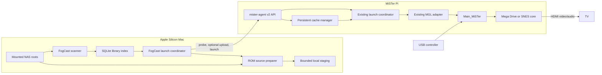

# FogCast POC 2 Design

**Date:** 2026-08-02

**Status:** Written specification approved on 2026-08-02

## Summary

POC 2 turns the POC 1 remote launcher into the first useful FogCast library workflow. The Mac owns a generated catalog of Mega Drive and SNES games stored on a macOS-mounted NAS share. Selecting a game causes the Mac to prepare and identify the ROM, push it to a bounded persistent cache on the MiSTer when necessary, and launch it by content identity. A cached game remains launchable after a MiSTer reboot and while the NAS is unavailable.

The POC retains the hardware boundary proven in POC 1. `mister-agent` remains a passive, authenticated appliance service; `Main_MiSTer` continues to own FPGA, core, controller, video, audio, and save behavior. The host never supplies a writable target path, and the MiSTer never receives NAS credentials or mounts network storage.

## Goals

POC 2 must prove all of the following on the dedicated MiSTer Pi:

- Recursively discover the user's Mega Drive and SNES collections from configured macOS-mounted directories.
- Replace the hand-written game manifest in the normal host workflow with a durable generated index.
- Accept raw supported ROMs and ZIP archives containing exactly one supported ROM entry.
- Avoid hashing the entire collection during routine scans.
- Transfer an uncached ROM over the existing authenticated Mac-to-MiSTer connection.
- Verify every transferred ROM by system, extension, length, and SHA-256 before it becomes launchable.
- Reuse cached content without retransmission on subsequent launches and after target reboot.
- List the last indexed library and launch cached games when the NAS is offline.
- Enforce a bounded target cache with deterministic eviction that protects active content.
- Preserve the POC 1 launch behavior and its hardware acceptance suite.

## Non-Goals

POC 2 does not include:

- A graphical application, artwork, favourites, collections, or rich metadata.
- Metadata scraping, DAT matching, or aggressive filename cleanup.
- Save-file or save-state synchronization.
- Systems other than Mega Drive and SNES.
- 7z, CHD, patch sets, multipart media, or nested archives.
- Bulk prefetch or whole-library mirroring.
- MiSTer discovery or mDNS.
- Direct SMB access from FogCast or the MiSTer.
- TLS, internet exposure, multi-user authorization, or credential distribution.
- Host software emulation, video/audio streaming, or return input streaming.
- Replacing or forking `Main_MiSTer`.

## Fixed Decisions

### NAS access

The user mounts the NAS through macOS before scanning. FogCast consumes ordinary absolute paths beneath `/Volumes` and contains no SMB client. If a mount is unavailable, FogCast uses its retained index rather than attempting to mount or authenticate to the NAS.

### Library ownership

The generated SQLite index is the sole normal POC 2 library source. The POC 1 TOML manifest remains only for compatibility tests and the unchanged POC 1 HIL path.

### Systems and source formats

Only the accepted Mega Drive and SNES cores are supported. Sources may be raw ROMs using the existing per-system extension allowlists or ZIP files containing exactly one supported ROM entry. ZIP member matching is case-insensitive.

### Cache lifetime

The MiSTer cache lives on the writable FAT partition, survives reboot, and defaults to a 2 GiB size ceiling. The ceiling is configurable in `agent.toml`.

### Offline behavior

An unavailable NAS root does not remove its games from the index. A game with a remembered digest can launch while its source is unavailable if the MiSTer confirms that the corresponding cache entry exists. An uncached game fails without disturbing the current game.

### Product naming

The new host command is `fogcast`, with configuration and state beneath `~/.config/fogcast`, `~/.local/share/fogcast`, and `~/.cache/fogcast`. The Go module becomes `github.com/DeanoC/FogCast-POC`. The target service remains `mister-agent`. `misterctl` remains buildable only for POC 1 regression and HIL use.

## Architecture



### Ownership rules

- The scanner owns source discovery and source fingerprints.
- SQLite owns durable catalog state and remembered content identities.
- The source preparer is the only host component that reads ROM bytes or ZIP contents.
- The host launch coordinator owns the probe, prepare, upload, and launch sequence.
- The cache manager is the only target component that creates, names, validates, accounts for, or evicts cache files.
- The existing launch coordinator owns launch serialization and status.
- The existing MiSTer adapter owns MGL rendering and `/dev/MiSTer_cmd` interaction.
- `Main_MiSTer` owns all hardware-facing behavior.

The host cannot name an arbitrary target file, and the target cannot access a host or NAS path.

## Approaches Considered

### Selected: host push with content-addressed staging

The Mac probes the MiSTer by content identity, uploads missing bytes, and then launches the verified entry.

Advantages:

- Preserves the established outbound Mac-to-MiSTer connection direction.
- Requires no inbound macOS listener, firewall exception, or callback authentication.
- Keeps NAS credentials and archive handling off the appliance.
- Supports persistent and offline cache behavior naturally.
- Makes future local-disk, cloud, or alternate catalogs host-only concerns.

Costs:

- Adds an authenticated upload surface to `mister-agent`.
- Requires bounded staging on both machines.
- Requires target cache accounting and eviction.

### Rejected: MiSTer pulls from a temporary Mac server

This resembles a media-cast protocol, but requires the target to select a reachable Mac address and the Mac to run an inbound service through its firewall. It adds callback authentication and host lifecycle failure modes without improving the POC 2 user experience.

### Rejected: MiSTer mounts the NAS

This avoids host-to-target upload but adds SMB, credentials, archive handling, and NAS availability to the minimal appliance. It violates the host-owned-library boundary and makes offline cached launch harder to reason about.

## Host Configuration

The connection and library configuration is one strict TOML document:

```toml
base_url = "http://192.0.2.10:8182"
token = "example-poc-token-not-valid"
request_timeout_seconds = 12
upload_timeout_seconds = 60

[[libraries]]
id = "snes-main"
system = "snes"
root = "/Volumes/Games/Games/SNES"

[[libraries]]
id = "genesis-main"
system = "megadrive"
root = "/Volumes/Games/Games/Genesis"
```

Rules:

- Library IDs are lowercase ASCII slugs and unique.
- Roots are absolute, cleaned paths and unique after resolution.
- A root is assigned exactly one system.
- Unknown TOML fields are rejected.
- Tokens and machine-specific paths remain local and uncommitted.

Default paths are:

```text
~/.config/fogcast/config.toml
~/.local/share/fogcast/library.sqlite3
~/.cache/fogcast/staging/
```

## Library Scanner

### Traversal

Each configured root is scanned recursively without following symbolic links. The scanner ignores directories as game candidates, `.DS_Store`, AppleDouble `._*` files, and unsupported extensions. A failure in one file does not abort its root or other roots.

Raw candidates use the existing core registry extension allowlists. ZIP candidates are opened only far enough to validate their central directory and enumerate members. A valid ZIP contains exactly one non-directory member whose extension is allowed for the configured system; unrelated non-ROM members are ignored. The scanner rejects encrypted archives, corrupt central directories, more than 4,096 members, nested archives as ROM sources, zero supported members, or multiple supported members.

### Incremental fingerprints

For every candidate the index records:

- Library ID and system.
- Normalized slash-separated relative path.
- Source kind: `raw` or `zip`.
- Source size and nanosecond modification time where available.
- For ZIPs, selected member name, uncompressed size, CRC-32, and archive entry count.
- Display title and stable game ID.
- Availability and validation reason.
- Optional prepared content digest, length, and extension.

A remembered content identity remains usable only while the complete source fingerprint is unchanged. A changed fingerprint clears the remembered digest and requires preparation again.

### Stable game IDs

The identity input is the UTF-8 string:

```text
<system> NUL <library-id> NUL <normalized-relative-path>
```

FogCast computes SHA-256 over those bytes and uses the first twelve lowercase hexadecimal characters as a suffix. The title portion is lowercased, sequences outside ASCII `[a-z0-9]` become one hyphen, leading/trailing hyphens are removed, and the result is truncated to 48 characters. An empty title slug becomes `game`.

The final ID is:

```text
<system>-<title-slug>-<12-hex-suffix>
```

This satisfies the existing protocol slug rule and is stable while the library ID and relative path remain unchanged. Renaming or moving a source creates a new game ID; once prepared, identical bytes still reuse the same target cache entry.

### Scan transactions and offline roots

SQLite uses a schema version and explicit migrations. A root scan writes into a transaction and marks rows with a scan generation. Only after traversal completes does FogCast reconcile missing rows. An interrupted scan rolls back and leaves the last complete generation intact.

If the root itself cannot be opened, FogCast records the root as offline and does not reconcile or delete its previous rows. If an online root completes and a previously indexed source is absent, its row is retained as source-unavailable so a known cached digest can still be used. Scan completion is successful when the index transaction completes; offline and invalid counts are reported as warnings rather than turning partial catalog availability into database failure.

The SQLite implementation must support `CGO_ENABLED=0` so host and test builds retain the existing portable build policy.

## ROM Source Preparation

Preparation is lazy and runs only when a launch needs bytes whose identity is unknown or stale.

For a raw source, FogCast streams the file into a uniquely created local staging file while hashing. For a ZIP source, it streams only the selected ROM member into the staging file while validating the ZIP CRC and hashing the uncompressed bytes. It never extracts using a member path.

Both systems have a POC 2 maximum prepared ROM size of 32 MiB. The preparer rejects a declared ZIP member above that limit before decompression and aborts if streamed output exceeds the limit. Staging files must be regular files created beneath the configured staging root with exclusive creation. They are removed after success or failure.

After preparation completes, FogCast atomically updates the indexed digest, length, and normalized extension only if the source fingerprint still matches the one observed before reading. A concurrent source modification makes preparation stale and forces a retry; it never associates the new bytes with an old fingerprint.

## V2 Cache and Launch Protocol

POC 2 adds authenticated `/v2` content endpoints while retaining the complete `/v1` API for POC 1 regression testing.

### Cache probe

```text
GET /v2/cache/{system}/{sha256}?extension=sfc
```

The system, digest, and extension are validated and normalized before filesystem access; the query extension omits the dot and must already be lowercase. The JSON response contains `present`, and when present, the exact `system`, `sha256`, `extension`, and verified `size`. After an agent restart, the first probe or launch of an entry rehashes its bytes and compares them with the filename digest before reporting a hit. Absence is a normal `200` response with `present: false` rather than a generic filesystem error.

### Cache upload

```text
PUT /v2/cache/{system}/{sha256}?extension=sfc
Content-Length: 524288
Content-Type: application/octet-stream

<raw ROM bytes>
```

`Content-Length` is required, non-zero, and no greater than 32 MiB. The cache manager streams the request to a uniquely created same-filesystem `.part` file while hashing and counting bytes. It rejects premature EOF, excess bytes, length mismatch, digest mismatch, unsupported extension, invalid system, insufficient capacity, and non-regular destination conflicts.

Only after all checks, flush, and close succeed does the manager atomically rename the file to:

```text
/media/fat/fogcast/cache/<system>/<sha256>.<extension>
```

Uploading an already verified key is idempotent and does not rewrite it. The JSON response contains `result: "present"` or `result: "created"` plus the exact system, digest, extension, and size; it never exposes the target path.

### V2 launch

```text
POST /v2/launch
Content-Type: application/json

{
  "game_id": "snes-super-mario-world-a1b2c3d4e5f6",
  "system": "snes",
  "content": {
    "sha256": "<64 lowercase hex characters>",
    "size": 524288,
    "extension": "sfc"
  }
}
```

The agent resolves the cache key internally, verifies that the regular file still has the declared length and digest, and passes the resulting path to the existing launch coordinator. A missing or mismatched entry fails before changing launch state. The v2 response contains the unchanged v1 status object beneath `status` and the exact content identity beneath `content`; it does not add fields to v1 responses.

`fogcast health`, `status`, and `stop` continue to use the compatible v1 read/control endpoints in POC 2. The host requires a v2 cache probe to succeed before advertising target cache support; no implicit downgrade to path-based launch occurs.

### Concurrency

The cache manager permits one upload at a time. Upload preparation may occur while a game is active, but launch and stop remain serialized by the existing transition lock. The active cache key is pinned during accounting and eviction. On a successful v2 launch the agent records that key atomically beneath `/run`; an agent-only restart reloads it and retains the pin only when the reconciled core matches its system. Stop clears it. The volatile record disappears on a full reboot, when the boot sequence returns to Menu. A failed probe or upload does not call the launch coordinator and therefore cannot disturb gameplay.

## Target Cache Manager

The target cache defaults to 2 GiB and is configurable by `cache_max_bytes` in `agent.toml`. The cache root is fixed by target configuration and cannot be overridden by an API request.

At startup the manager scans only direct registered system directories beneath its cache root. Structurally valid entries must be regular non-link files with an exact `<sha256>.<allowed-extension>` name and a size within the system limit. Their content identity is unverified until the first probe or launch in that agent lifetime; successful hashing is memoized in memory. A digest mismatch excludes the entry from launch and cache hits without renaming or deleting it. Invalid, unfamiliar, link, and special entries are likewise excluded, left in place, counted conservatively against capacity where their size is known, and logged without deletion.

The target uses no persistent database. Successful cache-backed launch updates the entry modification time. Eviction orders valid inactive entries by oldest modification time and then filename for deterministic ties. Before creating an upload part, the manager reserves the declared length under its upload lock and evicts entries until both the cache ceiling and actual FAT free space can accommodate it. It never evicts the active key, an upload in progress, an invalid/unfamiliar entry, or anything outside the cache root. If safe eviction cannot make enough room, the upload fails with `CACHE_FULL`.

Stale `.part` files created by FogCast are never launchable. The manager removes recognized stale parts at startup and before a retry, but does not recursively delete or follow links.

## Host Launch Coordinator

`fogcast launch <game-id>` performs these steps:

1. Load the indexed game and its current source state.
2. If a remembered digest exists, probe the target cache first.
3. On a cache hit, launch without opening the NAS source.
4. On a cache miss, require an available and valid source.
5. Prepare the source into bounded local staging and update the index transactionally.
6. Probe the newly computed cache key to handle a concurrent/idempotent prior upload.
7. Upload when absent and require the response to confirm the exact identity.
8. Send the v2 launch request.
9. Remove local staging on every exit path.

Human progress is written to standard output normally. With `--json`, progress moves to standard error and standard output contains exactly one final JSON value. Transport retries are allowed only before a request body begins or after an idempotent probe confirms state; FogCast does not blindly replay a partially transmitted upload.

## Host CLI

```text
fogcast scan
fogcast games
fogcast search <text>
fogcast launch <game-id>
fogcast health
fogcast status
fogcast stop
```

Behavior:

- `scan` reports added, updated, unchanged, invalid, missing, and offline counts per root.
- `games` reads SQLite rather than traversing the NAS.
- `search` performs case-insensitive substring matching over title, game ID, and system. Fuzzy ranking is excluded.
- `launch` reports source preparation, cache hit or upload, and final core state.
- `health`, `status`, and `stop` retain the POC 1 meanings.
- `--json` produces stable machine-readable values and never mixes progress into standard output.
- Operational failures are concise and typed, with non-zero exit status.

## Errors and State Safety

POC 2 adds these typed error codes:

```text
SOURCE_UNAVAILABLE
INVALID_ARCHIVE
TRANSFER_FAILED
DIGEST_MISMATCH
CONTENT_NOT_CACHED
CACHE_FULL
```

Existing authentication, busy, unsupported-system, MiSTer-unavailable, core-timeout, and internal errors remain.

State rules:

- A bad source becomes a per-game index state and does not abort unrelated scanning.
- A missing source with a cache hit launches normally.
- A missing source with a cache miss fails before changing the active game.
- Interrupted, oversized, short, or mismatched uploads never create a launchable cache file.
- Upload failure leaves the current game and existing valid cache content unchanged.
- Launch failure does not delete the content it attempted to launch.
- Agent restart reconstructs cache inventory and reconciles the active core using the existing POC 1 behavior.
- API errors and logs may contain game IDs, systems, digests, sizes, and typed reasons. They must not contain bearer tokens, ROM bytes, NAS absolute paths, or internal cache paths.

## Security and Privacy

- All v2 endpoints require the existing bearer token.
- Requests have bounded headers, JSON bodies, content lengths, and timeouts.
- Digest and extension validation occurs before path construction.
- Cache paths are constructed only from registered system names, validated digests, and allowlisted extensions.
- All writes use exclusive temporary files beneath the resolved cache root and same-directory atomic rename.
- Scanner and cache traversal do not follow symbolic links.
- No ROM, token, NAS path, SQLite database, or staged file may enter Git, build contexts, logs, HIL reports, or distributable images.
- The API remains LAN-only in POC 2 and is not suitable for internet exposure.

## Testing Strategy

### Unit tests

- Configuration validation and default paths.
- Deterministic IDs, slug edge cases, collisions, and path normalization.
- Recursive incremental scans, unchanged fingerprints, changed sources, removed sources, and offline roots.
- Raw files and valid, corrupt, encrypted, empty, nested, oversized, zero-ROM, and multi-ROM ZIPs.
- ZIP member-count and decompression limits.
- SQLite schema creation, migrations, transactional scan rollback, and query behavior.
- Lazy preparation, CRC verification, digest generation, concurrent source change, and staging cleanup.
- V2 request validation, authentication, length enforcement, digest mismatch, early EOF, excess body, idempotent upload, and atomic promotion.
- Startup cache reconstruction, invalid entries, accounting, deterministic LRU, active pinning, stale parts, and capacity failure.
- Human and JSON CLI output separation.

### Integration tests

- Scan to index to first upload to launch using a fake MiSTer runtime.
- Cache-hit launch that performs no source read and no upload.
- Agent restart followed by cache-hit launch.
- NAS-offline cached launch.
- NAS-offline uncached failure while another game remains active.
- Interrupted upload followed by a clean retry.
- Concurrent probes and serialized uploads.
- POC 1 v1 API, CLI, image, kernel, deployment, and HIL behavior unchanged.

Test archives and ROM-like fixtures must be newly generated synthetic bytes, not copyrighted game data.

## Hardware Acceptance

The final POC 2 hardware gate on the dedicated MiSTer Pi requires:

1. Start with an empty FogCast host index and target cache.
2. Scan the configured mounted SNES and Genesis NAS roots successfully.
3. Launch Sonic from its ZIP through the first-transfer path.
4. Confirm Mega Drive HDMI video, HDMI audio, wired controller, and playability.
5. Launch Super Mario World from its ZIP through the first-transfer path.
6. Confirm SNES HDMI video, HDMI audio, wired controller, and playability.
7. Repeat both launches and prove that no ROM body is uploaded again.
8. Reboot the MiSTer Pi and launch both from the persistent cache.
9. Make both NAS roots unavailable and launch both from the retained index and target cache.
10. Attempt an uncached offline launch and prove it does not disturb the current game.
11. Interrupt an upload and prove no partial cache entry becomes launchable.
12. Run alternating launches, stop-to-black, invalid-request, power-cycle, and agent-restart reconciliation checks.
13. Rerun the complete POC 1 software and hardware acceptance suite.
14. Audit Git and produced images for ROM bytes, NAS paths, tokens, host index files, and staged content.

The POC is accepted only when both games pass first transfer, cache-hit, post-reboot, and NAS-offline launch paths with all manual video/audio/controller observations confirmed.

## Delivery Shape

POC 2 produces:

- A renamed Go module at `github.com/DeanoC/FogCast-POC`.
- The `fogcast` macOS CLI and reusable host packages.
- A versioned SQLite schema and migration layer.
- V2 content-cache protocol types and client support.
- A cache-enabled `mister-agent` in reproducible development and production root images.
- Updated deployment/recovery procedures that preserve the accepted POC 1 tag as rollback.
- Automated software acceptance and a local ignored POC 2 HIL report.

No ROM-bearing artifact is produced or distributed.
