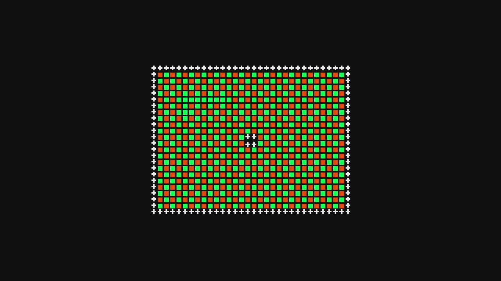

# SMS cartridge ROM linking on the designated kit

Status: **passed for exact-artifact package launch, ROM-link receipt, HDMI
diagnostic output, Stop and return to idle**. This does not establish audio,
physical input, or retail-cartridge behavior.

## Selected artifacts

| Identity | Exact value |
| --- | --- |
| FES/FogCast/runtime source revision | `b3e0be71b94d2047dbc7f1b9d3f9de44de1dff47` |
| Verified release version | `0.2.0-dev.sms-rom-link.1` |
| Release `rootfs.img` SHA-256 | `f72de8ff5d8cdf64f2cd36139c61f1f866a05866b061d2b47a21be6da8c64df4` |
| Release manifest SHA-256 | `fed65eb542335725f3350220b6fca4750383c5cef824db8bb8e1576faa7b0ea5` |
| Target ID | `73dc9f5f-1a12-4a95-a820-a9b4e600769a` |
| Confirmed boot ID | `438a710c-f35b-4214-b2ae-87f5cedb400b` |
| SMS package ID | `c29bbee636ee667023e16c1855b32b1d5ff12ec8597abda19bad946608d9e0c6` |
| Package archive SHA-256 | `1d865e75debece7e9c5a06cff6d443c6bf91d6c6bbebe76a452640ed4b7fb0ec` |
| `cartridge-rom` SHA-256, 32,768 bytes | `e35aa1b43844bd51b3573cfa53ba24bc8976e7a895e4aa6b6a4d43b5f2fc34b9` |

`make build` completed two independent cold image passes. `make verify`
passed reproducibility, structural checks and QEMU packaging smoke. `make
release` exported the immutable release after the locked boot payload cache was
provisioned from the same pinned, clean local checkout. The lease-aware
`fes-update` client installed and confirmed this image; the previous image
`450105faa49dcee7f3ee3023f487a4e4c44d63c46283b468297c5814daf2ace8`
remains available for rollback. Post-update status was `trial=false`,
`raw_idle_ready=true`, and `good` equal to the new image SHA.

## Physical result

A temporary loopback FogCast host used a private HOME and the single designated
target. Health identified the host, agent and runtime at the exact source
revision above. It imported the sealed SMS package and the exact diagnostic
ROM, received `compatible=true`, created an isolated library entry, and bound
`cartridge-rom` by immutable media digest. The host's ordinary launch path
acquired the kit lease and programmed the linked image. The active session
reported `fpga_native` and:

| Linked identity | Observed value |
| --- | --- |
| ROM map SHA-256 | `c239b3abc8ec26a30ebfe1ccecc4f925d8823548c4f18db101055287d1c0fdf1` |
| ROM source SHA-256 | `e35aa1b43844bd51b3573cfa53ba24bc8976e7a895e4aa6b6a4d43b5f2fc34b9` |
| Programmed RBF SHA-256 | `6d169af512e2c91bcd14366f4f5c90615f72fa3bedd4522bf01de09ef41e506e` |
| Programmed RBF bytes | `2583795` |

The final run reached package generation 3, flight
`67ae309c-77d2-4f77-9638-9ab4b9ae6c69`. After ten seconds of display
settling, `/dev/video0` captured the expected checkerboard, green border and
central plus tiles from the interactive diagnostic ROM:

The JPEG SHA-256 is
`cf21f54f9e83e50ce1398d785e288c39e7f60a601c0b27a6dac11f1be9246a17`.
The final local receipt is
`out/hardware/sms-rom-link-20260923/sms-hardware-video-receipt.json`
(SHA-256 `dd0208ab46947dcfe970f8fa889ed369f8929cfdce162a476d6e03d35abac598`).
The temporary host performed an identity-checked Stop, confirmed idle, stopped,
and removed its private credential. Independent kit status then reported a
free lease, and the updater still reported the confirmed new image with
`raw_idle_ready=true`.

An immediate five-frame capture in an earlier successful launch was black.
The settled capture above resolved this startup-timing ambiguity. A first
30-second launch HTTP request also timed out; the host was stopped and an
independent check found a free lease and raw idle before the diagnostic was
rerun with a longer request timeout. Neither attempt was counted as visible
output acceptance.

No physical controller presses, HDMI audio capture, retail ROM, mapper, or
expansion-bus combinations were exercised. The sealed SMS package is a
diagnostic product artifact and is not included in the factory image.
