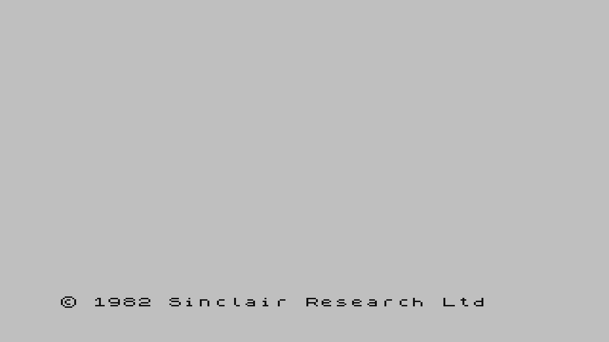

# FES ZX Spectrum: kit ROM link of the 48K BASIC ROM

On 2026-09-28 the designated MiSTer Pi (`192.168.10.84`) launched package
`aa9760d46279aadad862a78d6f6cfc7a5dd48b837dd2019b0aa3ca20807cd770` with the
16,384-byte Sinclair 48K ROM linked as `spectrum-firmware`. HDMI showed the
ROM's RAM-test pattern and then the copyright line. This is a **hardware
diagnostic** of that ROM link. It is not keyboard, tape, card, or appliance
acceptance.

## Setup

- Shell seal: [2026-09-28-spectrum-pathfinder-seal.md](2026-09-28-spectrum-pathfinder-seal.md), build `f27d64978666b0b15492c4dd7e6c8f31`.
- ROM SHA-256 `d55daa439b673b0e3f5897f99ac37ecb45f974d1862b4dadb85dec34af99cb42` (starts `F3 AF 11 FF FF`). It is not in git.
- The installed runtime knew `fes.media.apple2-floppy` and rejected an unknown `fes.media.spectrum-tape`. For this launch the kit ran a temporary ARM `mister-runtime` and `mister-agent` built from FES `5b7dff69`, bind-mounted over `/usr/sbin`. Afterwards the mounts were removed and the image binaries restarted. The lease was free before and after. Stop left the session idle.
- The running host at `127.0.0.1:8787` imported the archive, stored the ROM, and launched library entry `fpga-spectrum-basic-7dd35aecb124` (`Spectrum BASIC`). That entry remains in the host library.

## Result

The target linked the ROM. `programmed_sha256` is
`9123454dbd31cd55b8b50323ad01f0df75576a0fb10ba0ac62023271cf2a94f3`
(2,529,218 bytes), the same digest as an offline `fes-rom-link` of this ROM
and the sealed map. The session was `fpga_native` with the tape unit empty.
Active interfaces included `fes.media.spectrum-tape` and `fes.video.fixed-720p60`.

ShadowCast 1280×720, about eight seconds after launch:

Two seconds later, and again two seconds after that:

The first frame is the ROM's memory test. The later frames show
`© 1982 Sinclair Research Ltd` on the light screen. No key was sent and no
`.tap` was inserted.
