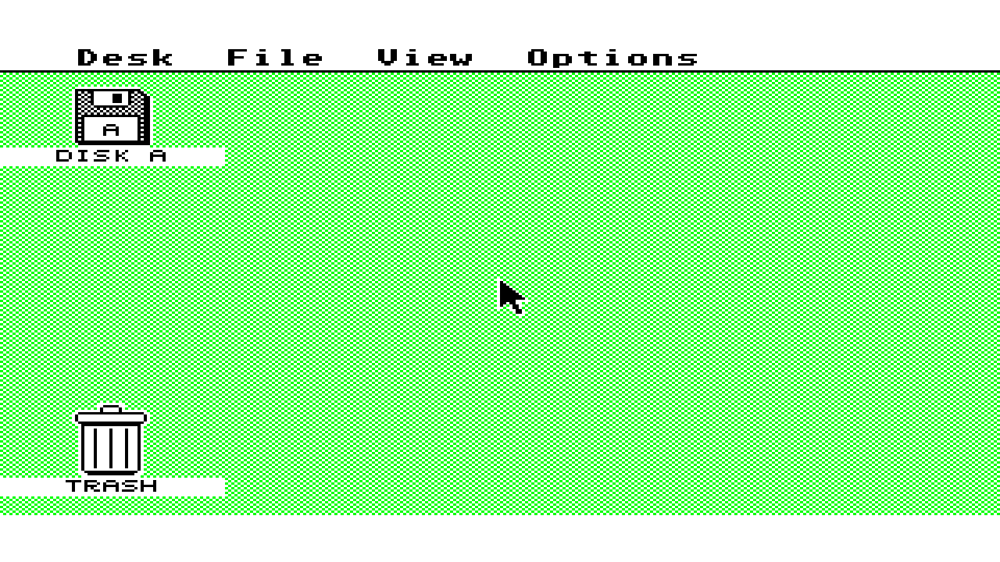

# Atari 520ST motherboard integration, 2026-10-03

This records host digital simulation and native compiler qualification for
[PR #483](https://github.com/DeanoC/fes/pull/483), based on FES
`9a42c71e9f3b36e9b13fa194914b757adfda2514`. It is not physical SDRAM, HDMI,
input, audio, or appliance acceptance. No device was programmed.

## Stock EmuTOS boot through SDRAM and video

The unmodified US 192 KiB image from
[EmuTOS 1.4](https://emutos.sourceforge.io/) reaches the GEM desktop through
the actual shared SDRAM command controller, five-client arbiter and
dual-clock video adapter. The output capture follows the shared direct video
part and both registered pixel boundaries.

The test ran 417,792,000 system clocks and 594,018,699 independent pixel
clocks, covering eight emulated seconds and 479 complete output frames.
EmuTOS detected `phystop=$80000`, placed its screen at `$78000`, and set
`memvalid=$752019F3`. Its 200 Hz counter reached 1,574, its VBL counter 476,
and the CPU performed 1,763 MFP interrupt acknowledgements. Four bus errors
were expected stock RAM probes. The CPU completed 927,042 reads and 708,161
writes alongside 7,664,000 video reads and 1,068,525 refreshes. Maximum
CPU/video request latency was 64/64 clocks; video underruns were zero.

The captured visible colors are exactly black, green and white. Unused
palette entries were not separately logged. The separate external-memory
boot test also ran for 15 emulated seconds with working system timers.
Neither boot test inserts a disk or supplies host input.

The [capture sidecar](2026-10-03-atari-st-integration/assembled-sdram-capture.json)
binds the PPM and RAM dump hashes. The
[model record](2026-10-03-atari-st-integration/assembled-sdram-model.json)
records the executable, generated model and source observations. That model
was compiled during integration, before the second-controller IKBD extension;
the record marks that source-metadata discrepancy explicitly. No keyboard,
controller or mouse events were supplied in this boot. The later IKBD
extension passed the focused input test. The generated model archive, full
RAM dump and logs remain under the task's ignored `out/validation/atari-st/`.

The external archive SHA-256 is
`59abac06a2d29b0864c5a7cfb2af65f022c337aed34188e174a9a08cc737e4bc`;
`etos192us.img` SHA-256 is
`8fbbf8b44fc3e34281eaf8cda5265510e9af9ccda0e3e409111648060d244cfc`.
The fetch recipe verifies both and retains the EmuTOS license. ROM bytes are
not tracked or included in the sealed blank-ROM package.

## Focused and shared checks

`make -C sources/misteross sim-fes-atari-st` passed CPU/MMU/exception and
expansion diagnostics, all three video modes, MFP, ACIA/IKBD/YM2149,
motherboard I/O, WD1772/DMA, SDRAM, video CDC and full GP media upload.
Notable results:

- MFP: 524,255 assertions; integrated I/O: 653,092 assertions, authentic
  200 Hz timer C and 200/400 timer-B active-display events per native frame.
- SDRAM: 3,036 requests, byte masks, fairness, refresh and withdrawn-request
  regression; maximum stress-test latency 102 clocks.
- Video CDC: 11,137,617 pixel clocks; all modes and frame-coherent settings;
  forced-stall and stale-fill black-line recovery.
- Media: all 737,280 bytes uploaded with odd chunk boundaries, CRC and
  acknowledgement after 527,286 physical writes.
- Floppy: register setup, geometry, exact DMA, stalls, cancellation, force
  interrupts, motor/index behavior, write protection and RAM bounds.
- Shared regressions: RAM tester SDRAM/HPS-DDR, 624 original computer-mailbox
  exchanges and existing ZX81 AY/audio diagnostics.
- Contract schemas, fixture generation and Go tests passed. Generated
  consistency covers 17 consumers and 33 copied fixtures.
- Producer/ROM-map/card tests passed 24 cases, including real Verilator
  ROM and packed-card transactions; one optional Mistral oracle was skipped.

The parent regression suite's generated-consumer count changed from 16 to
17. Its stale expected count was corrected and the affected parent suites
passed. Runtime and FogCast focused admission, media and composition checks
passed, and the pinned ARM target build passed. Full software and clean
parent-check results are recorded after final integration below.

## Native qualification

The producer uses the authenticated HIP stack from `toolchains/ramtest.lock`:
Yosys `886afa63953e97407153e9f4aae25fcedb639696`, Mistral
`7ed06e21c18b047ec5c6d6a7e85e5ea2c8827039` and nextpnr
`655f38334b8a1ba798cc05cf3744b6a897119b5d`.

Full shell synthesis passed with 199 M10Ks, including 192 blank synchronous
firmware lanes and seven preserved FX68K microcode memories. Native packing
required intentionally unused DDR and M10K ports to be left open. The pinned
FX68K vendor bytes remain unchanged; the generated Slang compatibility copy
only normalizes its two simulation-exclusion comment directives.

Final route, timing, ROM-map and independent-card qualification are pending.
No package or hardware qualification is inferred from synthesis alone.

## Contracts and next integration

`fes.media.atari-st-floppy` 1.0 adds computer capability bit 7 and a read-only
737,280-byte media unit 0. `fes.fabric.atari-st-bus` defines the internal
56/32-bit registered boundary; the optional package interface is
`fes.expansion.atari-st-bus` 1.0. Slot 1 is confined to
`fes.atari-st-bus.socket/1`. Existing opcode numbers and interface contracts
are preserved. Runtime captures and delivers the media; FogCast supplies
library context and APIs.

The recipe and experimental library metadata are registered. The factory
image selection is unchanged. Video uses the shared direct/scanline contract
with a build-time choice; no independently sealed frozen video-part archive
is claimed. Exact-artifact hardware testing requires a designated kit and
its existing lease after native qualification.
