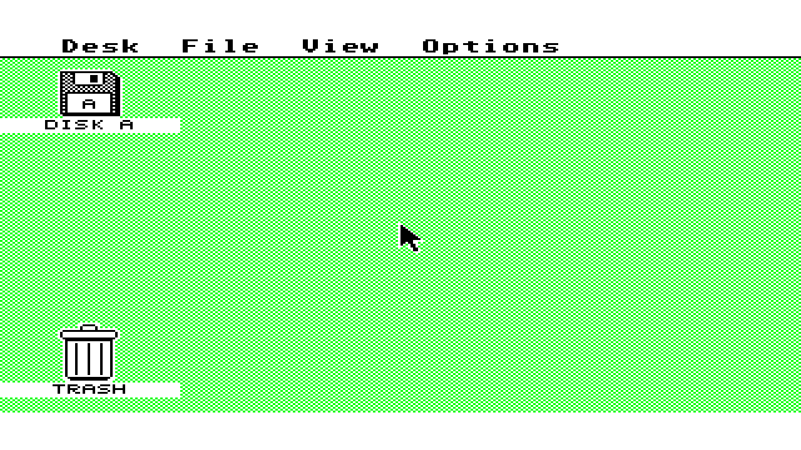
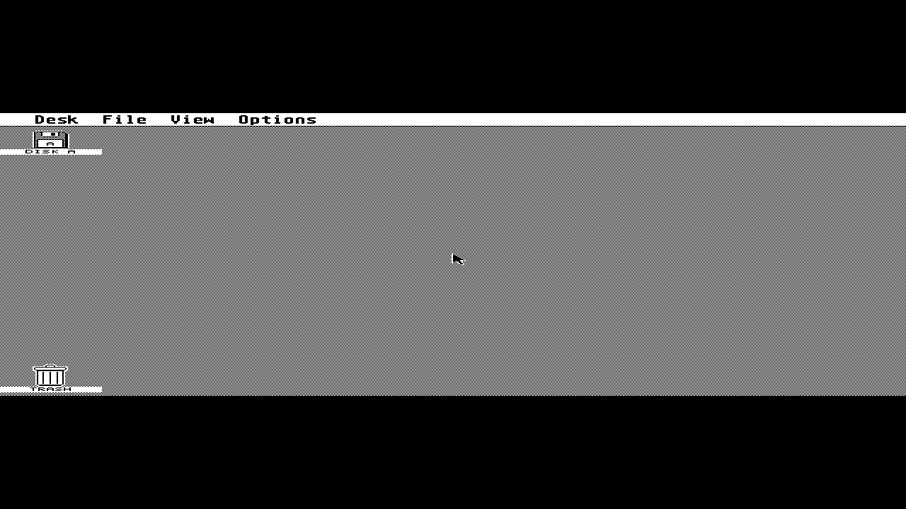

# Atari 520ST motherboard integration, 2026-10-03

This records host digital simulation and native compiler validation for
[PR #483](https://github.com/DeanoC/fes/pull/483) and its subsequent timing
qualification in [PR #490](https://github.com/DeanoC/fes/pull/490), based on FES
`9a42c71e9f3b36e9b13fa194914b757adfda2514`. It is not physical SDRAM, HDMI,
input, audio, or appliance acceptance. No device was programmed.

## Stock EmuTOS boot through SDRAM and video

The unmodified US 192 KiB image from
[EmuTOS 1.4](https://emutos.sourceforge.io/) reaches the GEM desktop through
the actual shared SDRAM command controller, five-client arbiter and
dual-clock video adapter. The output capture follows the shared direct video
part and both registered pixel boundaries.

The test ran 417,792,000 system clocks and 594,018,699 independent pixel
clocks, covering eight emulated seconds and 479 complete output frames.
EmuTOS detected `phystop=$80000`, placed its screen at `$78000`, and set
`memvalid=$752019F3`. Its 200 Hz counter reached 1,574, its VBL counter 476,
and the CPU performed 1,763 MFP interrupt acknowledgements. Four bus errors
were expected stock RAM probes. The CPU completed 927,042 reads and 708,161
writes alongside 7,664,000 video reads and 1,068,525 refreshes. Maximum
CPU/video request latency was 64/64 clocks; video underruns were zero.

The captured visible colors are exactly black, green and white. Unused
palette entries were not separately logged. The separate external-memory
boot test also ran for 15 emulated seconds with working system timers.
Neither boot test inserts a disk or supplies host input.

A second eight-second run selected the monochrome monitor input at source
checkpoint `a3a86767182bdff0d37583abdc049de06422cd41`. Stock EmuTOS selected
resolution 2 and reached its 640×400 desktop, scaled 2×1 in the HDMI raster.
It completed 890,270 RAM reads, 751,973 RAM writes and 7,664,000 video reads
with zero underruns and the same 64/64-clock maximum CPU/video latency.
Its 200 Hz counter reached 1,580 and native VBL counter 565. The final
output contains exactly black and white. The temporary monitor selection
and monochrome assertions are recorded in the
[model record](2026-10-03-atari-st-integration/monochrome-model.json), and the
[capture record](2026-10-03-atari-st-integration/monochrome-capture.json)
binds the retained output, RAM and log hashes.

Both eight-second boots were repeated after the video and keyboard timing
changes at `5e2b3e9f7cf094517d5fbf0c4661de793477877f` and again after cache
pipelining and FIFO banking at `9cfb97c54ea005ddd47746a5a233f772fbd32f2a`,
and the final fixed fetch windows, synchronous caches and scheduler simplification
at `b9711bcdfd8606f3f9861670cb680d577b58ea7e`.
All 25 compiled inputs were extracted from each commit into immutable
snapshots and verified again after execution. Every reported counter, the
complete PPM pixels and RAM bytes match the earlier runs exactly; both
remain at zero underruns. The
color run used the original test and top without modifications. Current
records are [color capture](2026-10-03-atari-st-integration/color-current-capture.json),
[color model](2026-10-03-atari-st-integration/color-current-model.json),
[monochrome capture](2026-10-03-atari-st-integration/monochrome-current-capture.json)
and [monochrome model](2026-10-03-atari-st-integration/monochrome-current-model.json).
The color image above matches this latest capture exactly. Neither run exercises disk DMA
or host input, and neither establishes physical FPGA acceptance.

`0435f069230846600984b2c1e9964c2fa63e0a07` moves two lookahead declarations
before their use for the pinned Slang frontend. A separate generation-only
comparison freezes its 25 inputs and verifies all 21 generated C++/header
files against the executed color model byte for byte, without normalization
or exclusions. The [comparison](2026-10-03-atari-st-integration/declaration-order-model-equivalence.json)
and [corrected model identity](2026-10-03-atari-st-integration/declaration-order-model.json)
retain that historical distinction. The current color and monochrome boots
were separately compiled and executed from frozen `b9711bcdf` inputs.

The [capture sidecar](2026-10-03-atari-st-integration/assembled-sdram-capture.json)
binds the PPM and RAM dump hashes. The
[model record](2026-10-03-atari-st-integration/assembled-sdram-model.json)
records the executable, generated model and source observations. That model
was compiled during integration, before the second-controller IKBD extension;
the record marks that source-metadata discrepancy explicitly. No keyboard,
controller or mouse events were supplied in this boot. The later IKBD
extension passed the focused input test. The generated model archive, full
RAM dump and logs remain under the task's ignored `out/validation/atari-st/`.

The external archive SHA-256 is
`59abac06a2d29b0864c5a7cfb2af65f022c337aed34188e174a9a08cc737e4bc`;
`etos192us.img` SHA-256 is
`8fbbf8b44fc3e34281eaf8cda5265510e9af9ccda0e3e409111648060d244cfc`.
The fetch recipe verifies both and retains the EmuTOS license. ROM bytes are
not tracked or included in the sealed blank-ROM package.

## Focused and shared checks

`make -C sources/misteross sim-fes-atari-st` passed CPU/MMU/exception and
expansion diagnostics, all three video modes, MFP, ACIA/IKBD/YM2149,
motherboard I/O, WD1772/DMA, SDRAM, video CDC and full GP media upload.
Notable results:

- MFP: 524,255 assertions; integrated I/O: 653,092 assertions, authentic
  200 Hz timer C and 200/400 timer-B active-display events per native frame.
- SDRAM: 3,036 requests, byte masks, fairness, refresh and withdrawn-request
  regression; maximum stress-test latency 102 clocks.
- Video CDC: 11,137,617 pixel clocks; all modes and frame-coherent settings;
  forced-stall and stale-fill black-line recovery.
- Media: all 737,280 bytes uploaded with odd chunk boundaries, CRC and
  acknowledgement after 527,286 physical writes.
- Floppy: register setup, geometry, exact DMA, stalls, cancellation, force
  interrupts, motor/index behavior, write protection and RAM bounds. Independent
  review found a pending-DMA removal bug; the fix and regression immediately
  withdraw writes on eject/deselect and ignore late completion (94,034,211 clocks).
- Shared regressions: RAM tester SDRAM/HPS-DDR, 624 original computer-mailbox
  exchanges and existing ZX81 AY/audio diagnostics.
- Contract schemas, fixture generation and Go tests passed. Generated
  consistency covers 17 consumers and 33 copied fixtures.
- Producer/ROM-map/card/compiler-audit tests passed the combined 39-test
  run, including real Verilator ROM and packed-card transactions; one
  optional Mistral oracle was skipped.
  The RAM-footprint follow-up passed 44 tests with the same deliberate skip,
  including control-only overlaps, cache/CPU/firmware placement rejection,
  database authentication and withdrawal of a timing winner that overlaps
  the socket.

The parent regression suite's generated-consumer count changed from 16 to
17. Its stale expected count was corrected and the affected parent suites
passed. Runtime and FogCast focused admission, media and composition checks
passed. Full runtime `make -j2 test`, FogCast race tests across 74 packages,
nested appliance race tests and shared expansion race tests passed against
unchanged source scopes from `76e27c5a3` through `a9ad1474ac`. The pinned ARM
target build passed on worker bytes selected into `89feb136a`; its original
binary is no longer retained, so no current target-artifact claim follows.
The parent regression run passed 616 tests (39 deliberate skips) both at
`a3a867671` and after the main merge at `52060e1d84`. Clean `make check`
also passed at both checkpoints with 17 generated consumers and 33 fixture
copies. The merge leaves the Atari RTL and shared media source bytes unchanged.
Focused parent checks passed 96 cases after the timing changes; clean
`make check` also passed for `83ce82152`, `9cfb97c54`, `81ae4bade` and `b9711bcdf`. The latter focused
parent run passed all 96 cases again. At both `9cfb97c54` and `b9711bcdf`, the default renderer
passed 8,662,509 clocks and the registered cache test passed 215,669
independent word/tag comparisons across 11,137,617 pixel clocks. Cache
completions immediately before, at and after the first lookup produced
the expected complete visible or black lines. Keyboard FIFO tests cover
all 64 tail addresses, packet sizes 1/2/3/6/7/8, wraps, simultaneous pop/push,
backpressure and soft/hard resets; the pinned Slang frontend passed.
The full FogCast race suite also passed after the merge at `52060e1d84`:
74 tested packages, including 21 rerun packages covering the changed host
input, launcher and reboot handling.
The [PR CI run](https://github.com/DeanoC/fes/actions/runs/37151727578) at
`5bee8b995` passed consistency, producer tests, the complete Atari ST
simulation, parent tests and the required integration gate. Host, runtime
and contract jobs were deliberately unselected for this narrower change.
The bounded card-seed follow-up also passed 11 focused tests and clean
`make check`: defaults and overrides bind the command, canonical recipe,
output directory and archive identity; invalid seeds fail before source,
tool or artifact actions.

## Native qualification

The producer uses the authenticated HIP stack from `toolchains/ramtest.lock`:
Yosys `886afa63953e97407153e9f4aae25fcedb639696`, Mistral
`7ed06e21c18b047ec5c6d6a7e85e5ea2c8827039` and nextpnr
`655f38334b8a1ba798cc05cf3744b6a897119b5d`.

Full shell synthesis and packing at `81ae4bade` passed with 201 M10Ks:
192 blank synchronous firmware lanes, seven preserved FX68K microcode
memories and two dual-clock video caches. Native packing
required intentionally unused DDR and M10K ports to be left open. The pinned
FX68K vendor bytes remain unchanged; the generated Slang compatibility copy
only normalizes its two simulation-exclusion comment directives.

The normal seed-4 route at `81ae4bade` completed with zero overuse and
achieved 56.558 MHz system and 190.404 MHz audio, passing their
52.225/12.288 MHz requirements. Pixel timing reached 69.013 MHz against
74.250 MHz; the remaining path entered the line scheduler through a
redundant current-row geometry mask. The reviewed `b9711bcdf` simplification
removes that mask and uses constant scheduling bounds without changing
state, latency or the physical word port. The strict tests and separately
executed stock boots above preserve pixels, RAM and counters exactly.

Placement inspection also found M10K(26,19)'s initialization and control
configuration overlapping the expansion socket CRAM despite its BEL being
outside the reserved LAB rows. That candidate was stopped before publication.
The producer correction reserves the adjacent RAM site, pins both caches at
safe nearby sites, and checks all RAM-local configuration footprints using
the authenticated Mistral table and die geometry. Existing frozen routing
and shell/card CRAM containment checks remain responsible for routing PIPs.
The [geometry preflight](2026-10-03-atari-st-integration/ram-configuration-preflight.json)
binds the real failed placement and the proposed safe placement; its changed
BEL metadata is not a fresh routed result.

A separate [native cache primitive test](2026-10-03-atari-st-integration/native-cache-primitive.json)
instantiates both actual mapped 9-bit-address/20-bit-data cache configurations
with the pinned, unmodified memory model. It covers all 80 live columns in
both banks, write-enable/byte-enable polarity, independent clocks, registered
reads, two-edge bank/tag selection and refilling the unowned bank. It does
not establish a whole-board native boot or promise data during collisions.

The [selected cache mapping bridge](2026-10-03-atari-st-integration/native-cache-primitive-v8.json)
binds the actual synthesis from `5bee8b995` to those tested primitives. It
independently evaluates mapped read-address logic across all 6,600
mode/raster cases, including all 80/80/40 live columns. The
[selected boot inputs](2026-10-03-atari-st-integration/boot-input-selection-v8.json)
verify all 25 inputs in both executed stock boot models against that commit
and the immutable native checkout. These are mapping and source-equivalence
checks, not another boot execution or routed timing result.

The final production shell from
`5bee8b995672d38ee4cd52a2851cfe93e608c76a` passed all three routed timing
gates using normal HIP routing, seed 5, the original constraints and default
timing repair. Seed 4 completed but missed pixel timing by 0.399 ns; the
producer rejected it before publication and advanced its committed search:

| Domain | Required MHz | Achieved MHz |
| --- | ---: | ---: |
| Pixel | 74.250069 | 74.610161 |
| System | 52.224773 | 57.813492 |
| Audio | 12.288032 | 192.604004 |

The sealed format-3 blank-ROM package is
`7642c270e3e3251badfbea0dfc30537e4818a91d3a85c2f520a60b65b4b91dcc`,
with BUILD_ID `08e5244db9fd6800e834ee9d1ba6724e`. Its base RBF is 2,836,423
bytes, SHA-256
`532629471d39dcc7dd5b5dd0bc86703ebe41a79c3af0372679378f05b1ecfb4a`.
The [seal record](2026-10-03-atari-st-integration/native-shell-seal-v8.json)
binds the manifest, timing, source, ROM-map and compiler evidence. All 201
RAM-local configuration footprints are outside the socket; caches occupy
M10K(26,20)/(26,21), and all 119 pinned boundary FFs and their dedicated
buffers pass validation. The
[independent native audit](2026-10-03-atari-st-integration/native-evidence-audit-v8.json)
checks all 295 selected source inputs, actual winner bytes, every firmware
map coordinate and the authenticated compiler/runtime binding. The
[package binding](2026-10-03-atari-st-integration/native-package-binding-v8.json)
independently recomputes the canonical format-3 ID and verifies all three
published members.

The [production card build](2026-10-03-atari-st-integration/native-card-build-summary-v8.json)
also passes with explicit seed 5, expansion ID
`2b8df5e5b327af742ef4b384c12ebac82b2cf65dcde0f4ea6c3c2a95b86370ed`.
Its recipe is
`3bfb3b06824cd21621536fef6a9f462845e61db971584693259afbc8e73ae5e5`;
archive SHA-256 is
`5f44b8f5f5b9ca8471273b43cf67b83bdaa90003e8ad2401edfa0f7e7d450957`.
It retains all three clock passes and the exact shell header, with 9,174
changed CRAM bits inside the socket and zero outside. Reproduce the card
placement with `scripts/build_atari_st_slot_card.py --seed 5`, supplying
that exact frozen shell and package; the regular make target uses the
default seed 4.

The [combined ROM/card result](2026-10-03-atari-st-integration/native-rom-card-validation-summary-v8.json)
and [qualification proof](2026-10-03-atari-st-integration/native-rom-card-qualification-proof-v8.json)
pass actual package/card admission and composition through the Go CLI/API
and FogCast. Their programmed output is byte-identical, SHA-256
`4f15471e3c3a8e0f54cca664ae9272d0650fdef51c02e891e6bd0d6a7edb08b7`.
Independent authenticated Mistral readback reconstructs all 192 lanes and
196,608 stock ROM bytes, with zero padding. ROM linking changes exactly
564,978 firmware INIT bits and no socket or other decoded payload bits,
preserving every card bit, ORAM/PRAM/header, compression mode and
non-firmware bit-table values. Derived frame CRCs are recalculated.

Five negative controls reject a different BUILD_ID, a different package,
nonexistent socket 2, a card write outside the fence at `(1000,1800)` and
a firmware destination overlapping the socket. All 262 selected Git inputs,
18 harness/binary/command files and the actual native/card/package/compiler
inputs are checked before and after the successful run. The retained
281-member source/harness archive binds binary provenance explicitly.
The first full attempt stopped because a private assertion expected
"outside socket" instead of the actual "outside its socket" error; its
packet remains separate. The successful rerun rebuilt only that private
helper after correcting the assertion, preserving both production CLI
binaries and every production source/artifact/seed.

The final shell's
[ROM-only result](2026-10-03-atari-st-integration/native-rom-only-validation-summary-v8.json)
and [proof](2026-10-03-atari-st-integration/native-rom-only-qualification-proof-v8.json)
verify the actual Go CLI/API and FogCast output SHA-256
`bfaffbdf5e9cfaa594039be7c2208993d5f05e3b3621efdd498bfb148d1071c0`.
Independent Mistral readback reconstructs all 192 lanes byte-exact, with
zero padding and exactly 564,978 firmware INIT bits changed. All other
decoded payload bits, the expansion fence, ORAM/PRAM/header and compression
mode are preserved. All 262 frozen Git inputs and 17 harness files are
checked before and after execution; binary reuse is recorded against all
176 unchanged compiled inputs.

The earlier `1ca8a4666` production qualification is preserved byte-exact in
its [seal record](2026-10-03-atari-st-integration/native-shell-seal.json),
[RAM mapping bridge](2026-10-03-atari-st-integration/native-cache-primitive-v6.json)
and [boot input selection](2026-10-03-atari-st-integration/boot-input-selection.json).
Its [exact-artifact ROM-only result](2026-10-03-atari-st-integration/native-rom-only-validation-summary.json)
and [qualification proof](2026-10-03-atari-st-integration/native-rom-only-qualification-proof.json)
verify admission and linking through the actual Go CLI/API and FogCast
helpers. Their programmed outputs match SHA-256
`547ef48f590407dfc393b516dd123a50b4cf603c93d571b01e5531028faa01d9`.
Authenticated independent Mistral readback reconstructs all 192 firmware
lanes, byte-exact to the stock ROM, with all padding bits zero. Exactly
564,978 decoded firmware INIT bits change; other decoded payload bits,
ORAM/PRAM/header, compression mode and the expansion fence are preserved.
Derived frame CRCs are recalculated by the linker. All 258 frozen consumer
inputs and 13 helper/binary files are verified before and after execution.

The first independent probe-card route failed an internal scratch-register
to read-mux path. A bounded unsealed placement with seed 4 passes normal
routing, all three clocks and configuration containment: 9,155 changed CRAM
bits inside the socket, zero outside. The card recipe now records that
placement seed; its command and recipe hash are regression-checked. The
next source checkpoint, `8f108d514`, also passed a production shell route
and exact ROM-only linking. Its seed-4 card failed a write-data input to
ordinary probe storage. A bounded unsealed seed-5 diagnostic passed all
three clocks with 9,387 changed CRAM bits inside the socket and zero outside.
Neither unsealed diagnostic is a published card. At `5bee8b995`, the card
producer accepts explicit seeds 1–10, defaulting to 4, and binds the actual
seed into the artifact identity. This permits bounded placement retries
against the same frozen shell without changing source or relaxing any
timing, clock, compiler or containment checks. Because the card recipe
belongs to the shell source closure, the final normal shell and real card
were rebuilt at that checkpoint as recorded above. The earlier
`1ca8a4666` shell and ROM-only evidence apply to that exact source.

No physical FPGA, SDRAM, HDMI, input or audio acceptance follows from these
host-native checks.

An authenticated, unsealed seed-4 diagnostic at `df0f38e2f` completed a
zero-overuse HIP route in 511.9 seconds. Its diagnostic run disabled timing
repair to expose the initial paths; it achieved only 16.483 MHz pixel and
19.822 MHz system timing, so it cannot qualify a package. The measured
60.668 ns video path traversed the adapter's inverse address division, and
the 50.450 ns system path traversed IKBD keyboard event selection. The fixes
pass native row/column coordinates directly to the cache and use a balanced
key selector carrying the selected make/break state. Strict renderer, CDC,
CPU and keyboard tests passed; the keyboard tree also passed the pinned
Yosys/Slang frontend. Production routing retains normal timing repair and
all three original clock gates, with a separate 1,800-second Atari attempt
bound. Compiler cancellation tests preserve timeouts and file-read auditing.

A second authenticated unsealed diagnostic at `83ce82152` completed in
670.0 seconds with zero route overuse. Pixel/system/audio results were
34.902/44.423/210.172 MHz against 74.250/52.225/12.288 MHz requirements.
Its 28.652 ns pixel path traversed scaled-row/address selection into plane
staging; its 22.511 ns system path traversed an IKBD response into the FIFO.
The reviewed `9cfb97c54` implementation replaces pixel division with native
row/repetition counters and two registered cache lookup stages, and writes
response packets through eight address banks. It preserves the original
plane-capture and atomic FIFO edges. Independent reviews and the focused
tests above passed; a fresh normal native build is required to qualify it.

## Contracts and next integration

`fes.media.atari-st-floppy` 1.0 adds computer capability bit 7 and a read-only
737,280-byte media unit 0. `fes.fabric.atari-st-bus` defines the internal
56/32-bit registered boundary; the optional package interface is
`fes.expansion.atari-st-bus` 1.0. Slot 1 is confined to
`fes.atari-st-bus.socket/1`. Existing opcode numbers and interface contracts
are preserved. Runtime captures and delivers the media; FogCast supplies
library context and APIs.

The recipe and experimental library metadata are registered. The factory
image selection is unchanged. Video uses the shared direct/scanline contract
with a build-time choice; no independently sealed frozen video-part archive
is claimed. Exact-artifact hardware testing requires a designated kit and
its existing lease after native qualification.
