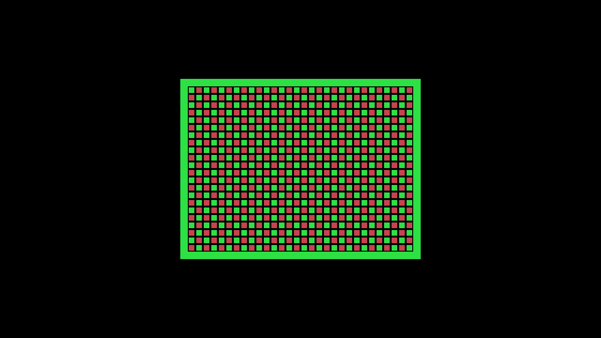
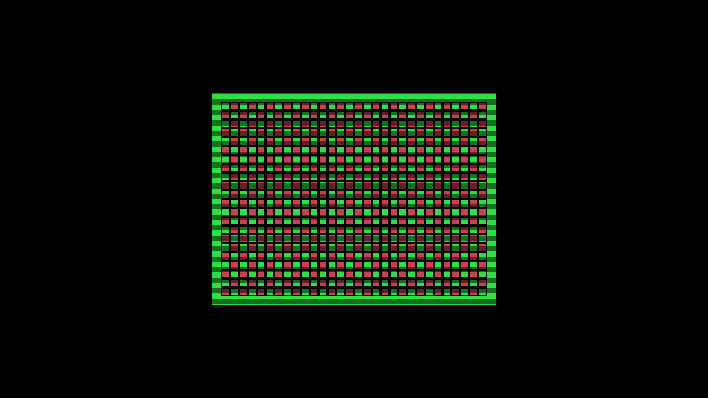

# Native factory video and SGM — Kit 2 validation, 2026-10-03

The corrected factory image from FES `6ed1dad4` passed the bounded Kit 2
diagnostic: normal catalog Install, six library launches with Direct/Scanlines
and optional SGM, preference and selection retention, Stop/relaunch, and
independent HDMI video/audio analysis. Partial-inventory checks also passed.
The operator then restored and verified the original baseline automatically.
This accepts the exact image and open diagnostic artifacts named below;
it does not establish retail-cartridge compatibility or acceptance of every
core in the image.

## Source and image identity

| Identity | Value |
| --- | --- |
| Selected executable/image source | `6ed1dad495b0c836b611e4e7b331c3a7d4801c63` |
| Original FPGA artifact source | `3ffe989fbba6857b74f149112d1965156face870` |
| Image SHA-256 | `3573ea1df11cf3235599ce69a85a540c7263f48219ad3a51083de3ceaf7e0496` |
| Image size | 134,217,728 bytes (128 MiB) |
| Release version | `0.2.0-dev.native-video-6ed1dad4` |
| Release manifest SHA-256 | `d48c5c00ccd105e73dd0396ad50d4c4da1416ec9604af7f3614669a1b9395241` |
| Coleco package ID | `936a14d37f178966868050a00005851d8619127425a08cc0cbd0dca59357961c` |
| Coleco BUILD_ID | `8d97fd1c36f5c79d08af074f972f96d0` |
| Video inventory SHA-256 | `2c5cacb765a1afd71837dbba0f6344473a3c35ac600325128b4a14f9fe82f66a` |

Both independent cold image passes produced the image above.
[Image verification](native-video-factory-kit2-2026-10-03/image-verification.json)
passed structural checks, reproducibility and QEMU packaging smoke. The
[release](native-video-factory-kit2-2026-10-03/release.json) and
[release evidence](native-video-factory-kit2-2026-10-03/release-evidence.json)
remain the original host receipts; subsequent hardware results are recorded
separately here. QEMU does not emulate the FPGA video/audio path.

The FPGA artifacts were reused unchanged from the
[original host proof](2026-10-03-native-video-factory-build.md), which records
their authenticated routes, clock/resource gates and four independent
Go/Python composition comparisons. The new
[source/cache binding](native-video-factory-kit2-2026-10-03/source-cache-binding.json)
checks 220 unchanged functional FPGA inputs and 27 unchanged cached files.
The [image binding](native-video-factory-kit2-2026-10-03/image-binding.json)
independently reads seven installed files from ext4: shell, video archives
and inventory bytes match the original proof. The selection metadata updates
`mister_packages_revision` while retaining the original FPGA provenance;
the release and installed-image receipts establish executable source identity.
It also binds the reused four-file local catalog publication. This was not a
new FPGA build or a newly generated catalog.

The factory inventory contains the exact-shell Direct and Scanlines parts.
SGM part `a49942b5e71765a3c04c1f7452a597e940952b81f4b4c3d95fc6e7e3f8af54bf`
was imported separately and selected for its diagnostic title. Its original
source remains `3ffe989f`. The later commit publishing this document is not
the source of either the tested executable image or those FPGA artifacts.

## Failed first launch and runtime correction

The first deployment used the original `3ffe989f` image
`4c2de9f3edb28d71fd920eee66157b94b56d9b2dd9cf7adfea92aabd1c8c2628`.
Package/part staging succeeded, but normal Play failed in `InspectCoreData`:
metadata inspection applied ordinary activation admission to the bare native
shell and rejected its missing mandatory video output before load dispatch.
That [attempt](native-video-factory-kit2-2026-10-03/history/3ffe989f/attempt-completion.json)
produced no successful native library capture. Its rollback
required a user power cycle; the operator subsequently verified baseline
image `e3600f2df010bbc455c69a231e44234bac0c02470d33b611d478ea1d244c0ff1`
at boot `faec4b24-5046-4dfa-a12c-b4de2dc39837`.
The cause of that initial warm-reboot stall remains undetermined.

Before that deployment, the user authorized removal of older backup images.
The leased operator [removed four unreferenced images and their manifests](native-video-factory-kit2-2026-10-03/history/3ffe989f/retired-image-removal.json),
reclaiming 448 MiB. Factory, known-good, previous and loop-referenced images
were preserved and their protected hashes rechecked.

The `6ed1dad4` correction permits the native shell during metadata inspection
through the runtime's private admission path. It retains package hash,
compatibility and core-data checks. Actual native activation still requires
a valid linked video part; public standalone admission and the final load
guard retain that requirement. The regression covers metadata inspection
without hardware mutation, invalid package inputs, incompatible retained data
and standalone rejection. The
[full runtime tests](native-video-factory-kit2-2026-10-03/runtime-tests.json)
and [parent checks](native-video-factory-kit2-2026-10-03/parent-checks.json)
passed at the corrected source. This fix changes no shared ABI, package
format, media/audio contract or durable-data wire format.

The corrected image installed and confirmed automatically, without another
manual recovery. [Installed-image verification](native-video-factory-kit2-2026-10-03/platform/candidate-installed.json)
binds boot `f8ebdbe9-27f1-4b3f-85da-8970ffb12ebe` to the image above,
the read-only loop-mounted root, matching live/on-disk agent and runtime
bytes, source `6ed1dad4`, and the exact installed video inventory.

## Normal library and capture results

The [library result](native-video-factory-kit2-2026-10-03/captures/result.json)
records automatic import of both catalog companions and six successful
normal Play/Stop cases. Their runtime package, composition, selected media
and generation tuples match the frozen expectations and original host proof.
Changing the saved video preference during generation 1 left that running
generation unchanged. A host restart retained the entry, profile and both
part mappings; the SGM restart also retained its per-title expansion
selection. Each stopped case returned to idle with a free lease.

| Case | Generation | Composition ID prefix | Settled frames |
| --- | ---: | --- | ---: |
| Direct | 1 | `bc7b88cb3cdf` | 178 |
| Scanlines | 2 | `16e5fb76c1f95` | 178 |
| Direct relaunch | 3 | `bc7b88cb3cdf` | 177 |
| Direct + SGM | 4 | `00a732e23a52` | 177 |
| Scanlines + SGM | 5 | `d04bb677f219` | 176 |
| Direct + SGM relaunch | 6 | `00a732e23a52` | 178 |

Full composition IDs and payload hashes are in the per-case receipts and
[original composition proof](native-video-factory-2026-10-03/build.json).
Library preference/selection retention here is host configuration persistence;
it does not establish saved game-state persistence.

The frozen open graphics ROM is SHA-256
`e9e63faa08c53de62c819b85ebf4d030bfbfb8015e33e127e1eb178a4daeb73d`.
The SGM variant is
`33705344c6ae221a8ec3b9c862996b6136b9c236052c9c6517e9926eeb2a5317`.
Its unchanged graphics body runs only after the memory-boundary sentinels,
console-RAM isolation checks and four AY register readbacks succeed.
[Fixture preparation](native-video-factory-kit2-2026-10-03/fixture/prepared.json)
and [frozen inputs](native-video-factory-kit2-2026-10-03/fixture/frozen.json)
bind those bytes. The probe does not test every SRAM address.

Independent analysis of the completed 4K Pro HDMI captures passed **79 of
79 checks**. The analyst used regular files and saved operator receipts,
without target, capture-device or network access. The
[compact receipt](native-video-factory-kit2-2026-10-03/analysis/independent-receipt.json)
and [full analysis](native-video-factory-kit2-2026-10-03/analysis/analysis.json)
record these bounds:

- Each case decoded 180 frames. After 16 total leading acquisition-black
  frames, all **1,064 settled frames** passed the full-viewport geometry and
  outer-background checks, with zero horizontal offset. The native 256×192
  picture is doubled into x `[384,896)`, y `[168,552)` within 1280×720 capture.
  Settled frame intervals were 16–17 ms and RGB variation was at most one
  level per channel. USB timestamps do not directly measure HS/VS timing.
- Direct and Direct+SGM reference pictures matched exactly. Both Direct
  relaunch references differed by at most one RGB level. Scanlines preserved
  the bright rows and dimmed alternate HDMI rows: one-pixel line height,
  border odd/even luma ratio `0.49145147`, and maximum half-brightness model
  error 2.5 RGB levels. The model rejects doubled native-row scanlines.
- Stereo 48 kHz audio was analyzed over 2.5–5.5 seconds of each capture.
  The SN tone measured **216.79144–216.79159 Hz** in all six cases; SGM's AY
  tone measured **440.42352–440.42362 Hz** in its three cases. Tone gates
  required error at most 0.5 Hz, SNR at least 20 dB and the declared minimum
  relative peak power. Non-SGM captures had no material AY peak at the
  1% relative-power threshold. This is not an electrical-silence claim.
  There were zero clipped settled samples; profile/relaunch changes varied
  RMS by less than 14 ppm within each expansion mode.

Capture conversion and filtering prevent bit-exact FPGA RGB/PCM claims.
The measured tones and bounded SGM probe establish diagnostic execution,
not general PSG accuracy or retail-game compatibility.

| Direct reference | Scanlines reference |
| --- | --- |
|  |  |

## Partial inventory and restoration

The [paired partial-inventory run](native-video-factory-kit2-2026-10-03/partial-paired/result.json)
passed. With no matching video output installed, Play returned HTTP 400
`BAD_REQUEST`, phase `request`, with target status unchanged. With only the
matching Direct part installed, a Scanlines preference resolved to that
linked Direct part (`builtin: false`); the observed composition matched
Direct, and Stop returned to idle with a free lease. These are normal library
launches through the host. They do not exercise corrupt selected archives
or a valid Scanlines-only inventory; those remain software-test cases.

The [partial-observation summary](native-video-factory-kit2-2026-10-03/partial-observation-summary.json)
retains two earlier harness failures separately from this result. The first
expected error phase `admission` although the actual response was `request`.
The second encountered unscoped host Health HTTP 503 and Stop HTTP 500 while
direct target observations still showed idle/free. The passing harness
paired its health/status observations to the fixed target UUID; it retained
the same ordinary missing-output and fallback launch operations. The
unscoped host failure is not claimed to be a diagnosed or fixed product bug.

The final [rollback](native-video-factory-kit2-2026-10-03/platform/rollback-completion.json)
completed successfully in 80.40 seconds at 17:16:53 UTC and confirmed the
original `e3600f2d…` baseline automatically. The
[restored-baseline verification](native-video-factory-kit2-2026-10-03/platform/restored-baseline.json)
records boot `00014b3b-4f54-4bae-94ef-af1aaf8de4a5`, baseline source
`23decdbeed37ec52e04e7250914aba9abe4b0da0`, matching disk/live executable
hashes, the read-only loop root backed by the baseline image, idle runtime
and a free kit lease. No second manual recovery was required.
[Host cleanup](native-video-factory-kit2-2026-10-03/platform/host-cleanup.json)
records no remaining temporary host processes and preservation of the
unrelated active/enabled service.

## Evidence and scope

The [host evidence index](native-video-factory-kit2-2026-10-03/evidence-index.json)
and [hardware evidence index](native-video-factory-kit2-2026-10-03/hardware-evidence-index.json)
bind published files to their original paths, sizes and hashes. Raw captured
AV is retained locally and hash-bound by the capture/analysis receipts;
the two reference PNGs above are published. The original `3ffe989f` build
proof remains unchanged and separately linked. Host byte-composition proof,
image verification/release, physical diagnostic observations and baseline
restoration are separate evidence.

At `6ed1dad4`, all 43 GitHub Actions jobs in the
[recorded CI run](https://github.com/DeanoC/fes/actions/runs/37135160662)
passed; the [CI summary](native-video-factory-kit2-2026-10-03/ci-summary.json)
records the external GitGuardian failure separately. The
[false-positive receipt](native-video-factory-kit2-2026-10-03/gitguardian-false-positive.json)
verifies that its flagged value is the public SHA-256 of the tracked
`image/scripts/scan-target-image-secrets.sh`, published in the earlier
image-input receipt. No evidence alteration, scan suppression or external
incident resolution was performed; the recorded disposition remains open.

This record covers this native Coleco package, its exact Direct/Scanlines
parts, the separately imported SGM and the named open ROMs on the corrected
image. It does not transfer acceptance to other cores, rebuilt FPGA parts,
later images, proprietary ROMs or arbitrary cartridges. Settings overlays,
CRT/DDR consumers, additional source-video standards and pluggable audio
remain later work.
Video+SGM compositions reuse separately routed parts; they were not jointly
placed and routed. Their timing proof and these physical observations have
the distinct scopes recorded above.
