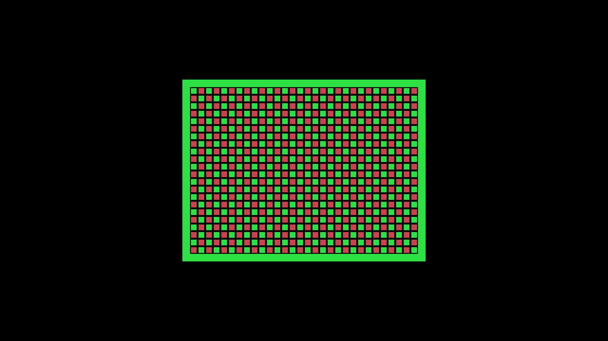
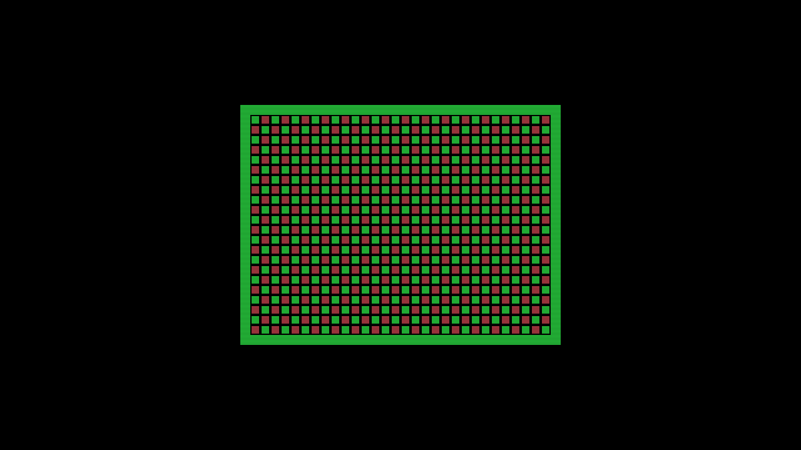

# Native-pixel video parts: sealed build and Kit 2 diagnostic, 2026-10-03

This record covers a Coleco developer shell whose linked Direct or Scanlines
part owns the framebuffer and 720p scanout. The system shell emits the
TMS9918's active 256×192 indexed pixels through the native fabric contract.
The factory catalog and household video selection still use the earlier raster
layout. This is an exact-artifact developer diagnostic, not appliance-image
acceptance or acceptance of every Coleco cartridge.

## Source and artifact identities

Development began at FES `6357a220dfc85eceeb9e29846c0bf55085dfcd08` after
the native contract and simulation work landed. The shell was sealed from
`2769b08e0478e6bac420495b58b23d4e93120ed2`. Final parts and the diagnostic
agent use `d82c0f92c2b3400d9e89a151271dda2da20c6151`; the unchanged diagnostic
runtime was built from `7dbce883142a40d13320fc5bcdd4cf9db086a145`.
The later integration merge brings in #404's standalone Z80 additions without
changing these historical artifact identities.

The sealed shell package is
`9884da6328b91f2e72e59ec350488ad348424e1b513294a5d19342bb52aac86e`,
BUILD_ID `c2cd6921235a9bfc238286aa3798382d`, with payload SHA-256
`a6d049cd75798019c815beb11555a1f922b2d1e7503a4c7128fbaa97a4dcf719`.
The [build receipt](native-video-parts-kit2-2026-10-03/build.json) binds package,
part archives, compositions, source revisions, tool identities and original
build-report hashes.

| Profile | Final part ID | Programmed payload SHA-256 | Bytes |
| --- | --- | --- | ---: |
| Direct | `797faa29ea0c7edeb78a2a85a760cf9dfeabda3e46f9c38fd83a168b502007cc` | `ba57ffe39b29475151eab0105381d17991866f19ba78af5bf9dc8f24856691de` | 2,790,496 |
| Scanlines | `af2dd566691ba53a6d9d61e152bc9c85935bdf2722e2e384f965f869f4f40168` | `4b7cf5c9c14222d3781bc2b9f9bf473a28b1c5866b1c00cdb923905260b1ae8a` | 2,787,049 |

Both profiles use `fes.coleco-native-video.parts/1`, socket map
`fes.coleco-native-video.socket/1` and the optional package marker
`fes.fabric.video.native-pixels` 1.0. The marker fixes the source geometry and
TMS9918 four-bit palette. It adds no runtime GP capability or wire operation.
An actual load requires the matching video part; the uncomposed shell has no
fallback HDMI framebuffer.

## Physical fit and composition

The shell has 171 M10Ks. Each part contributes 48 M10Ks for two complete frame
banks, within the 55 available RAM sites reserved at placement columns 5–38,
rows 23–38. The half-open CRAM fence is `(124,1800,3906,3442)`, disjoint from
the existing CPU socket `(1769,32,2806,1800)`.

| Final routed profile | COMB | FF | Total M10K | Pixel Fmax | System Fmax | Audio Fmax |
| --- | ---: | ---: | ---: | ---: | ---: | ---: |
| Direct | 5,561 | 1,720 | 219 | 90.253 MHz | 52.921 MHz | 157.282 MHz |
| Scanlines | 5,587 | 1,721 | 219 | 83.139 MHz | 52.921 MHz | 157.282 MHz |
| Required | — | — | — | 74.250 MHz | 52.224 MHz | 12.288 MHz |

Both authenticated HIP routes completed. Full decoded CRAM comparisons found
548,381 changed bits for Direct and 548,401 for Scanlines, all inside the
native fence, with unchanged ORAM/PRAM headers. The Go-composed payload,
Python preview and complete compiler-produced `cart.rbf` are byte-identical
for each profile.

The producer also proves that all 153/154 active part clock pins use the
imported pixel clock. A bounded netlist adaptation resolves transparent clock
aliases before the frozen importer consumes them: the pinned importer did not
reconnect an SDP RAM's second clock through the removed buffer. Original and
prepared netlist hashes are retained. RAM mode, data, initialization and
write-enable wiring are preserved.

## Corruption found by the first capture

The first linked artifacts passed simulation and matched the old target
linker's bytes, but full-frame capture analysis found corruption on 88 settled
frames in each run. Still image 120 was correct. Two bad frames followed by
two good frames exposed the fault as the displayed framebuffer bank changed.

The inherited whole-column checksum exclusion silently discarded four Direct
and eight Scanlines routing bits inside the new, wider fence. The authenticated
Mistral decoder identified lost routes from RAM read outputs `B1DATA[3]`,
`B1DATA[2]` and `B1DATA[4]`. Their logical framebuffer regions and forced-high
pixel bits exactly matched the captured corruption. These were real routing
muxes in a column historically excluded by the older socket policy.

Native composition now checks every decoded CRAM bit, copies every in-fence
change and rejects every outside change. It has no whole-column exceptions.
The producer additionally requires its preview to preserve the entire routed
CRAM. Regression tests retain the exact lost bits, reject outside writes even
in formerly excluded columns, and prove the older raster/CPU payload behavior
is unchanged. The [failed-attempt record](native-video-parts-kit2-2026-10-03/prior-failure.json)
and [decoder diagnosis](native-video-parts-kit2-2026-10-03/strict-overlay-cause.json)
remain available alongside the corrected results.

## Software and simulation

The physical socket/cart simulation checks 3,712,500 exact HDMI cycles for each
profile. The real-VDP simulation checks 360,544 indexed pixels, three full HDMI
frames and 442,331 CDC tokens, including fractional 12/13-cycle source spacing
and HOLD recovery. Legacy, inline-native and socket-native board elaboration
passed. These RTL sources are unchanged by the composition fix.

The [software receipt](native-video-parts-kit2-2026-10-03/software-tests.json)
distinguishes the earlier broad suites from focused checks after the fix:
parent tests completed 647 cases with 39 skips; full runtime and FogCast suites
passed. The strict fix passed the full Go expansion suite, focused FogCast
admission/recomposition tests, 30 producer tests and 14 codec regressions.
Integration with the updated #404 base passed 43 planner/CI tests and parent
consistency checks for 17 generated consumers and 33 fixture copies.

## Kit 2 execution and capture

The operator used only Kit 2, target
`67c5f4e2-d288-49bb-9049-39ecf39cf6f6`, and its ASUS 4KPRO. Its existing image
`5af410626ae3c241b2d30009d6c9f384dc44c2be3ffaf2388d53beec31fe775f` remained
installed throughout; boot ID stayed `aaf0cc16-b03c-4b92-8252-b7cf141ddee0`.
Temporary diagnostic executables were installed and removed only after
verifying ready, idle and an unowned kit. The existing agent lease covered
all FPGA loads, media delivery, captures and Stops.

The vacant shell inspected successfully but an ordinary load returned
HTTP 422 `UNSUPPORTED_OPERATION` with unchanged idle status. Host runtime
tests separately establish that this rejection occurs before programming.
Each linked inspection left the board idle. Direct, Scanlines and Direct
relaunch then activated generations 1, 2 and 3 with the exact expected
package/BUILD_ID/ABI/composition/payload identities and volatile persistence.
The generated 1,086-byte graphics/SN cartridge was streamed against that
package and generation. Every Stop returned idle and retained the operator's
lease; final release returned it to free.

The [hardware result](native-video-parts-kit2-2026-10-03/hardware-result.json)
and [capture verdict](native-video-parts-kit2-2026-10-03/capture-verdict.json)
bind the final run. Each case contains 180 lossless 1280×720/60 frames and
approximately six seconds of stereo 48 kHz PCM. The independent analyzer uses
the unchanged generated-ROM oracle at 2× scale, viewport x384:896/y168:552,
with zero horizontal offset. Full metrics are in
[capture analysis](native-video-parts-kit2-2026-10-03/capture-analysis.json).

All **30/30 gates passed** with the analyzer unchanged from the failed run.
All 540 frames were examined: each capture had three leading acquisition-black
frames followed by 177 settled frames, with zero geometry or outer-background
errors and at most one RGB level of settled variation per channel. Direct and
relaunch reference images and settled image sets were identical. Scanlines'
bright rows matched Direct exactly; dim rows followed the alternating HDMI-row
half-brightness model with mean error at most 1.052 RGB levels per channel.

The settled SN tone measured 216.79147–216.79155 Hz against the fixture's
216.78446 Hz nominal value. It remained present in every settled second, with
no clipping, stereo correlation above 0.999999998 and less than 0.000238%
cross-profile RMS variation. [Capture file identities](native-video-parts-kit2-2026-10-03/capture-files.json)
bind original lossless video/PCM and public still/audio artifacts;
[diagnostic sources](native-video-parts-kit2-2026-10-03/diagnostic-sources.json)
bind the runner, fixture provenance, unchanged analyzer and its controls.

## Restoration and limits

[Platform verification](native-video-parts-kit2-2026-10-03/platform.json)
records restoration of the original live and on-disk agent SHA-256
`8d0622d08b8f79e35c940e0de6051fa94f4154dd335854a0a0d340b3aff00430` and runtime
`3de558d3a21a12052321472fb8096970b6c42e15516920c2ec60130c0e197310`.
The original read-only image root, image-file digest and boot identity matched;
the board was ready/idle and the lease free. Temporary mounts and staging
files were absent, and both capture-device handles and ALSA input were closed.
No image update, reboot or host-service change was performed.

USB capture timestamps and color/audio conversion do not establish bit-exact
FPGA RGB or PCM values. The named native artifacts were exercised with one
open diagnostic cartridge and no CPU expansion. SGM operation on this native
shell, normal library/factory selection, additional geometries, CRT/DDR
processing and interchangeable audio parts require their own work and
acceptance. The next integration step is native-profile selection through the
existing factory and household settings flow, with fresh selected-artifact
validation.
