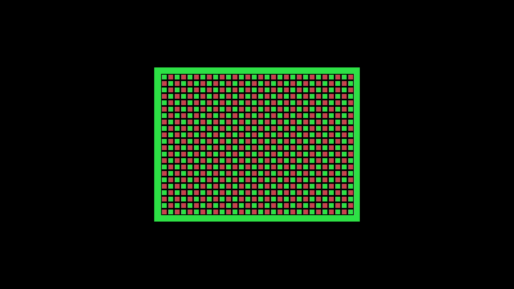
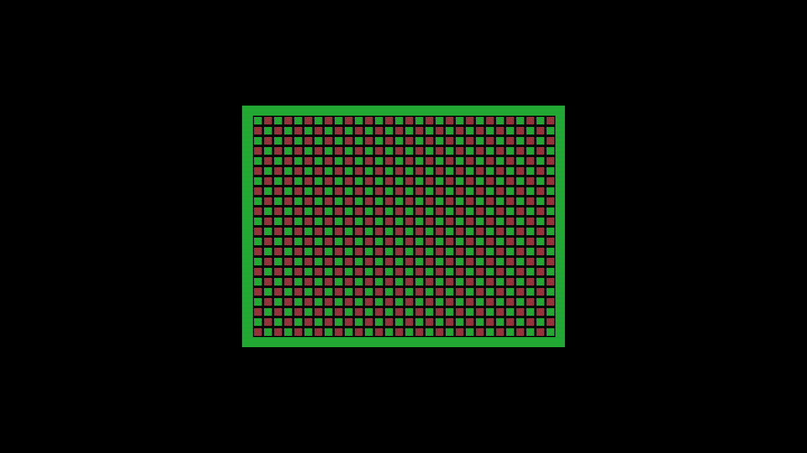

# Factory Coleco video parts — Kit 2 validation

The factory Coleco shell and direct/scanlines companions passed software admission, two independent 128 MiB rootfs assemblies, structural verification, QEMU packaging smoke and release export on 2026-10-03. Seeded incremental assembly produced the same image; its subsequent warm repeat reused the checked output. The exact appliance passed the Kit 2 catalog/library diagnostic and independent analysis of three fresh video/audio captures. Final observations confirmed restoration to the original image after an initially unconfirmed rollback command.

## Source and bounded implementation

The phase base is `576cdbc7046eee25803d6063487554c2cb01cc99`. Image, agent and runtime sources are the clean tested commit `2ce9047f8a9e91900ac46e6b961e054370b55855`. The implementation/CI result commit `1c328b285b11407ca1c70d9439a13d0f293be09a` changes only `.github/workflows/check.yml` relative to that image source, raising the existing host race-suite timeout to 20 minutes. A later main merge preserved all tested production source and recipe bytes. The artifact receipts retain their actual `2ce9047f8a` identity; the tested CI commit records the earlier CI run rather than the current branch head.

FES selects the Coleco CPU/video shell and both sealed video assets, binds their exact source/tool/recipe/build-summary/CRAM evidence and publishes them through the existing package generation transaction. The image retains the original producer tar bytes in `/usr/share/mister-runtime/core-video-parts`, with the matching selection record under `selections/`. Canonical core-package shape remains unchanged. Marked factory shells require the complete companion pair; catalog Install validates all declared parts before importing them and preserves conflicting existing profile mappings. A cached base-only or partial installation remains installable until its exact shell/profile/part tuples match.

Warm preparation validates any retained RAM Tester package and installed selection through the existing sealed package verifier, checks its exact license/source notice, and rejects parent symlinks. Only that verified `SOURCE.md` passes the generic Markdown ban. Selected agent, kit and tenfoot replace retained binaries before the unchanged secret scan; post-build then refreshes packages/notices. Existing library persistence/media/lifecycle and volatile developer-load behavior are retained.

## Exact FPGA and companion identities

| Item | Identity |
| --- | --- |
| Coleco shell package | `6f4c219db7927b6a93b9e95055f7689f19087e919aba45b3b09a7d067d04fdb1` |
| Shell BUILD_ID | `1c095e79e992327d4a8e09187ec2fb1d` |
| Shell RBF SHA-256 | `df4c26b17e916a7b3db86fb831d2f2a828938dbb1d6f33b818922a2fa5850d27` |
| Video index SHA-256 | `f01ef1cfce3203355af3469300eefa4cbdb4c27780a32e951b6d0ad7d2164247` |

| Profile | Part ID | Producer tar SHA-256 |
| --- | --- | --- |
| direct | `e53eb3b4dace0a51924de46908fb321eaa65b4465c824a68267183e5ea46a2b4` | `79d1742fadbe9c0bc4c04cf80693b158ffc0d7f5e768144277d1939ccc7e1fb8` |
| scanlines | `e9b6a7a75c972cb58857d33f91aac82529b7ab012b3b9c66abbd328acfad0382` | `70c95e146ec934241ce576454bf4190a7ffd8de8cc18a46ad38e4527df4f3c02` |

Each tar is 2,846,720 bytes; the canonical index is 834 bytes. The original shell and part producer revision is `576cdbc7046eee25803d6063487554c2cb01cc99`. The [selected package provenance](video-factory-kit2-2026-10-03/core-package-provenance.json) records current selection at `2ce9047f8a` separately from that producing revision and its original build record. [Part inputs](video-factory-kit2-2026-10-03/parts-inputs.json) preserve recipe, build-summary and containment-report hashes. [The index](video-factory-kit2-2026-10-03/factory-video-index.json) binds the exact shell, profiles, archives and sizes.

Exact-shell linking and admission remain the resource-fit authority. This factory lane covers the current Coleco fixed-720p60 pixel socket and direct/scanlines profiles, with the existing stereo s16 48 kHz PCM path. It adds no generic LUT-budget admission, DDR/CRT/variable-resolution output, interchangeable audio processor, operational capability bit or coordinator. Existing builtin-direct fallback remains available for manually imported marked packages outside strict factory publication.

## Cold image, incremental reuse and release

| Item | Identity or result |
| --- | --- |
| Rootfs SHA-256, both cold passes and seeded dev | `b2b38270ee4a548bd139341af56f3c3f72ff6f933cf440f549a1527f5f5be5dd` |
| Rootfs size | 134,217,728 bytes, 128 MiB |
| Release version | `0.2.0-dev.video-factory.1` |
| Release manifest SHA-256 | `b8f385479541b01ea1d73c0e1fd80a34ad3ce505ebcf518160195719eff205c4` |
| Locked kernel SHA-256 | `a6c7b1be0da9ba24a91bc1816737915d6a6cfba27c6c3025caded95167dc8dae` |
| Cold structural / two-pass reproducibility | pass / pass |
| QEMU packaging smoke | pass, vexpress-a9 |
| Subsequent warm development repeat | checked output cache hit |

The image contains five selected packages (menu, Pong, ZX81, Coleco and RAM Tester) and both video archives. Cold and seeded development manifests retain identical internal/external video index hashes. QEMU reached the read-only-root, writable volatile-tmpfs and ready markers; init/service packaging validation passed. QEMU does not emulate the MiSTer FPGA or establish physical video/audio output.

The [image verification summary](video-factory-kit2-2026-10-03/image-verification.json) binds both pass hashes, source selections, package inventory, incremental diagnostics, QEMU/log hashes and the [original closed image receipt](video-factory-kit2-2026-10-03/image-receipt.json). [Release metadata](video-factory-kit2-2026-10-03/release.json) and [release evidence](video-factory-kit2-2026-10-03/release-evidence.json) retain `hardware: not-run`; that describes assembly evidence independently of later physical acceptance. The immutable release is retained locally under `out/native-integration-dev/appliance/releases/<image-sha>/<manifest-sha>/`.

One preexisting fingerprint detail is recorded explicitly: `inputs.json` includes an incidental host `ramtest-notices.cpython-313.pyc` cache hash. All 48 tracked recipe hashes match Git `2ce9047f8a`; the selected builder uses Python 3.11.2 with `cpython-311` and incompatible bytecode magic, and neither rootfs manifest contains Python bytecode. The unused entry remains in the original receipt/fingerprint; metadata is not relabeled as entirely Git-tracked. The [public input receipt](video-factory-kit2-2026-10-03/inputs-receipt.json) represents `image_recipe` as explicit path/SHA-256 rows; all 49 identities round-trip exactly to the original map. The verification summary binds the normalized public file and the unchanged original input receipt separately and preserves the incidental-bytecode qualification. No immutable receipt or image fingerprint was altered.

## Software and CI validation

The [software receipt](video-factory-kit2-2026-10-03/software-tests.json) records each source and log hash. The full parent suite at `eca740ab7` passed 639 tests including 38 cases delegated to pinned bootstrap/card/media drivers; the locked U-Boot derivation ran successfully. Complete image software and platform suites passed. Later focused checks passed the inventory correction, 13 notice tests, the expanded cold/warm preparation fixture and the complete isolated image suite for the final warm-fix bytes. An independent reviewer repeated the notice/rootfs checks and found no remaining blocker.

The latest UI bytes passed 344 JavaScript and 58 Chrome 154/CDP tests; the required-browser repeat passed all 58 with zero failures or skips. Parent consistency passed 16 generated consumers and 33 fixture copies. [CI run 37061383283](https://github.com/DeanoC/fes/actions/runs/37061383283) passed all 42 jobs/gates with no skipped jobs for branch head `1c328b285b11407ca1c70d9439a13d0f293be09a`, tested merge `dd87263d9b43d4f2ddb3a74c4df0abf910d32eae`. Those jobs include planning/setup/gating and software/simulation lanes; they do not establish FPGA synthesis or hardware acceptance. Full host race testing passed, including catalog at 564.148 seconds and fogcast at 600.872 seconds. Earlier 10-minute timeouts had no assertion/race failure and also occurred on the base; the CI-only timeout correction preserves tests, race instrumentation and concurrency.

## Exact appliance Kit 2 diagnostic

The sole operator used the existing target lease on Kit 2, target ID `67c5f4e2-d288-49bb-9049-39ecf39cf6f6`, with its ASUS 4KPRO HDMI capture attached. The original image was `f449886fc026dbf678e7ab22ac14dd6d54c924485658e1015835f8fd3c9a127e`, boot `da6bd708-6c4a-45ca-b600-d58a94d72b27`, revision `d7e13eaa01c062f924a7a287c03261f6021b671e`, healthy idle and lease free. The existing network update installed and confirmed the exact `b2b38270…` release, boot `d89dc3a2-e73f-4c67-8c86-789a970bc67b`, with no pending/trial/corrupt update state. The running root was the matching image mounted read-only through `/dev/loop0`.

Actual disk and live executable hashes agreed; health and all installed component selections reported `2ce9047f8a`. The installed video index and both archives matched the identities above, and their index/archive/selection files were read-only. [Platform observations](video-factory-kit2-2026-10-03/hardware-platform.json) retain the pre-update, installed and post-run observations with their original receipt hashes; [update confirmation](video-factory-kit2-2026-10-03/hardware-update-result.json) records the confirmed image and original previous image.

| Live/disk executable | SHA-256 on tested image |
| --- | --- |
| mister-agent | `5cc13278b86ac0b16c905e42d902039a0cd5d341ee4ae80ec6647318b175d4be` |
| mister-runtime | `7bea4ac89ee79a2b9631daa96284dec55df14af93f42ff22dde0b660eb034412` |

The task-local loopback driver opened the selected production FogCast service and host routes. Ordinary catalog Install automatically imported both companion mappings into a fresh host catalog. Repeating Install retained the mappings and entry/media without programming the FPGA. A generated, BIOS-free graphics cartridge with an appended constant SN tone used normal library media attachment and Play. Changing the preferred profile during generation 2 left the active tuple unchanged; after Stop, the next Play selected scanlines. Restarting the host preserved both mappings, the entry/media and the scanlines preference. Selecting direct again produced generation 4 with the original direct composition. Each normal Stop returned physical idle and a free lease. [The operator result](video-factory-kit2-2026-10-03/hardware-result.json), [installed mappings](video-factory-kit2-2026-10-03/hardware-installed.json), [active preference check](video-factory-kit2-2026-10-03/active-preference-preserved.json) and [restart observation](video-factory-kit2-2026-10-03/restart-persistence.json) retain these checks.

| Case | Generation | Composition ID | Programmed payload SHA-256 |
| --- | --- | --- | --- |
| [direct](video-factory-kit2-2026-10-03/direct.json) | 2 | `0d268a60f937274f0210932aa8d23c2d8c6f08ba240ca35e8e6723142a723c05` | `85b87829a3681c7e2a74d63bbaf9edfe2aa37d677d5891fa345c68a153832cf8` |
| [scanlines](video-factory-kit2-2026-10-03/scanlines.json) | 3 | `ad26bfe9cb372aa3c45c67499b884fac1c895e694f7977cd3fa143d1b38043a1` | `dccdf4b4999db0b96a2fcfa0773408da2d720e2ec4e7b1836b3732378b5ef9cc` |
| [direct relaunch](video-factory-kit2-2026-10-03/direct-relaunch.json) | 4 | `0d268a60f937274f0210932aa8d23c2d8c6f08ba240ca35e8e6723142a723c05` | `85b87829a3681c7e2a74d63bbaf9edfe2aa37d677d5891fa345c68a153832cf8` |

Host launch and runtime status matched the complete expected package/BUILD_ID/ABI/generation/composition/programmed-byte tuple. Each composition contained exactly the selected video part, with no CPU/SGM asset. Direct and scanlines payload sizes were 2,834,242 and 2,834,949 bytes respectively. The current Coleco descriptor reports `persistence_mode: volatile`; host mappings, media and preferences surviving restart do not establish game-save persistence. Firmware-less media delivery used the existing blob stream with 512-byte chunks and a 32 KiB limit.

An earlier direct launch at generation 1 stopped because the diagnostic runner incorrectly required `Health.ready` during an active session. That flag admits a new load from physical idle, so a healthy active session normally reports false. Only the task-local runner was corrected; five offline runner tests and syntax checks passed. The preliminary run was stopped/released and excluded from the three-case capture verdict. [The correction receipt](video-factory-kit2-2026-10-03/runner-observation-fix.json) preserves the diagnosis and source/log hashes; no production change was made for this observation.

## Fresh capture and independent analysis

Each case captured 180 frames at 1280×720/60 through YUYV422 into lossless FFV1, plus approximately six seconds of stereo s16 PCM at 48 kHz. The analyzer read only existing local files and accessed no kit, SSH, programmer or capture device. All **27 gates passed** in [the independent verdict](video-factory-kit2-2026-10-03/capture-verdict.json); [full metrics](video-factory-kit2-2026-10-03/capture-analysis.json) preserve per-frame and audio measurements.

All 540 decoded frames were examined. After 3/3/2 leading acquisition-black frames, all 532 settled frames retained the 256×192 native raster at 2× scale in the exclusive viewport x384:896/y168:552, with settled RGB differences at most one level per channel and zero outer-black deviation. Settled capture intervals were 16/17 ms; each capture had one 50 ms acquisition-boundary interval. Direct and direct-relaunch reference pictures were identical. Scanlines darkened alternating HDMI rows, so each doubled native line had one bright and one dim row. Bright rows matched direct exactly; dim rows matched half brightness with mean absolute error 0.70–1.01 RGB levels and maximum 2.5, with border luma ratio 0.49145. This is a period-two HDMI-row effect, not a period-four doubled-native-line effect.

The common settled audio window was 2.5–5.5 seconds. The SN tone measured approximately 216.791 Hz in both channels for every case (fixture nominal 216.784 Hz), with no settled clipping and a tone present in every settled second. Across profiles, AC RMS changed by less than three parts per million; stereo correlation exceeded 0.999999998 and tone peak-bin power exceeded median FFT-bin power by more than 83.65 dB. Public [direct](video-factory-kit2-2026-10-03/direct.flac), [scanlines](video-factory-kit2-2026-10-03/scanlines.flac) and [relaunch](video-factory-kit2-2026-10-03/direct-relaunch.flac) audio files are lossless FLAC copies whose decoded s16 samples were checked identical to the original WAV captures. [Capture file identities](video-factory-kit2-2026-10-03/capture-files.json) bind the original FFV1/WAV/PNG hashes, public FLAC hashes and decoded PCM hashes.

USB timestamps do not directly measure FPGA HS/VS, and capture color conversion/audio filtering prevent bit-exact FPGA RGB/PCM claims. The full-pixel oracle includes the shell framebuffer's existing one-HDMI-pixel read latency. These cases establish the exact factory image, Coleco shell and selected direct/scanlines profiles with this generated cartridge; they do not validate SGM, unrelated games, interchangeable audio processing or additional video standards.

[Diagnostic sources](video-factory-kit2-2026-10-03/diagnostic-sources.json) bind exact public text copies of the driver, corrected runner/tests, capture commands, fixture generator/adapter and independent analyzer. [The fixture receipt](video-factory-kit2-2026-10-03/fixture.json) records the 1,086-byte generated cartridge SHA-256 `e9e63faa08c53de62c819b85ebf4d030bfbfb8015e33e127e1eb178a4daeb73d`; its MIT generator/derivative license is retained. The raw FFV1/WAV captures, full operator logs and private host state remain under ignored `out/`. Public receipts exclude credentials, card configuration and executable appliance images.

## Final restoration

All three runs finished with Stop, physical idle and a free lease on the tested image. The first rollback command exited 1 with an unconfirmed outcome at its six-minute deadline. Approximately twelve minutes later the target answered ping, while SSH and agent ports refused connections; no UART was attached. The operator requested one user power cycle, whose completion has not been explicitly acknowledged by the user. The cause of the initial unavailable services is unestablished and no watchdog fallback was observed.

Services subsequently returned on the original `f449886fc026dbf678e7ab22ac14dd6d54c924485658e1015835f8fd3c9a127e` image, boot `453e9b34-454e-409d-b523-d1db9b5dd716`, in a protected trial. After verifying that exact boot/image and physical idle, the operator used the existing `ConfirmAppliance` API with a fresh kit lease and closed the lease. [The confirmation](video-factory-kit2-2026-10-03/rollback-confirmed.json) and [stable update status](video-factory-kit2-2026-10-03/restored-update-status.json) record good=original image, previous=tested image, trial=false, no pending/corrupt state and raw idle ready.

Fresh [full platform verification](video-factory-kit2-2026-10-03/hardware-platform.json) matched the restored read-only loop root, original agent live/disk SHA-256 `2de33b804ccd03c7bbb695cf3fc460d7277e31bded24f2cacb9c59b965d89699`, original runtime SHA-256 `a6c24668d3e98ab067f0835371733ab895905919ba630e60c409cd3c678b50a2`, revision `d7e13eaa01c062f924a7a287c03261f6021b671e`, health ready, physical idle and lease free. Final restoration therefore **passed**, while the first command's outcome and the cause of the interim outage remain qualified. [The publication receipt](video-factory-kit2-2026-10-03/hardware-publication.json) retains both observations and their source hashes; the exact task-local confirmation helper is included in the diagnostic-source manifest.

[Final operator cleanup](video-factory-kit2-2026-10-03/operator-cleanup.json) confirmed no capture handles, closed capture ALSA input and a closed task host listener, with the existing user service still active/enabled. [Retained release checks](video-factory-kit2-2026-10-03/restored-retained-releases.json) confirmed that factory, original good and tested previous image files remained present and recorded the mounted bootstrap's init SHA-256; no garbage collection was performed. Its boot-time ticket records the initial protected trial; the live stable status above records its later confirmation.
