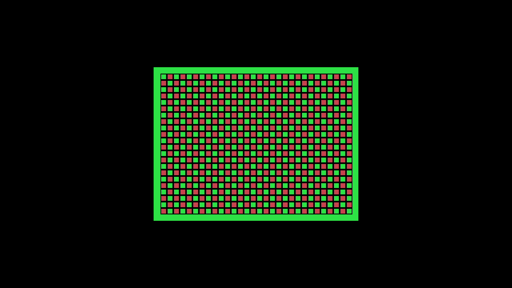
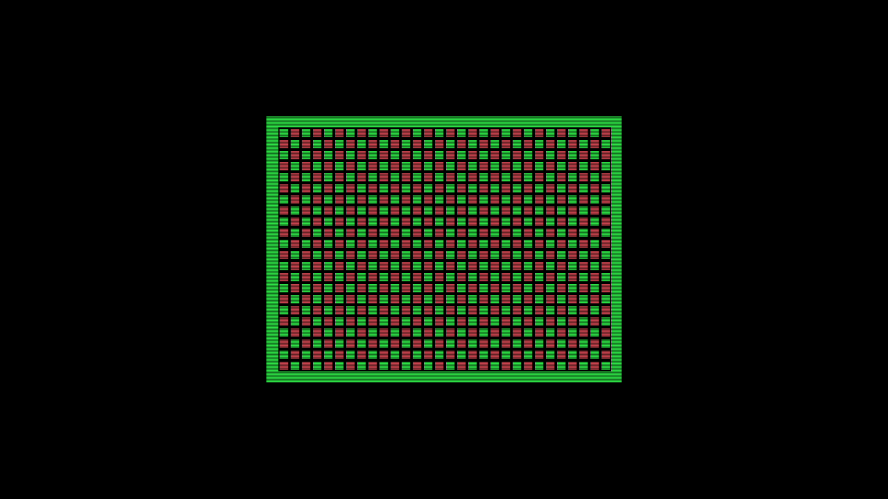

# Factory Coleco video parts — Kit B acceptance

On 2026-10-03, the exact `de32b3d083e98ba7f387ec16da1204cdd05f4284` native-integration-dev image passed the Kit B Coleco factory diagnostic and HDMI capture analysis. Kit B is the same physical target called Kit 2 in the earlier record. This acceptance applies to the generated cartridge and Coleco Direct/Scanlines only.

## Image and core identities

| Item | Identity or result |
| --- | --- |
| Build | Powerboat `0.2.0-pr404-de32b3d0.1`, profile `native-integration-dev` |
| Selected packages | menu, Pong, ZX81, Coleco, SMS, SG-1000, Spectrum, RAM Tester; all rebuilt from `de32b3d0` |
| Build checks | `make check`, `make build`, `make verify` and `make release` passed; two-pass reproducibility, structural checks and QEMU smoke passed |
| Rootfs/image SHA-256 | `cbb6d172f7ef28af8d435861b4a4356888c4a21b735a09d92144ae8c39769a27` |
| Release manifest directory | `b3e98f0e61aafa1e2943230cc302bdfb1cfb2539c0e200f970692f1c0f011dbc` |
| Rootfs capacity | 105,237,504 B (78.41% of 128 MiB; below the 85% guard of 114,085,068 B) |
| Coleco package / BUILD_ID | `e8fb0875292643d05cd500c461a51afa59ae839e085c5ff5d1f28629d4578772` / `9cf92c6e6f791c854aad2d448df79871` |
| Coleco RBF SHA-256 | `0c88c70b842d93c40a8a240254ca7f68b2193434f72da7ed7a3c871f00776199` |
| Coleco timing | system 53.46 MHz (52.22 constraint), pixel 76.95 (74.25), audio 177.68 (12.288) |
| On-kit video index SHA-256 | `8e32a3b9584d944862265c534c57f4dd4c3c035f39f8de303ae25a20333eae73` |
| SG-1000 timing | system 52.99 MHz vs 52.22; package rebuilt at this head via the #446 seed ladder |

The selected Coleco part mapping in [`installed.json`](video-factory-kitb-2026-10-03-de32b3d0/installed.json) is:

| Profile | Part ID | Producer tar |
| --- | --- | --- |
| direct | `f94d25ec0ee2b054f468b23e34541d391e57c8ccbdc7eb91d3eda9172ebf9849` | `f94d25ec0ee2b054f468b23e34541d391e57c8ccbdc7eb91d3eda9172ebf9849.tar` |
| scanlines | `fb604d99dfea254a3472c841c64176b53d1d31b6f86b956bf2069c94115231e7` | `fb604d99dfea254a3472c841c64176b53d1d31b6f86b956bf2069c94115231e7.tar` |

## Kit diagnostic and captures

The target was `67c5f4e2-d288-49bb-9049-39ecf39cf6f6` (192.168.10.85) with ASUS 4KPRO capture. Before the update a fail-closed lease claim succeeded and was released at once; `fes-update` and the host sessions then took their own kit leases. `fes-update` installed and confirmed the exact image; the running root was read-only `/dev/loop0`, and installed `core-packages` contained the Coleco package above. See the [update log](video-factory-kitb-2026-10-03-de32b3d0/kitb-update.log), [initial idle](video-factory-kitb-2026-10-03-de32b3d0/initial-idle.json), and [installed inventory](video-factory-kitb-2026-10-03-de32b3d0/installed.json).

The published diagnostic harness was byte-identical to the Kit 2 harness, rebuilt against `de32b3d0` sources with a fresh catalog publication and empty private host state. Catalog Install auto-imported both parts; repeating Install was unchanged. Preference changes applied on the next launch, persisted with mappings and entry across host restart, and left the active FPGA unchanged. Every Stop returned idle with a free lease. The [operator result](video-factory-kitb-2026-10-03-de32b3d0/result.json) records:

| Case | Generation | Composition ID |
| --- | ---: | --- |
| direct | 1 | `b1e21c41441ffe33622b4cef7ebad9d3c1c9cc042ccb966d1a1db99843fc0039` |
| scanlines | 2 | `3065c00bc73b197af68530964edd6b92d26df7d2d09860e5349f9a4661247058` |
| direct relaunch | 3 | `b1e21c41441ffe33622b4cef7ebad9d3c1c9cc042ccb966d1a1db99843fc0039` |

Each case captured 180 frames at 1280×720/60 and six seconds of stereo 48 kHz audio. The independent [capture analysis](video-factory-kitb-2026-10-03-de32b3d0/capture-analysis.json) reports all 27 checks passing. Leading acquisition-black frames were 2/2/3, with no later bad frames; settled-frame mean luma was approximately 31.7 direct and 27.7 scanlines. The frames below are frame 120.

QEMU smoke checks packaging and does not emulate FPGA behavior. HDMI capture and its color/audio conversions do not provide bit-exact FPGA RGB/PCM evidence. These results validate this generated cartridge on the named Coleco image with Direct and Scanlines; they do not establish behavior for other cartridges, SGM, other cores or video standards. Raw FFV1/WAV captures and host logs remain private on the build host.

## Restoration

Kit B was then updated back to its prior image `7d9614c745ec3569119ddfff318c68c470ac2f0d9aee4850475b8a8372bc2eb7` through the same `fes-update` path. The new boot was `e53ba752-1ab1-4485-9866-c8644cfdb5cf`, it was confirmed with trial=false, previous=`cbb6d172…`, and there was no pending or corrupt state. Afterwards health reported agent revision `7d90519a`, the target was physically idle and the lease was free. See the [rollback log](video-factory-kitb-2026-10-03-de32b3d0/kitb-rollback.log). There was no power cycle, no SD reflash and no boot-configuration write.
