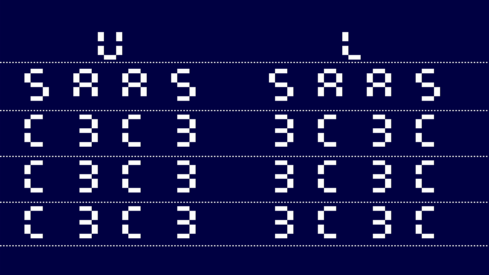
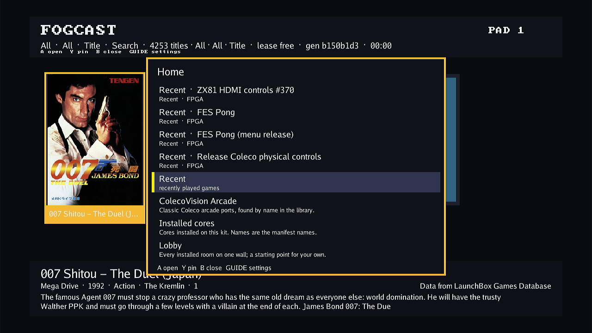

# Atari ST mouse, writable disks and video parts, 2026-10-04

This is the historical selection. The [October 6 bring-up](2026-10-06-atari-st-bringup.md)
records passing physical memory on the corrected shared-pin shell; nextpnr #125
is closed following FES #514. The results below retain their original artifacts.

The writable ST shell and both video companions are sealed, and the
software and guest simulations described below pass. The new sealed shell
still fails physical upper-byte preservation with RED03. The cause remains
under investigation; physical mouse, durable-disk and video-part acceptance
is blocked by this memory fault.

This phase develops `codex/atari-st-interaction` from FES
`7953bf0f0b382bc797e2beb50696f890eaa3b90a`. Native artifacts select
`517a285c089153dc3701fd02dd366c0286a3efd2`; the subsequent
`6fd86ac7de5d8bdd67b51913dd9a04cdcd3a724b` changes only the daemon descriptor
test. `27935bba0` clears inherited Make flags for the video-part producer; it
does not change the FPGA functional inputs. Earlier runs keep their original
source identities. The compact
[evidence record](2026-10-04-atari-st-interaction/evidence.json) binds their
results, source and artifact hashes without publishing private device data or
ROM bytes. This extends the package-only ST work recorded in the
[motherboard integration](2026-10-03-atari-st-integration.md) and
[nextpnr head qualification](2026-10-04-atari-st-nextpnr-head.md).

## Resulting behavior and shared contracts

The existing `fes.computer` 1.0 framing remains in use. The shared
[computer contract](../../sources/mister-packages/docs/computer-io.md) adds
`fes.mouse.relative` 1.0 at capability bit 8 and
`fes.media.atari-st-floppy-write` 1.0 at bit 9. The write extension requires
the base ST floppy interface and its exact 737,280-byte unit-0 geometry.
Generated C++, Go and Verilog consumers and their golden fixtures change
together.

Mouse opcode 11 delivers one signed 8-bit movement packet and a complete
two-button state. Runtime and FogCast split larger deltas into bounded packets,
preserve their sum, and do not replay ambiguous movement. IKBD accepts these
events alongside the existing keyboard and controller paths. A confirmed Busy
rejection may reconcile the latest button state later with zero motion; it
does not retain relative motion. The reconciliation is generation-bound and
cancels on unbind, source closure or ambiguous transport failure.

WD1772 sector writes gather a complete 512-byte sector from ST RAM before
publishing it to the separate disk buffer. Accepted publication drains through
warm reset or force interrupt. Begin and Eject reject while collection or
publication is busy, including volatile disks. The runtime preserves an old
disk after a completed first-Begin rejection: it does not issue a cleanup
Eject that could remove the disk as soon as the guest writer becomes idle.

Snapshot opcodes 12–15 provide Info, Control, Chunk and Data. Freeze fences
new writers and acknowledges after accepted work drains; it does not hold
the CPU. Ordered chunks return the complete frozen image through physical
byte reads, with at most 512 bytes per chunk. Info carries layout
`fes.atari-st-floppy.image` 1.0, flags and a wrapping change epoch. Saved
clears dirty state and authorizes destruction only after successful durable
publication; Resume explicitly releases the same generation's fence.

Library inserts bind the core, game, unit and immutable base-image digest.
Raw development inserts remain volatile. The runtime stores the complete
image using the shared [media-data envelope](../../sources/mister-packages/docs/media-data.md),
namespace lock, revision comparison, complete temporary-file write, file sync,
atomic rename and directory sync. Imported library media remain immutable.
A failed save retains disk RAM and ownership. If directory sync fails after
rename, exact re-read comparison reconciles the visible revision while still
reporting failure and withholding Saved. Ambiguous replacement or ejection
refreshes live state; an unconfirmed retained image requires recovery instead
of destructive idle programming. Bound-disk input faults capture before idle
retirement and retain RAM if capture or publication fails.

The host exposes explicit library insert/save/eject operations. Save-backed
Eject and Stop allow 135 seconds locally and a 150-second HTTP envelope;
replacement of a bound disk allows 405/450 seconds, including retained-image
verification after ambiguity. Ordinary Stop keeps its existing request shape
and performs no new preflight GET. Completed observations select the save
budget, and mutation completion prevents an older poll from restoring stale
budget state. Native core-load staging has a configurable 180-second default
bound. These operations do not retry a destructive mutation.

ST video composition uses `fes.atari-st-video.parts/1` with independently
produced Direct and Scanlines archives bound to the exact shell. The ROM and
video part can be selected together through the existing package composition
path. This keeps firmware linkage, expansion admission and explicit library
disk identity intact. The raster interface is
`fes.fabric.video.raster-rgb888` 1.0; its socket map is
`fes.atari-st-video.socket/1`.

Sector atomicity does not make several FAT updates one transaction. Flux,
formatting and deleted-sector metadata are outside this extension, and no
power-loss durability follows from unsaved guest RAM.

## Software and digital validation

The runs are deliberately reported by their actual selection:

| Selection | Check | Result |
| --- | --- | --- |
| `b9d9bd4862be01a9a274f9c3910cd5a24f1543d0` | Parent Python, host Go, appliance Go, shared expansion linker and UI lanes | Passed; parent Python ran 695 cases. This earlier affected run stopped at a runtime audit failure. |
| `6fd86ac7de5d8bdd67b51913dd9a04cdcd3a724b` | Full runtime `make -j2 test` and `archive-audit` | Passed. All 297 tracked runtime files and clean HEAD/status were verified before and after. |
| `d4892592cd2c0e29910e83a72229e457821688d5` | Remaining affected contract and FPGA lanes | 37/37 commands passed after `scripts.test_changed` preflight: one contract command, 16 software patterns and 20 RTL targets, with two jobs. The frozen checkout remained clean and unchanged. |
| `517a285c089153dc3701fd02dd366c0286a3efd2` bytes | Focused media lifecycle and computer interaction | Passed; old-mailbox Begin and Eject controls both failed as intended while the real writer remained busy. |
| `517a285c089153dc3701fd02dd366c0286a3efd2` bytes | Runtime first-Begin rejection regression | Passed; the old driver control fails by cleanup-ejecting the retained disk after the writer clears busy. |
| `6fd86ac7de5d8bdd67b51913dd9a04cdcd3a724b` | Actual C64 board-top elaboration | Passed with the real producer RTL and primitive boundary stand-ins. Original source fails on 12 invalid port bindings. |

Integration with upstream `31ba38465` selects merge `b1236121a` plus the
recorded single-import correction in `hostclient/session.go`. Focused race
tests pass for hostclient, CLI, target agent, host/HTTP APIs, local cores,
kit launcher/controller and ten-foot UI. Independent overlap review finds
the durable Stop budgets, observation fences and kit-local ownership rules
intact. This combined host selection has no physical acceptance claim;
the native artifacts retain source `517a285c0`. Exact selected bytes and
the command/log digest are recorded in the evidence sidecar. Parent `make host`
and `make check` then pass on committed `10a8ffbd7` bytes; the host manifest
records both linux/amd64 binaries. Subsequent evidence changes do not relabel
that build.

The runtime run includes lifecycle, mouse, snapshot, durable-record, fault,
composition, protocol and daemon tests; representative completion counts are
56 runtime tests, 23 GP groups, 32 native-hardware tests, 27 protocol tests,
36 daemon tests and 213 video scenarios. The canonical archive contains 21
members, including `media_data.o`. A private Make shim caps existing nested
`-j16` invocations at two jobs without changing selected source or targets.
The embedded version reports `git-6fd86ac7de5d-dirty`: the retained inspection
shows the existing default Make pipeline always prints that suffix, while
independent HEAD, clean-status and file-hash checks establish the actual source.

The new media fixture connects the real mailbox, host media adapter, sector
writer and arbiter to independently delayed RAM and disk completions. It
checks first/final collection words, stalled first/partial publication,
withdrawal with full drain, stable addresses/data/byte enables, rejected
mutation ownership and bytes, dirty epoch, and an explicit later upload/eject.
The fixture uses a representative 1,024-byte image; whole-disk guest behavior
is separate evidence below.

The cached renderer's constant capture windows also pass an independent
original-address oracle against the actual cached and physical RTL over
4,950,000 legal raster/mode states, including invalid mode and wrapped group
zero. Strict renderer and dual-clock adapter tests pass. The public physical
word-port behavior is preserved.

## Original GEMDOS guest disk test

An original AUTO `DISKTEST.PRG` ran for eight emulated seconds under stock
EmuTOS 1.4 US 192 KiB, through the actual 68000, WD1772/DMA, sector writer,
SDRAM command controller and independent-clock video adapter. The executed
model selects `d4892592cd2c0e29910e83a72229e457821688d5`. All 28 frozen inputs
match that commit and the current native source `517a285c0`; the explicit
bridge to `6fd86ac7d` also matches. This does not relabel the executed model.

The program creates, writes, closes, reopens, reads, renames and deletes a
1,537-byte file, verifies its contents and EOF, then publishes the exact
96-byte PASS.TXT marker. Independent FAT12 parsing confirms identical FAT
copies, intact original AUTO program and README, no FAIL/transient files, and
freed temporary allocation. All 15,798 traced program fetch words match the
original PRG bytes; 23 Trap-1 words were observed.

The run completed 417,792,000 system clocks, 479 output frames, 980,902 CPU
reads, 939,667 CPU writes, 7,664,000 video reads and 1,068,525 refreshes.
Disk reads/writes were 25,600/4,352 and DMA reads/writes 4,352/12,800. Maximum
CPU/video latency was 74/77 clocks; video underruns were zero. Four startup
bus errors were the expected stock RAM probes. The captured output is the
coherent green EmuTOS desktop.

The captured disk SHA-256 is
`d5e7c8f0015a44a545f16fec8db55ee1881836c1c2d8aa453f6f8c30010aff6d`.
The [evidence record](2026-10-04-atari-st-interaction/evidence.json) retains
the ROM, original disk, PRG, source/model archives, executable and proof hashes.
The disk fixture was preloaded privately into modeled SDRAM. This run does
not test host upload, snapshot capture/publication, the sealed FPGA, or
electrical timing.

## Sealed shell and independent video parts

The normal authenticated HIP producer selects source `517a285c0`, nextpnr
`3d4a5b352b4edb478b744b82cc61333353751a80`, Yosys
`886afa63953e97407153e9f4aae25fcedb639696` and Mistral
`7ed06e21c18b047ec5c6d6a7e85e5ea2c8827039`. Winning seed 5 passes the original
clock gates with default timing repair and no timing waiver.

| Clock | Required MHz | Achieved MHz | Result |
| --- | ---: | ---: | --- |
| Pixel | 74.250069 | 79.808464 | Pass |
| System | 52.224773 | 53.302063 | Pass |
| Audio | 12.288032 | 202.922073 | Pass |

The sealed package is
`d7a9e5412958beba958b37c5d1228785efd0f84180fe23763d5ec4492b2788b5`,
BUILD_ID `bd83f737c1a8e2252fe0f9b8a10c2cf6`. Its 2,881,106-byte base RBF is
SHA-256 `c7f5f61e0cba8c519e185f15ce0ace3cb96ee2ba2d49ae59a14ac2f0a2356320`.
All 51 pinned inputs match selected Git bytes. The producer validates all
202 M10K configuration footprints, 119 bus boundary cells/route buffers and
93 video boundary cells. Resources include 6,487 FF and 14,170 COMB.
The 256×16 sector buffer is the required M10K
`machine.system.io.floppy.writer.sector.0.0.0`, rather than 4,096 storage FFs.
Packed padding checks accept only uniquely proven zero constants and still
reject constant or invalid live address, data, enable and clock connections.

The separately sealed Direct part is
`abb8407a2138e0668f2d9212452bbb8e472a94d30fa32455de82de79d95cb5fa`.
It binds this exact package, BUILD_ID and base RBF, preserves all three clock
results, and changes 2,362 CRAM bits inside its permitted rectangle with zero
outside. The independently audited Scanlines part is
`4fa1ae46b0ec742c312b9812f1215b02c2755ed69d329ccb7fefd278bd93623c`.
It binds the same shell, preserves all three clock results, and changes 3,654
bits inside its rectangle with zero outside. Its one FF uses only the pixel
clock. Preview and routed CRAM agree for both parts. The Scanlines archive
SHA-256 is `163f06d1395efaeb58af24e1849c2f3179b7a23ba4bb2df6def9fddca080eb59`.
Fabric clock and seal checks do not establish physical SDRAM or HDMI acceptance.

The seed-5 CPU expansion probe also has a producer-sealed archive,
`a53d635f7d0bda3ebc0994a901f40df7d06f9638b1eaecd56a41ef1d2d73a3b4`.
Its build record reports 9,130 changed bits inside the bus rectangle, zero
outside and unchanged clock results. Independent canonical archive, recipe,
source, scaffold, clock and complete bit-containment review passes; no physical
probe execution is claimed here.

## Physical predecessor and DQM correction

The earlier read-only package
`7d213b4148a1ab659c61bd398c809c703d0c8a592309b7aa47782e0b1ab5e20a`
selects `fd45b2be7db01d5f9b6f56b2ed86f6dfb338d7a2`, BUILD_ID
`43ece831982c1e6e416cbf9bc4a6e2e9`. On Kit A its original stackless memory
ROM passed full-word/address and byte-read stages, then displayed RED03:
upper-byte writes failed to preserve the neighboring lane. The retained
720p lossless capture hash and original/programmed ROM identities are in the
evidence sidecar. Stock EmuTOS on that predecessor also reached an address
error display. Neither observation accepts the new writable shell.

The corrected controller drives the selected write DQM masks during ROW and
both RCD setup states, two whole fabric cycles before the WRITE command.
ACT/RW holding and read defaults remain in place; the RAM tester's default
disabled byte-mask path remains zero. The old controller bytes match the
physical predecessor's controller input. In the actual-RTL delayed-mask
model, old delay 0 passes while delay 1 and 2 fail byte preservation. The
corrected controller passes delays 0, 1 and 2 with two-clock read-mask latency:
3,036 requests, 132 refreshes, 32 masked writes after refresh, maximum latency
102 clocks in each run. The existing SDRAM/HPS-DDR RAM tester also passes.
These bytes were subsequently committed in `d4892592c` and are unchanged in
the fresh sealed shell. The digital check increases mask setup margin. The
new physical result below shows that it has not resolved the lane failure.

## Hardware status

The root operator launched the original stackless memory ROM through normal
named-ROM Play on Kit A using the new sealed `d7a9e541…` package and runtime
source `517a285c0`, with the same target boot. The completed launch returned
active generation 1 and the expected BUILD_ID. The 196,608-byte diagnostic ROM
SHA-256 is `89803338298d66159bcfead34bd54046a51a7893b9805cff7fddc6be67454e99`;
the linked 2,591,976-byte programmed RBF is
`1c5b2d8ef36a611417ecd6880de442f522bd9c4d241a5a5079fab14d81b7ac49`.

The subsequent 1280×720 lossless HDMI capture again displays
[RED03](2026-10-04-atari-st-interaction/current-memory-720.png): full-word,
address and byte-read stages pass, but the upper-byte write preservation stage
fails. The probe PNG is byte-identical to the predecessor's deterministic
raster; the separate launch and video hashes bind this observation to the new
artifact. The physical cause is unresolved. No nextpnr issue attribution or
successful physical DQM correction follows from the digital tests.

Stop completed with idle status. The normal host was restored, and the
[subsequent HDMI menu capture](2026-10-04-atari-st-interaction/menu-after-new-memory.png)
shows the lease free. These are local hardware diagnostics, not appliance
acceptance. No successful physical EmuTOS mouse, durable-disk or independent
Direct/Scanlines acceptance is attributed to this package. The compact evidence
record retains capture and session hashes without target identifiers.

## Physical byte-mask observation

A second original, stackless 192 KiB ROM prints the actual full-word CPU
readbacks after separate upper/even and lower/odd stores. The new package
launched through normal library Play, named firmware linkage and the tested
runtime. Its ROM digest is
`7b4fd4cf2fbb3394469007de94cf4ebac2c58a7466cfd68d0c8cafcce81d39cb`;
the active generation was 2. This changes only the firmware input.

| Row | Expected upper / lower test | Physical readback |
| --- | --- | --- |
| Full-word baseline | `5AA5 / 5AA5` | `5AA5 / 5AA5` |
| Immediate byte writes | `C3A5 / 5A3C` | `C3C3 / 3C3C` |
| 32 NOP gaps | `C3A5 / 5A3C` | `C3C3 / 3C3C` |
| Eight gapped writes, another bank | `C3A5 / 5A3C` | `C3C3 / 3C3C` |



The observed words match the independently validated ignored-mask control.
Six actual-CPU/SDRAM digital cases verify the ROM's captured words and every
1280×720 pixel: ideal, ignored masks, swapped masks and each lane/both lanes
inhibited. Each has zero CPU faults and video underruns. The model remains
selected at `630950ab2`; this verifies the new ROM's diagnostic semantics,
without qualifying native electrical behavior.

The source/QSF/routed pin assignments match the standard SDRAM mapping.
Independent mapped-logic inspection verifies all four CPU byte-enable
combinations and both separate live mask cones. Authenticated Mistral
decoding finds the expected mask outputs and SDRAM DDR clock in the sealed
RBF. These checks rule out a simple pin swap, constant mask or missing
BYTE_MASK parameter override; they do not establish a compiler defect.

Reproduce the original observation firmware without an OS ROM:

```sh
python3 docs/validation/2026-10-04-atari-st-interaction/generate-byte-observation.py \
  --output out/atari-st-byte-observation.bin \
  --record out/atari-st-byte-observation.json
```

Bind it to `atari-st-firmware` on the exact sealed package. The blue display
is observational and has no pass verdict. The expected digital display is
[retained separately](2026-10-04-atari-st-interaction/byte-observation-expected.png).
The next isolating check is the same hostile-neighbor masked writes in the
RAM tester, with actual expected/read words for both byte enables.
Normal Stop completed, the target became idle with a free lease, and the
normal user host was restored after this probe.

Independent read-only audit receipts bind the [Direct](2026-10-04-atari-st-interaction/direct-audit.json),
[Scanlines](2026-10-04-atari-st-interaction/scanlines-audit.json) and
[CPU probe](2026-10-04-atari-st-interaction/cpu-probe-audit.json)
archives. The [DQM inspection](2026-10-04-atari-st-interaction/physical-dqm-review.json)
retains the checked truth tables, decoded pads and common-control limitations.

The [independent physical review](2026-10-04-atari-st-interaction/physical-byte-review.json)
binds all 126 settled capture frames to the ignored-mask pixel oracle, the
exact package and named ROM, and completed Stop. Final cleanup removes the
own diagnostic overlay, three private containers and two private configuration
files. Factory runtime/agent `5a5805322` and image `5032c2d2…` are restored,
with unchanged boot identity and selection. The normal host remains enabled
and active, matching its initial state. The host API was ready before the
final menu restart; HDMI shows the restored 4,253-title library and a free lease.



The investigation is tracked in [nextpnr #125](https://github.com/DeanoC/nextpnr/issues/125).
It reports the verified physical failure and proposed RAM-tester regression;
the compiler cause remains unconfirmed.
