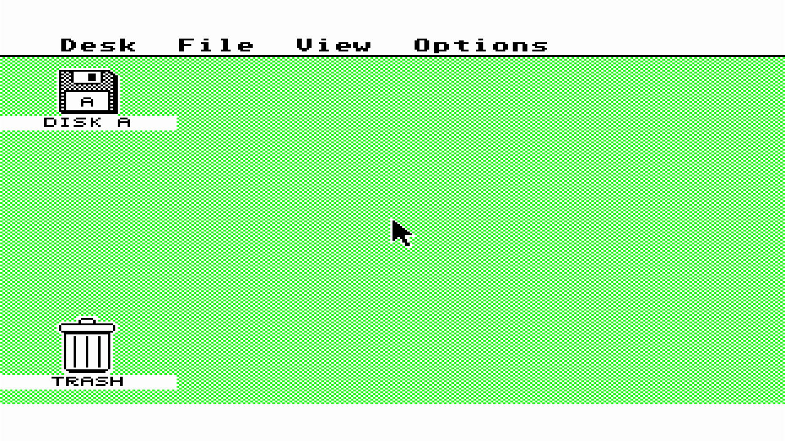
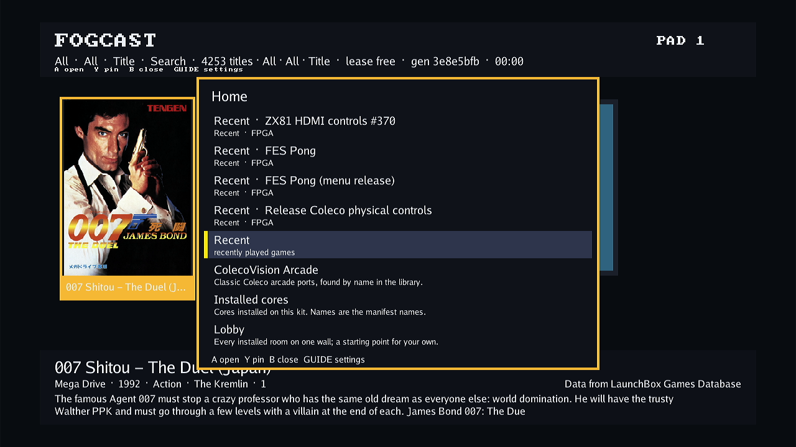

# Atari ST automatic disk boot, 2026-10-06

Normal library Play now supplies the selected drive-A disk before releasing the
68000. Stock EmuTOS executes AUTO/DISKTEST.PRG without guest input on both a new
disk and a saved-disk restore. Both complete 737,280-byte payloads match the
independent cold CPU/SDRAM model exactly, including timestamps. This closes the
manual-launch startup limitation in the [earlier bring-up record](2026-10-06-atari-st-bringup.md).

These are exact-package diagnostics on designated Kit A with selected diagnostic
software, using built-in Direct video. They do not accept an assembled appliance
image or extend physical expansion/video/audio qualification. The
[compact evidence](2026-10-06-atari-st-auto-boot/evidence.json) binds artifacts,
results, software validation and actual HDMI captures. ROMs, raw disks, target
logs and credentials remain private.

## Selection and startup ordering

The implementation is based on merged PR #511, FES
`f16a74a4ce2e8bc972211e906731bc742acaa5f3`. Tested runtime, agent, host and CLI
select clean committed FES `8cc9b64145bd258154cde49fa993c31023b5bc22`.
The unchanged FPGA shell selects `f4551a4d58dc1deadb8a979c77609b37bdd720cf`,
package `4e4f4f1a9767c13328722a849d1a4f07e280d16805dbf7414fabd18014f16ba2`,
build ID `eb6d41e5c73c58c65a89000fb280aedc`. The firmware is digest-pinned
EmuTOS 1.4 US 192 KiB. All artifact digests are in the evidence.

FogCast retains a checked disk snapshot with the existing ROM launch envelope.
Native admission validates its writable unit-0 contract and durable namespace
before programming, refreshes a saved record after any outgoing save, then
uploads the disk and confirms readiness while execution remains held. Binding
publication precedes the existing execution release. Live disk replacement and
ejection continue through their existing paths. No FPGA or shared generated
schema changes are required.

## Two automatic boots

The fresh library title starts generation 1 with the original immutable disk.
Without operator keyboard, mouse or program launch, the AUTO guest creates,
writes, reads, renames and deletes an odd 1,537-byte file, then writes PASS.TXT
and RESTSEED.TXT. Explicit Save and normal Stop succeed; independent post-Stop
inspection confirms the reported record and unchanged immutable base.

The private host cold-restarts the same container and HOME. Normal library Play
starts generation 2 with the exact saved seed revision bound before execution.
The AUTO guest verifies both old markers and EOF before its first write, then
creates RESTORED.TXT. Save and Stop succeed again. The runtime and agent retain
the same PIDs and process start ticks throughout both boots; no recovery,
service restart or failed launch intervenes.

| Phase | Saved record revision | Payload SHA-256 | Bytes compared | Differences |
| --- | --- | --- | --- | --- |
| Seed | `5ecbe52d3aea4f255c05ee62c9dc735a9086fe61d2dd554eada9f9151f56a2a5` | `a9d2a28156ffbef7989f42d99272b844eb1af519754e4486e72bd550fc99b53c` | 737,280 | 0 |
| Restore | `49a1b4431819aa5a1d048654370e89cc80fa0faea3c2dcaac3b79546ea337841` | `c5a68818e6ac53d11e1c2f3596e61b0ad55eb7b11924fa79c3cb65d9e9a1744b` | 737,280 | 0 |

The comparator checks boot sectors, both FATs, directory entries, programs,
markers, slack and every unallocated byte. It permits only valid DOS modification
time/date differences on newly created marker entries; none differ in these
runs. Separate semantic checks verify exact marker contents and allocation.
The desktop captures establish visible boot completion; saved disk bytes provide
the authoritative evidence of automatic guest execution.

## Software validation and handoff

The full native runtime suite passes, including upload-before-first-release,
same-namespace save refresh, retained source, bad preflight, failed save ownership
and failed upload without execution release. Full FogCast host, core-package,
runtime adapter, protocol, agent, HTTP and target-client race suites pass.
Parent consistency checks all 18 consumers and 34 fixtures with zero standalone
pins; host/CLI and selected ARM runtime/agent builds pass. An existing lost-reply
test teardown was corrected to Stop and retire the now intentionally retained
publication. Independent implementation review found no blockers.

The evidence commit adds documentation and captures to the tested software
commit; its later commit identity must not relabel those binaries. Shared module
contracts and factory package selection remain unchanged. Review and merge
[PR #569](https://github.com/DeanoC/fes/pull/569), then assemble and validate the
source-selected appliance integration. Broader ST compatibility and physical
expansion/audio operator acceptance remain separate work.

## Final restoration

The exact owned overlay bindings, mount and target image are removed after their
loop references disappear. Original factory runtime, agent and build-inputs
hashes are verified, with one runtime and one agent. Factory source remains
`5a58053229b5e1772defe5f9bdc34c72f659db71`; boot identity and selection are
unchanged. No reboot or block-device operation occurs.

The stopped private container and its owner-only credential copy are removed;
the normal host configuration is byte-identical. The normal host is active and
enabled, preserving autostart. The full **4,253-title menu** is verified through
normal API and actual HDMI capture. Kit A ends ready and idle, with **lease free**.

