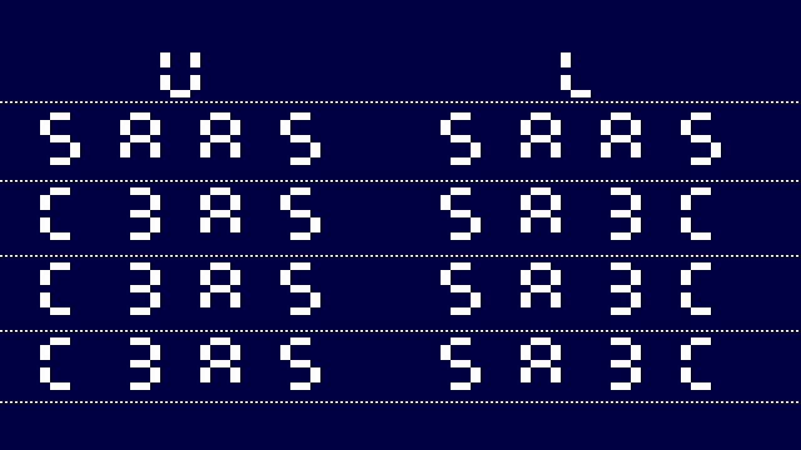
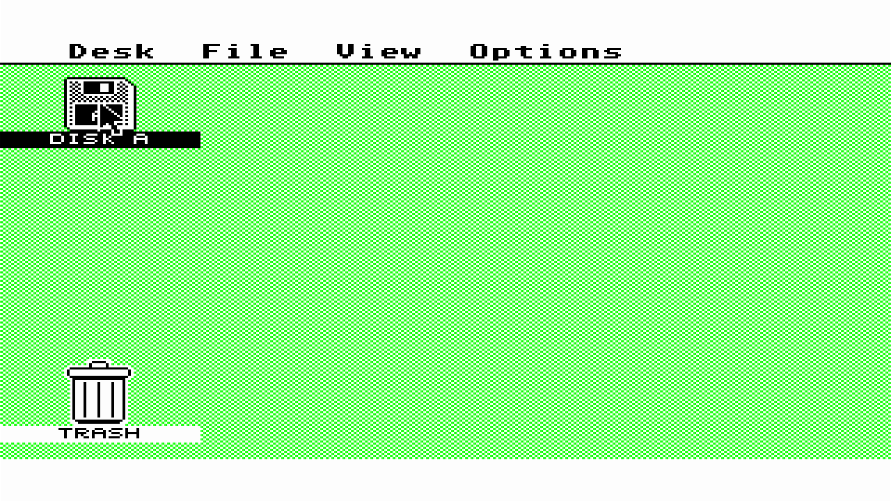
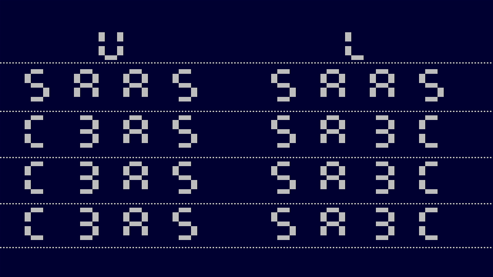
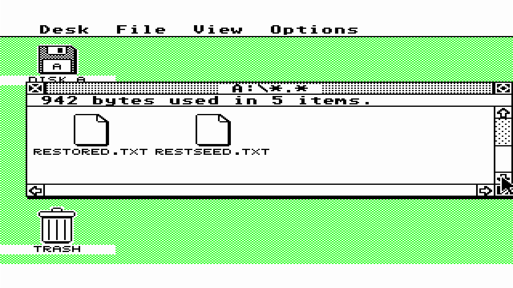
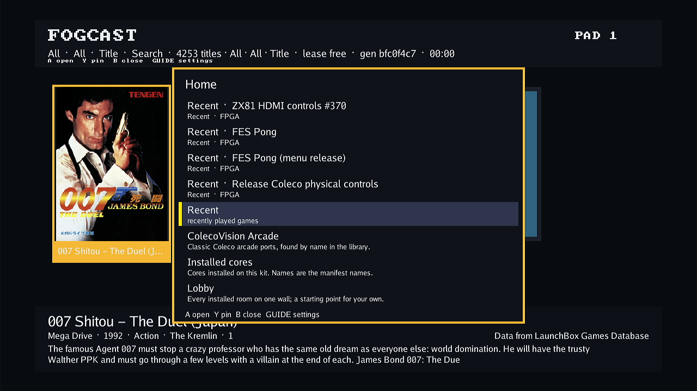

# Atari ST physical bring-up, 2026-10-06

The fresh Atari ST shell passes physical SDRAM, stock EmuTOS GEM/mouse,
independently selected video and durable disk save/restore diagnostics on Kit A.
Upper- and lower-byte writes preserve the neighboring lane, including delayed
and repeated writes in another bank. This supersedes the memory failure in the
[October 4 interaction record](2026-10-04-atari-st-interaction.md).

These are exact-package diagnostics using a disposable software overlay on the
unchanged factory boot. They do not qualify an assembled appliance image.
The [compact evidence](2026-10-06-atari-st-bringup/evidence.json) binds the source,
artifacts, captures and independent reviews. ROMs and raw target logs stay private.

## Native selection

The shell selects committed FES `f4551a4d58dc1deadb8a979c77609b37bdd720cf`,
package `4e4f4f1a9767c13328722a849d1a4f07e280d16805dbf7414fabd18014f16ba2`
and build ID `eb6d41e5c73c58c65a89000fb280aedc`. Authenticated HIP seed 4
passes the original pixel/system/audio targets: 74.449/53.553/276.625 MHz.
The source closure, 202 M10K footprints, ROM map, mapped controller truth tables
and actual shared A11/A12 mask pads pass independent inspection.

The addon SDRAM carries DQML/DQMH on A11/A12. The merged correction in
[FES #514](https://github.com/DeanoC/fes/pull/514) retains row bits for ACTIVATE,
asserts write masks before the column command and clears them for reads.
[nextpnr #125](https://github.com/DeanoC/nextpnr/issues/125) is closed; the
separate command/address pad-register work in [nextpnr #135](https://github.com/DeanoC/nextpnr/issues/135) is also closed and remains the RAM tester's opt-in lane.
This ST shell uses the direct 52.224 MHz controller path.

Independent Direct and Scanlines archives seal against this exact shell, with
2,137 and 3,649 changed CRAM bits respectively and zero changes outside the
strict video socket. Clock configuration, shell clock pins and all non-CRAM
bytes remain intact. A seed-5 CPU probe also seals with strict containment;
its legacy producer has a narrower recorded source/tool closure than the shell
and video producers. No physical CPU-probe execution is claimed.

## Physical memory

Normal named-ROM library Play ran the original stackless memory test and byte
observation ROM on the new package, with source-matching runtime and agent.
The first reports green `00`; the second reads:

| Stage | Upper-byte test | Lower-byte test |
| --- | --- | --- |
| Full-word baseline | `5AA5` | `5AA5` |
| Immediate byte writes | `C3A5` | `5A3C` |
| 32 NOP gap | `C3A5` | `5A3C` |
| Eight gapped writes, another bank | `C3A5` | `5A3C` |

An independent replay verifies every pixel mask of all 179 settled frames in
each lossless capture against the CPU/diagnostic oracles: 329,932,800 comparisons.
The captured PNGs equal movie frame 119. Package, ROM, generation and completed
Stop observations bind both runs; the normal menu and free lease were verified.

## Guest restore model

The opt-in restore-proof `DISKTEST.PRG` fixture completes two separate
cold FX68K/SDRAM runs with stock EmuTOS 1.4 US 192 KiB. The first creates,
writes, reads, renames and deletes the odd 1,537-byte test file, then publishes
exact PASS.TXT and RESTSEED.TXT markers. The second reads and verifies both
saved markers and EOF before its first write, then publishes RESTORED.TXT.
Its CPU trace does not execute the first boot's file-generation loops.

Each run completes 417,792,000 system clocks and 479 frames with zero video
underruns. The second starts with fresh CPU/RAM and the first run's captured
image; it changes 121 disk bytes. Independent FAT12 checks confirm intact
programs, exact marker contents, identical FAT copies and reachable allocation.
This model preloads the disk and excludes host upload and durable publication.

## Linux-side memory correction

After memory testing and menu restoration, the kernel killed the agent for
running out of RAM. Its anonymous RSS was 178.6 MiB, alongside 100.8 MiB for
the launcher and 188.6 MiB shared memory. The agent request log alone had grown
to about 185 MiB in the RAM-backed `/var/log`, predominantly idle read polling.
The full log is archived before maintenance clears it.

Successful target GET/HEAD request logs move to debug level; failed reads and
mutations remain visible by default. A real HTTP polling regression confirms
3,000 idle reads previously wrote 494,340 bytes and now write none at Info.
ROM-map parsing streams bounded rows, staging uses one declared-length upload
allocation and borrows private RBF/map members, and cancellation reaches decode.
Map meaning and linked EmuTOS bytes are checked against the previous parser.

The corrected agent selects committed FES `f45865c00193865df91c08573ea83fa78ad33630`;
the native shell and runtime retain `f4551a4d58dc1deadb8a979c77609b37bdd720cf`.
The same real upload/map links byte-identical EmuTOS images with both parsers.
Isolated staging of two imports peaks at 60.89 MiB on amd64 and 58.22 MiB on
32-bit x86, versus 151.7/146.4 MiB previously; these are layout comparisons,
not ARM timing estimates. Post-GC retained heap is 0.23/0.15 MiB. Full linker
and core-package race suites pass (108 top-level tests), as does the HTTP suite.

## Physical desktop and mouse

Stock EmuTOS boots to a coherent GEM desktop. Independent capture inspection
finds the pointer at `(640,360)`, then `(736,360)` after native delta `(24,0)`
and `(736,432)` after `(0,24)`: the expected 4× horizontal/3× vertical scaling.
Returning both deltas restores the original PNG byte-for-byte. A single left
press/release inverts Disk A's icon and label. Normal Stop detaches input;
the populated normal menu and free lease are verified after the probe.

## Physical video parts

Normal library Play independently selects the sealed Direct and Scanlines parts,
with observed composition identities and matching completed Stops. Every pixel
mask in each capture's 179 settled frames matches the CPU oracle. White glyph
median red levels are 253 on both Direct row parities; Scanlines keeps even
rows at 253 and reduces odd rows to 125. The HDMI capture's chroma resampling
prevents claiming an exact half for every individual RGB sample. Both PNGs
match movie frame 119. Menu restoration and lease release pass.

## Physical durable disk investigation

The first real boot runs the AUTO guest and displays PASS.TXT and RESTSEED.TXT,
with four root items and no RESTORED.TXT. Its normal save is rejected after an
unstable GP response; subsequent Stop also fails without publishing an
uncertain record. A transient initial status failure is recovered by adopting
the exact existing session, without launching again. Readback recovery is
corrected as described below; the failed first run remains separate evidence.

The failed run contains only the disposable diagnostic fixture. After preserving
its captures and failed replies, init-managed SIGTERM restarts the diagnostic
services and restores the populated menu with the lease free. Factory boot
selection stays unchanged. Owned overlay cleanup and verified menu restoration
are recorded separately from disk acceptance.

## Acknowledged readback and explicit Save recovery

Committed runtime `650598f3feae8c7fd146acb6f8fbfe93deaa858a` keeps each
command unchanged after its matching ACK, waits a bounded 1 µs settling guard,
then requires two identical validated full response samples before accepting
data. Settling remains inside the original deadline and never resends the
command. Invalid framing, ACK reversion, MMIO errors and deadline exhaustion
still poison the exchange. This is a runtime sampling correction; the physical
cause of the original unstable sample is unproven and no compiler defect is
claimed. The full runtime software suite and selected ARM build pass.

Committed FogCast `7a32b4d1c7017da902a33b4a324e00dcff101ba2` preserves
`SAVE_FAILED` in human and JSON CLI replies. An explicit Save may inspect the
same active persistent disk after a retained `SAVE_FAILED/save`; unrelated
errors, recovery states and identity changes remain rejected. It makes one
physical call, requires a confirmed durable revision, then publishes that
revision and clears only the permitted retained error. Generic media admission
stays strict. Full protocol, agent and runtime adapter race suites plus focused
host media tests pass: 298 top-level tests, 749 passing test events, no failures
or skips. Selected agent, host/CLI ARM/native builds and parent consistency pass.

The later physical disk probe selects runtime `650598f3f`, agent/host/CLI
`7a32b4d1c` and the unchanged native shell `f4551a4d5`. Its first boot
creates PASS.TXT and RESTSEED.TXT, saves a complete record and completes Stop.
Independent post-Stop inspection verifies the exact reported record revision,
all marker contents and all 737,280 payload bytes against the cold CPU model.
Only valid DOS modification time/date fields of newly created markers may vary;
free sectors, slack, programs, FATs and all other bytes remain exact. The
original immutable disk's metadata, size and opened-content hash are unchanged.

The original private operator receipt remains failed: it incorrectly required
`health.ready` during an active core. That field denotes physical idle/admission,
so this interruption was in the verifier. A separate completion receipt binds
the successful Save, matching full session projection, successful Stop and
post-Stop raw record. The corrected private operator requires the exact active
native package/generation and held owning lease instead of idle readiness.

A cold restore launch then fails with `MISTER_UNAVAILABLE/recovery` after core
activation, before library disk insertion, leaving an owned blocked lease. Linux remains healthy with about
196 MiB available memory. The preserved first-boot record is unchanged; normal
Stop also refuses. Init-managed SIGTERM recovers only this owned disposable
diagnostic, restores the menu and frees the lease. The failed launch is retained
separately from the subsequent explicitly selected cold launch after service
recovery. The accepted second boot saves a complete restored disk and completes normal
Stop; independent comparison checks all 737,280 bytes, with only three differing
DOS timestamp bytes and zero unexpected differences. Both boots use the same
private host container and HOME, with distinct cold-start timestamps and the
exact first saved revision bound at restore Play. The original base remains
unchanged. This proves disk persistence after owned service recovery; the
additional same-daemon lifecycle acceptance follows below.

Both accepted boots manually launch DISKTEST.PRG exactly once, after visually
inspecting the actual directory. EmuTOS scans AUTO before the host disk upload
finishes. Automatic disk boot is therefore not qualified by this procedure;
initial-media upload before CPU release remains a separate integration step.

## Disk-binding lifecycle correction

Source tracing finds process-local disk metadata surviving successful Stop/menu
programming and the next core load. Native capabilities can then attach the old
persistent binding to the new empty drive before explicit library insertion.
FogCast correctly rejects that inconsistent status; relaxing its unit or
persistence checks would hide the lifecycle error. The missing raw first native
reply prevents identifying the exact first validation branch. The similar
successful and failed load durations do not support a timeout diagnosis.

Committed runtime `e2d503eb5ae5a4d447dda6800aeb8a48e28f5bae` retires the
previous disk binding after confirmed FPGA programming replaces its owner.
Save-failure and nonmutating pre-program failure retention remain intact;
destructive partial-program failures keep the existing invalidation of unsafe
active-core metadata. An independent review approves this bounded change. Its
regression covers Stop to both menu and splash, subsequent ST activation,
explicit restoration of the saved disk and direct core replacement in the same
runtime instance. The committed ARM build and parent consistency pass. Full runtime unit,
incremental build, version stamping, active-tree and support-truth checks pass;
all 297 tracked runtime files match the selected commit. The new regression
fails on the previous hardware source and passes on the corrected source.

A fresh physical seed/Stop/cold-Play/restore sequence passes with the same
runtime and agent PIDs and process start ticks throughout. Native generations
advance from 1 to 2. The cold host restarts the same container with the same
HOME and binds the exact saved seed revision before guest execution. The
guest verifies its old markers before writing RESTORED.TXT; both Saves and
Stops succeed, raw records retain the reported revisions, and both complete
737,280-byte payloads match the guest model apart from valid new-marker
timestamps. The immutable base remains unchanged. No runtime/agent restart,
manual recovery or failed launch occurs between these accepted boots.

## Final cleanup and integration boundary

The final cleanup restores and hashes the original factory runtime, agent and
build-inputs files. All owned diagnostic bindings, overlay mounts and target
image files are removed after their loop references disappear. Only the original
factory and bootstrap image loops remain. The unchanged factory source is
`5a58053229b5e1772defe5f9bdc34c72f659db71`; its image digest is
`5032c2d2282da26e79e6f7efc47f9f2a1aa9abca4aad4ca6f19817e82d18ce4a`.
Boot identity and selection stay unchanged; no reboot or block-device operation
occurs. The exact stopped private container and its exact owner-only config
are removed. Private catalog/evidence and the disposable diagnostic records
are retained; the normal host configuration remains byte-identical.

An intermediate cleanup script mistakenly starts the older factory services
twice. Actual HDMI inspection catches the black screen. Exact task-created
supervisors are stopped with SIGTERM, their children exit, and one original
runtime and one agent restart. The corrected cleanup avoids redundant starts;
final service counts and original file hashes pass independent readback.

The normal host ends **active and enabled**, matching its initial autostart
state. Its full 4,253-title catalog is verified, and an actual final HDMI capture
shows that populated menu with **lease free**. The target is ready and idle,
with no owned diagnostic overlay or coordinating container left running.

These results qualify only the selected package on designated Kit A diagnostic
software. They do not accept an assembled appliance image, automatic disk boot
or a physically executed CPU expansion card. The next integration step is
review/merge of PR #511, then source-selected appliance integration; initial
media-before-CPU-release and expansion/audio operator acceptance remain bounded
follow-up work. Runtime fixes in this continuation change no shared wire or
package layout. The historical byte-mask and failed disk runs remain explicit
in the earlier records and compact evidence.
