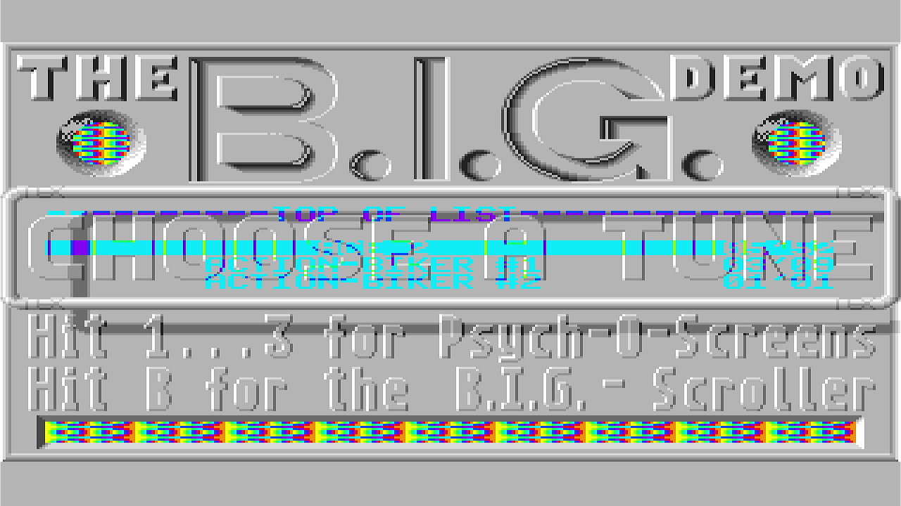
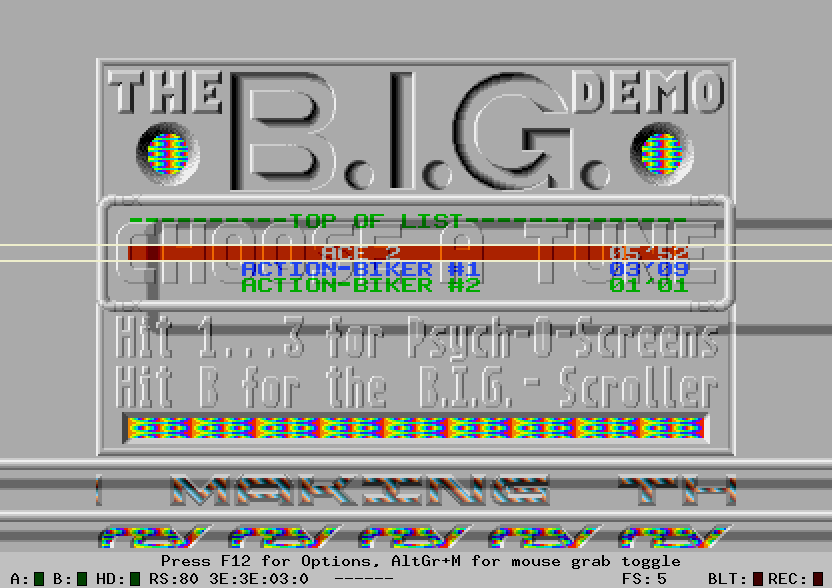
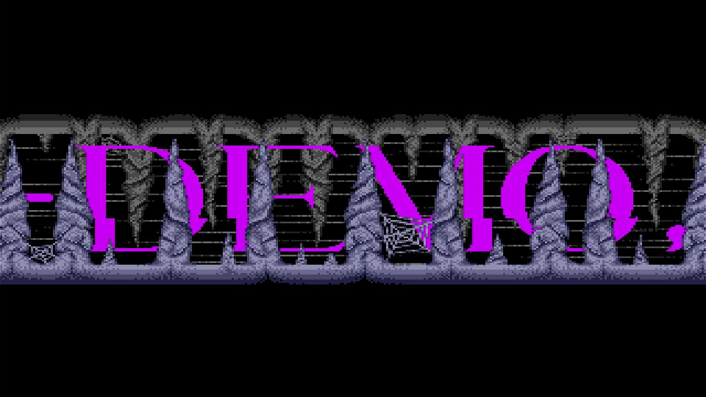
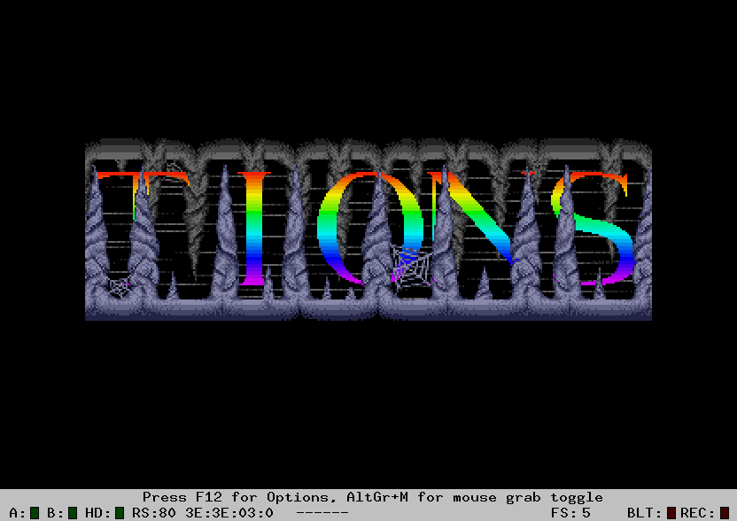

# Atari ST BIG loader: empty-memory acknowledgement and ROM comparison

This follow-up to [task #621](https://github.com/DeanoC/fes/issues/621)
starts at main `10472724c17fa31d43849d81eb56e661e968ddc6`. Main already includes
the request-egress fix and separate Direct/Scanlines qualification from the
work associated with closed PR #620. That routing dependency is resolved;
it is separate from BIG's CPU/firmware behavior.

The [evidence record](2026-10-08-atari-st-big-loader/evidence.json) binds the
frozen input/model identities, before/after traces and independent Hatari run.
The initial loader comparison was host-only. The hardware follow-up below
binds a fresh source-selected FPGA package to a temporary qualified geometry
diagnostic image, then restores the original installed image and populated
menu. It does not accept BIG's border effects or audio fidelity.

## The early FES fault

The original 409,600-byte BIG disk is unchanged, SHA-256
`608c4beff1780552e8ae6ee5a1efff27198fb6a3ca6274597f1cb528c3970edb`.
The firmware is unchanged stock EmuTOS 1.4 US 192 KiB, SHA-256
`8fbbf8b44fc3e34281eaf8cda5265510e9af9ccda0e3e409111648060d244cfc`.
Physical RAM remains 524,288 bytes.

New simulation-only observability captures each rising bus-error edge with
its latched address, direction and function code. The first 64 faults are
logged and the first eight also save RAM; the existing per-second captures
remain. The exported CPU PC is prefetch/exception state, not retired-instruction
PC. Upstream FX68K bytes are unchanged.

The first four faults are supervisor reads probing absent hardware at
`$FF8006`, `$FF860E`, `$FFFC20` and `$FF8A3C`. The earlier geometry record's
RAM-discovery description of these faults was incorrect; its count and captures
remain valid. The fifth fault is a supervisor write to `$3FFFFE`, at fabric
cycle 243,145,893 (about 4.656 seconds), while BIG clears the ST RAM address
window. The exported PC is `$1076`. This happens after one sector/256 DMA
words have been loaded, before the ROM-dependent lookup described below.

The old decoder acknowledged only the configured logical banks. In normal
`$04` configuration, it faulted at `$0A0000` and above. The corrected decoder
keeps the populated bank's address aliases, then acknowledges the rest of the
original 4 MiB RAM decode window. Unpopulated writes are discarded. `$400000`
and higher still fault unless separately claimed by cartridge, ROM or MMIO.
The existing empty-memory read model stays `$FFFF`; it does not emulate the
STF's floating data-bus value.

This boundary follows Hatari 2.5.0's
[release-matched memory implementation](https://github.com/hatari/hatari/blob/v2.5.0/src/cpu/memory.c),
`memory_map_Standard_RAM()`: void space below 4 MiB, bus-error space above it,
then populated-bank mappings. `VoidMem_*put()` discards writes. Its reads use
the previous bus data, a separate behavior not added by this fix.

## Regression and unchanged original loader

The actual CPU diagnostic now writes words and each byte lane at `$080000`,
`$0A0000`, `$200000` and `$3FFFFE`, checks the retained empty-read model, and
checks that real RAM markers and the last populated longword did not alias.
It faults at exactly `$400000`. Both firmware variants pass with immediate
and delayed storage. Running that same new diagnostic against main's original
decoder fails at stage 8, confirming that the regression catches the defect.

The complete `sim-fes-atari-st` aggregate passes, including physical SDRAM,
media geometry, memory arbitration, peripherals and video tests. Nine root
media-helper tests and nineteen Atari producer tests pass. The separate fifteen-second stock EmuTOS boot regression passes: 512 KiB,
screen at `$78000`, timer C and VBL running, and no CPU halt. Parent `make check`
also passes with 18 generated consumers and 34 fixture copies.

Frozen Verilator 5.032 captures execute the original disk for twelve seconds
before the fix and ten seconds after it. Sources, generated models, executable,
microcode, disk and ROM remain unchanged during each execution. The before
capture's frozen source remains authoritative even though the worker RTL was
edited while that model ran. The after capture's compiled input hashes match
the implementation in this change.

After the correction, BIG's high-memory writes acknowledge and execution
passes the clear loop. The complete ten-second capture retains only the four
startup hardware-probe bus faults. Its RAM at `$26` subsequently contains
`$4879`, also seen in the independent loader comparison. This removes the
specific early hardware fault; BIG still does not reach its demo screens.
The trace does not count internal 68000 address-error exceptions, and no
complete CPU exception-frame equivalence is asserted.

## Independent same-input ROM comparison

Private Debian Hatari `2.5.0+dfsg-1+b1` runs the same ROM and disk with ST mode,
512 KiB RAM, 68000 at 8 MHz, cycle-exact/prefetch-compatible CPU, 24-bit
addressing, no blitter, RGB/low resolution and read-only floppy A. TOS patches,
fast boot, Timer-D patches and fast FDC are disabled. Sound is disabled for
this boot diagnosis; it provides no audio acceptance. ROM/disk hashes before
and after match. Tool package, binary and private Capstone hashes are retained.

A debugger capture at boot PC `$10D8` records `A0=$FC06A2`, `D0=$4879` and
`MOVEA.W 6(A0,D0.W),A0`. Its word-read address is `$FC4F21`, which is odd.
The full run records address-error exception 3 there, then invalid execution
through vectors the boot code has overwritten with `$2A2A2A2A`. The word
`$4879` was taken from EmuTOS's ROM code at `$FC06A0` and treated as a table
offset. This is evidence of dependence on an internal ROM layout, not a
failure that can be resolved by increasing the FES RAM buffer.

Hatari's [official EmuTOS record](https://hatari.tuxfamily.org/doc/emutos.txt)
also lists BIG as failing before OS calls. The new comparison identifies a
specific failure for these exact inputs; it does not imply that all BIG disks
or EmuTOS versions fail identically.

The user's library supplies unchanged 192 KiB UK TOS images: 1.00 SHA-256
`5771f9fd1391d3ae0b513ab3fd67aec30fb1843753e7e0345f92615e72c36797`
and 1.02 SHA-256
`ee16750d11299b3e5cf747e6f3c8f9f923aa8ee52c57cc1632d98241500b55f5`.
With the same original disk and emulator settings, both display BIG's
introductory instructions by VBL 700. No user input is injected. These runs
still report address errors; the introductory screen itself says the loader
uses errors and debugger-sensitive tricks. Reaching this screen does not
qualify every demo section or its sound. Only identities, observations and
private capture hashes are checked in; no proprietary firmware or RAM is
published.

With TOS 1.00, the FES model also reaches the introductory instructions by
fabric cycle 156,672,000 (three simulated seconds). The 32,000-byte low-resolution
planar framebuffer at `$70000` matches Hatari's VBL-700 capture exactly:
SHA-256 `87ad658b65f3628c812a1c71ad298ad42983f730dbbea1e6de3b870bc6045e42`.
This compares static RAM contents, not shifter output timing or raster effects.
The ROM, disk and upstream CPU sources remain unchanged. By seven simulated
seconds the model renders BIG's main menu and its scrolling text. A longer
Hatari run also reaches that menu at VBL 2000 without user input. Per-second
static images do not capture its palette changes by scanline or opened borders;
there is no raster or audio acceptance. The full fifteen-second capture
completes with zero external bus faults and no CPU halt. Captured sources,
generated model, executable, microcode, ROM and disk remain unchanged, and
captured RTL/helper hashes match this change. The record still sets
`demo_compatibility_asserted=false`; later demo sections were not selected.

The FES harness accepts such firmware only through an explicit
`--rom-sha256`; the default still requires stock EmuTOS. Mismatched ROMs are
rejected before output creation. The hardware follow-up now reaches the menu and selects the scroller.
No demo or firmware patches were applied. The fresh package below qualifies
this bounded observation; full current appliance-image acceptance remains
outstanding. The shared
manifest, capabilities, generated consumers and wire contracts are unchanged.

## Fresh-package hardware follow-up

After source commit `7a072353a4f42fa7e2a00569d7234cc008c4683b`,
`make core-dev CORE_DEV_ARGS='prepare --core fes.atari-st --output out/core-dev/st-big-tos100-001'`
produced package `61d24aac299033283dc4168d041d573ef01cdbd0c10527b8f27a15ae458a571f`,
including sealed shell, ROM map and separately linked Direct/Scanlines parts.
The [hardware receipt](2026-10-08-atari-st-big-loader/hardware-proof.json)
binds the archive, selected sources, composition, firmware, original disk,
programmed artifact and capture hashes. Final seed-2 shell timing passes:
pixel 76.34 MHz against 74.25, system 52.80 against 52.224, audio 218.91
against 12.288. Seed 4 missed pixel timing; seed 5 passed an intermediate
report but missed system timing in its final report. Those artifacts were
not loaded. These misses do not establish a compiler defect.

The normal installed image and host predate the floppy-geometry interface.
Their compatibility checks correctly reject this package. Under the existing
exclusive Kit A lease, the managed appliance client temporarily selected the
previously qualified geometry image `0beed5b5a6ef41e2967b8d2a500ebea602d205b40562cafcd39e6f5d99448d9f`
and an isolated matching host from revision `4ab1d84b4967394d6f4edf4580e2f7dcb29cf096`.
The relevant runtime sources are identical to the new package's selected
revision; FogCast differs only in the tenfoot local-catalog fallback. This is a
bounded diagnostic of the fresh FPGA package with older qualified software,
not acceptance of a new complete appliance image. Early operator attempts
with insufficient host readiness or an unmatched old host ended before any
guest load; each temporary image transition was rolled back.

Normal library Play bound unchanged TOS 1.00 and the original 80×1×10 BIG
disk. The active receipt confirms both media identities and ROM composition.
After settling, HDMI shows BIG's main menu. A normal HID B press/release,
held 150 ms, selects the scroller; the second capture shows its rotating
stone-letter display. The menu has horizontal colour artifacts, and the
scroller has mostly a single letter colour where Hatari shows rainbow bands.
Different animation positions and output dimensions prevent a pixel-equivalence
claim. These images demonstrate loading and input progression, and expose
missing raster palette behaviour.

| FES hardware | Independent Hatari 2.5.0 |
| --- | --- |
|  |  |
|  |  |

The [independent scroller receipt](2026-10-08-atari-st-big-loader/hatari-scroller-proof.json)
records identical read-only inputs, a menu snapshot at VBL 2000, documented
`hatari-event keypress b`, a scroller snapshot at VBL 2400, and clean exit 0.
Its sound is disabled. A separate completed Hatari A/V run supplies the
reference audio amplitude statistics; an earlier timed-out scroller A/V run
is excluded from completed evidence.

The ten-second HDMI audio capture is stereo 48 kHz, with peak 29440, RMS
13784.73, nonzero samples and no saturated 16-bit samples. The
[audio record](2026-10-08-atari-st-big-loader/audio-analysis.json) also retains
the separate Hatari reference identity and statistics. The captures are not
aligned, and amplitude statistics do not establish tune, tempo, noise or
waveform accuracy. Hardware channel means are about 11513.79 versus 3.09 in
the Hatari run: a substantial DC component is present in this capture. The
current PSG adapter emits nonnegative sample values; accurate analogue-output
filtering is separate from this raster investigation. Audio fidelity remains open.

The code explains why scanline colours cannot survive this path:
`st_video_adapter.sv` snapshots the entire palette with base/resolution once
per output frame and activates it only at SOF. It refetches live framebuffer
lines against a 720p60 clock, while native HBL/VBL/Timer-B timing runs separately
in `st_io.sv`. The native display phase itself is reduced. Simply forwarding
live palette bits would still mismatch native 50 Hz drawing and 60 Hz output,
and would introduce an incoherent clock crossing. A correct follow-up needs
native timing and coherent raster capture before fixed-output scaling. The
menu flashing reported by the user is consistent with this limitation; its
exclusive cause has not yet been established.

After Stop and isolated-host shutdown, the managed client restored original
installed image `8f148240b3d31736a09c97f3be99bde1c4bd51bd51aa23a88e9e5fa4a7f01877`,
confirmed good with no pending trial. The original normal host is active and
enabled; HDMI shows Ready and 29 eligible titles in the populated menu.
The older installed launcher needs a volatile supervised invocation using its
configured remote catalog rather than its empty local catalog. No persistent
launcher or owner configuration was changed. The menu supervisor is running,
the target is idle and the kit lease is free. The owned stopped diagnostic
container and private credential copy were removed. Current-image integration
must include the already merged local-catalog fallback fix for reboot durability.

## Native palette diagnostic after merged #629

The follow-up starts from merged main `582d3c608eb7bd0a89ca7940b9cbb6fce2c7eb39`.
Simulation-only outputs observe `st_io`'s native line and horizontal accumulator.
The unchanged CPU/chipset/ROM/disk run for twelve seconds, with a normal HID B
press at eight seconds held for 150 ms. The static nine-second RAM image shows
the stone-letter scroller. This does not change production video, timing or
shared contracts.

The [summary](2026-10-08-atari-st-big-loader/palette-summary.json),
[frozen capture proof](2026-10-08-atari-st-big-loader/palette-proof.json) and
[bounded trace](2026-10-08-atari-st-big-loader/palette-trace.jsonl) retain native
frame counts, the first eight changed palette bundles per frame after six
seconds, their line/phase and full counts of changed entries. Menu frames in
the seven-to-eight-second window have a median of 119 changed entries and a
maximum of 190. Scroller frames in the nine-to-twelve-second window have 128
changed entries per frame. Sampled changes occur on different lines within a
frame in both windows. These palette changes cannot be preserved by the
current output-frame palette snapshot. Native frame/line and horizontal phase
refer to the reduced functional model, not verified original GLUE timing.

The completed capture has zero external bus faults and no CPU halt; frozen
and working sources, model, executable, microcode, ROM and disk are unchanged.
Trace validation checks monotonic cycles, the eight-bundle sample cap, and
bounded line/phase/palette fields. Invalid keypress times reject before inputs
are read; Python compilation and parent `make check` pass. The hardware
capture above predates this observer-only follow-up and binds source `7a072353`.
No further kit transition was needed for this diagnostic.
