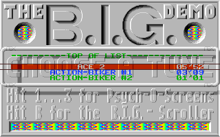
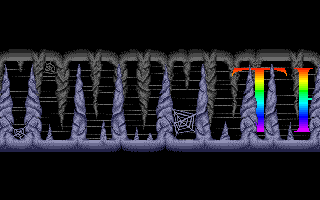
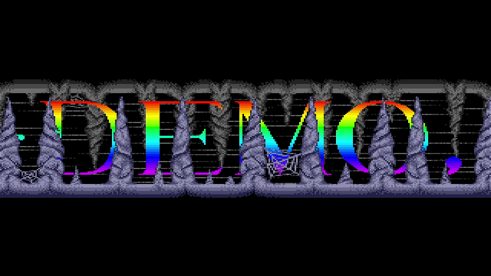
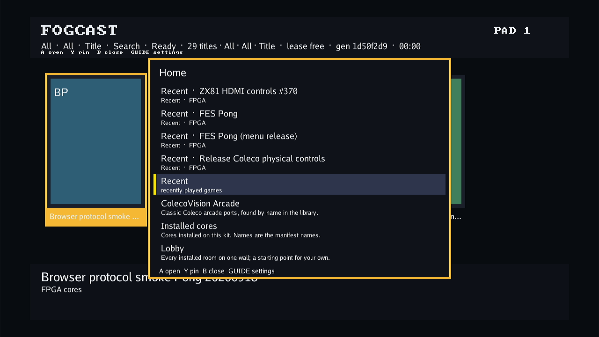

# Atari ST native low-resolution palette capture

This follow-up to [task #621](https://github.com/DeanoC/fes/issues/621) and
[PR #630](https://github.com/DeanoC/fes/pull/630) starts at merged main
`582d3c608eb7bd0a89ca7940b9cbb6fce2c7eb39`. The production implementation is
`5a0174d559f45e9b9b01219b44e199478213bb1b`. The [evidence record](2026-10-08-atari-st-native-palette/evidence.json)
binds the captured input hashes, completed simulations and companion files.
The earlier [BIG loader hardware record](2026-10-08-atari-st-big-loader.md)
applies only to its earlier FPGA package.

## Ordinary raster capture

The low-resolution renderer now captures live palette selection at nominal
8 MHz before output scaling. Alternating RAM row caches feed three 320×200
RGB333 banks. Publication/release toggles transfer ownership between system
and pixel clocks; only complete native frames become available at output SOF.
The reader pins its displayed bank until a later SOF. A stopped reader makes
the producer skip frames. Missing memory rows become whole black lines;
HOLD discards incomplete captures and invalid bases cannot wrap into RAM.
Medium/high modes retain the indexed renderer and frame-held palette.

The reduced I/O model now uses ordinary PAL and NTSC display porches,
following [Hatari 2.5.0's ordinary timing table](https://github.com/hatari/hatari/blob/v2.5.0/src/video.c).
It samples mode settings at line/frame boundaries. The first BIG run with
immediate mode changes captured only nine complete native frames during the
seventh simulated second; immediate mode changes could interrupt DE in that model. Boundary sampling
produces fifty complete frames during that interval. This is deliberately an
approximation, not original GLUE latch positions or opened-border behavior.

## Digital checks

The complete ST simulation aggregate passes. The default production adapter
runs with independent 52.224/74.25 MHz clocks and exact per-pixel expectations
for within-line palette changes and fixed HDMI timing. Its 178,966,052 checks
cover ownership, 50-to-60 Hz repeats, delayed memory, whole-line black recovery,
HOLD, invalid bases, medium/high mode recovery and a paused consumer. The run
publishes eleven captures, repeats six output frames and records 203 missing
native rows: three from injected latency and 200 from the invalid base.

The I/O test passes 653,108 assertions, including the ordinary vertical and
horizontal porches, 200 color/400 monochrome Timer B edges per frame and brief
mid-line mode writes that retain the PAL frame period. Nineteen producer,
nine demo-helper, three memory-helper, one capture-helper and fourteen
compiler read-audit tests pass.
Parent consistency passes with eighteen generated consumers and thirty-four
fixture copies. Shared ABI, generated contracts, video socket layout and
physical fences are unchanged.

The assembled stock EmuTOS 192US 1.4 test uses real FX68K/chipset/memory RTL,
physical SDRAM commands and independent pixel clocks. Over eight simulated
seconds it passes 417,792,000 system and 594,018,699 pixel clocks, with 479
complete native/HDMI frames, zero skipped frames and zero native/indexed
underruns. CPU/video latency maxima are 63/64 system clocks. RAM sizes to
512 KiB, screen base is `$78000`, and timer/VBL processing continues under
contention. This is a digital SDRAM model, not physical-kit acceptance.

## Original BIG disk and TOS 1.00

The unchanged 409,600-byte disk has SHA-256
`608c4beff1780552e8ae6ee5a1efff27198fb6a3ca6274597f1cb528c3970edb`.
The independently supplied 192 KiB TOS 1.00 ROM has SHA-256
`5771f9fd1391d3ae0b513ab3fd67aec30fb1843753e7e0345f92615e72c36797`.
Neither ROM nor raw RAM is published.

The frozen twelve-second CPU/chipset diagnostic selects B through the existing
HID/IKBD path at eight seconds. It was frozen at
`22e3994166ac18b1aa0b898785bc949dbe980ad5`; all twenty-one captured
compiled/helper inputs also match the implementation commit. The subsequent
row-counter change affects the HDMI adapter, which this diagnostic does not
compile. That adapter is tested by the independent-clock and assembled SDRAM
regressions. Frozen sources, working inputs, executable,
generated model, microcode, ROM and disk remain unchanged during execution.
It finishes with 599 complete native captures, zero capture underruns, zero
external bus faults and no CPU halt. Native capture uses model RAM and a
system-clock consumer; it does not exercise the physical SDRAM arbiter or HDMI
clock crossing. Those are separately exercised by the tests above.

The seventh-second menu capture has 32 distinct RGB colours, compared with
15 in the same-second static RAM/palette reconstruction. The final B scroller
capture has 39 colours and visible rainbow bands. These establish native
palette capture in this model, not complete BIG compatibility or a pixel-exact
original-machine comparison. The earlier independent Hatari capture remains
a visual reference; scrolling phases are not synchronized for exact equality.

## FPGA and hardware qualification

The first selected-source synthesis passes and maps 418 M10Ks in total,
including 216 for the three RGB banks. Its route misses clock timing: an
intermediate report gives 47.04 MHz pixel and 44.82 MHz system. The critical
paths run through coordinate arithmetic/native DE validity into RGB RAM.
Registered write data and a two-pixel read-address forecast shorten those RAM
paths. The full native pixel test, ST aggregate and assembled EmuTOS regression
pass after this change. Every native BIG snapshot matches the preceding
capture byte for byte.

A subsequent completed route reaches 66.15 MHz pixel and 49.91 MHz system,
still below 74.25/52.224 MHz. Its limiting paths are publication ordering and
row-validity selection into RGB data. The current source uses bounded
three-bit publication ordering and registers black-line validity separately
from RGB. The native pixel, aggregate and assembled EmuTOS simulations pass with these
changes. Every native BIG snapshot also matches the preceding run byte for byte.

The next route reaches its system target in intermediate analogue signoff,
but the pixel path still misses through vertical/next-row arithmetic into
the RGB read-address register. It is interrupted before final qualification.
The current adapter instead advances a repeated-line counter in horizontal
blanking. Its row base uses 64-pixel units, confining the read-address addition
to ten bits. Native pixel, aggregate and eight-second assembled EmuTOS checks
all pass after this change.

The revised synthesis initially exceeds the compiler read-audit trace cap.
The allowance is now bounded at 64 MiB per process and 256 MiB total, with
expanded error diagnostics. A live overflow regression confirms cancellation
of the compiler process. Source exclusion and complete-trace checks remain
required.

The selected implementation seals at routing seed 4 with final analogue timing
74.34 MHz pixel, 53.15 MHz system and 255.62 MHz audio, meeting
74.25/52.224/12.288 MHz. Worst clock slack is 0.017 ns. It maps 418 M10Ks,
including 216 for the RGB banks. Package
`582545af9ff0c933389c565fbb709f89dd29bd0f13ba33729bc08460c78ae975`
has payload SHA-256
`0a277e7a62f7c3216c085d34e988f90ca3e2cb236a335e94b8e81c1171f836eb`.
The [prepared receipt](2026-10-08-atari-st-native-palette/prepared.json) and
[video inventory](2026-10-08-atari-st-native-palette/video-parts-index.json)
bind the sealed Direct and Scanlines companions to this exact shell.

## Bounded Kit A diagnostic

The [hardware record](2026-10-08-atari-st-native-palette/hardware.json) binds the
same package and original disk/TOS to normal library Play on Kit A. Both
companions are imported, and entry resolution selects the prepared Direct
part. Active-session checks verify its ST layout, shell/part IDs, composition
digest and firmware link. HID B selects the scroller. The physical capture
now shows the rainbow bands missing from the earlier indexed-renderer capture.
Scanlines is sealed but is not separately launched in this diagnostic.

The menu still alternates between two appearances. In 221 settled capture
frames, a static logo region's mean luminance varies from 142.483 to 154.861;
the initial black capture buffer is excluded. This is not a flashing-fix
claim. The frozen model's [palette excerpt](2026-10-08-atari-st-native-palette/menu-palette-excerpt.jsonl)
also alternates its initial grayscale raster sequence: source frames 310/312
write palette zero on lines 63–68, while 311/313 begin with different raster
updates. In an independent same-input Hatari run, the
[static logo crop stays identical across sixteen consecutive frames](2026-10-08-atari-st-native-palette/hatari-static-logo-comparison.json).
This supports investigating native interrupt/palette sequencing before HDMI
scaling; it does not identify the precise CPU/GLUE/MFP timing defect.
The models are not synchronized for a pixel-exact whole-screen comparison.

The diagnostic temporarily uses the previously qualified geometry runtime and
matching host revision `4ab1d84b4967394d6f4edf4580e2f7dcb29cf096`.
It is exact-FPGA/Direct diagnostic evidence, not full current appliance-image
acceptance. Stereo 48 kHz audio is captured and nonzero with no saturated
samples; audio fidelity remains unqualified.

The original installed image
`8f148240b3d31736a09c97f3be99bde1c4bd51bd51aa23a88e9e5fa4a7f01877`
is rolled back and confirmed good. The normal menu shows 29 eligible titles,
the host is active with its original enabled autostart, and the target is
ready, idle and lease-free. Owner configuration is unchanged. The private
container and credential copy are removed. The older launcher uses the
previously documented volatile remote-catalog invocation; no persistent
launcher configuration is changed.

Menu flashing, opened borders, exact GLUE/MMU/shifter timing, mid-line base
changes, later BIG sections, audio fidelity and full current-image integration
remain open. Keep #621 open until its intended borderless effects and correct
sound are qualified. Next investigate the alternating source raster sequence
against the independent reference; do not suppress source frames to hide it.
