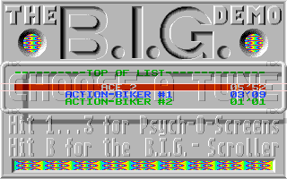

# Atari ST CPU bus timing investigation, 2026-10-09

This is host-only evidence for [#621](https://github.com/DeanoC/fes/issues/621)
and [#635](https://github.com/DeanoC/fes/pull/635), based on
`9b424997b5c06cb4f333b84ac65f9e9606f02450` and stacked on #634.
It measures access timing against the real FX68K and compares unchanged BIG
inputs. It does not change the selected production timing or the physical
SDRAM controller. No kit was claimed, programmed or interrupted.

## Calibrated access boundaries

The optional `MFP_WAIT_STATES` probe delays the peripheral request, so both
read sampling and write side effects happen after the wait. Four states follow
[Hatari 2.5.0's MFP register accesses](https://github.com/hatari/hatari/blob/v2.5.0/src/mfp.c#L2468).
The default remains zero while the cause of the flash is investigated.

Original firmware uses repeated `MOVE.B abs.L,Dn` and `MOVE.B Dn,abs.L`
instructions, with the 512 KiB bank selected explicitly. It counts native CPU
phase-2 enables between bus starts; no Atari ROM or external assembler is
involved. The separate checked-in regression inserts NOPs and covers all
fractional-clock phases with 125 reads and 125 writes.

| Access fixture | Repeated byte-read instruction | Repeated byte-write instruction |
| --- | --- | --- |
| Current immediate MFP path | 16 CPU cycles | 17 CPU cycles |
| Four-state MFP probe | 20 CPU cycles | 20 CPU cycles |
| Existing variable CPU RAM callbacks | 17 CPU cycles | 18 CPU cycles |
| Zero-wait CPU RAM callbacks | 16 CPU cycles | 16 CPU cycles |

The RAM calibration keeps its instruction stream in ROM and accesses `$600`
and `$602` as data. The default callbacks wait `8+(byte_address%7)` system
clocks; zero-wait callbacks acknowledge immediately through the same motherboard
path. This measures the guest-visible effect of those two storage fixtures.
It does not establish what a physical memory controller can sustain.

Local frozen calibration drivers and source/executable digests:
[MFP record](2026-10-09-atari-st-bus-timing/mfp-calibration-v2.json),
[MFP driver](2026-10-09-atari-st-bus-timing/calibrate_mfp.cpp.txt),
[RAM record](2026-10-09-atari-st-bus-timing/ram-calibration.json),
[RAM driver](2026-10-09-atari-st-bus-timing/calibrate_ram.cpp.txt).
The original ROM programs select bank `$04`, load D0 with `$5A`, perform sixteen
reads and sixteen writes, then store `$C0DE` at `$400`. MFP operands are
`$FFFA01/$FFFA03`; RAM operands are `$600/$602`. Both programs end with STOP.
The drivers assert completion and exactly 32 observed data transactions.

## MFP timing alone does not remove the flash

The completed twenty-second run freezes the four changed compiled inputs at
base `9b424997b`; all 21 captured compiled inputs match result commit
`41bd97b5f883d8e0e425044580db13dc429880fa` byte for byte. Its proof remains
labelled as a working-tree diagnostic at the original base, rather than being
rewritten to claim a selected-revision run.

Inputs are unchanged TOS 1.00, SHA-256
`5771f9fd1391d3ae0b513ab3fd67aec30fb1843753e7e0345f92615e72c36797`,
and original 409600-byte, 80×1×10 BIG disk, SHA-256
`608c4beff1780552e8ae6ee5a1efff27198fb6a3ca6274597f1cb528c3970edb`.
ROM, disk, guest RAM and guest disassembly remain private.

At 6–20 seconds there are 699 complete native captures: nine startup captures,
688 canonical settled-logo captures, and two outliers at **923/924**. Their crop
hashes are the same as baseline outliers **911/912**, documented in
[#634's investigation](2026-10-09-atari-st-menu-flash.md). Both complete all
16000 video reads with no underruns. FNV-1a-64 crop equality is a diagnostic,
not a cryptographic image identity or a compatibility oracle.

The direct trace records an opposite sync write on **frame 922, line 263,
phase 143**, followed by PAL restoration on **frame 923, line 35, phase 33**.
The late pulse again spans VBL. Four MFP states shift the event twelve native
frames later and are therefore not sufficient to fix the flash. There are
998 native frames over the run, zero bus faults, no halt and zero native
capture underruns.

[Completed MFP-four-state result](2026-10-09-atari-st-bus-timing/mfp4-menu-20.json).

## Nominal RAM timing removes the modeled flash in this window

The second twenty-second run selects committed source
`855241e27a3f00150ccf4c8eb48baafd647516a7`. All 21 frozen compiled input
hashes match that revision. It keeps four MFP states, the same original ROM
and disk, and the same variable video-storage delays, while selecting
`--ram-fixed-wait 0` for CPU RAM callbacks only.

All **699 of 699** complete native logo captures at 6–20 seconds match the
canonical crop hash `8b37e307e4ed35df`. There are no cross-frame PAL pulses,
zero bus faults, no halt and zero native capture underruns across 998 native
frames. Maximum CPU storage callback wait is zero; maximum video storage
callback wait remains 18 system clocks. Startup completes earlier than with
variable RAM delays, so this window contains no startup logo captures.

[Completed nominal-RAM result](2026-10-09-atari-st-bus-timing/mfp4-fixed0-menu-20.json)
records the selected source, input and artifact digests. The native RGB sample
below is a lossless conversion of frame 300, with both file digests recorded.

This comparison makes CPU/RAM latency the strongest next target. It shows
sensitivity to storage latency in the callback model; it does not establish
an exclusive cause on the FPGA or full original-ST timing equivalence. The
zero-wait backend is a diagnostic probe, not an implementable SDRAM controller.
The next integration step is to measure and reduce physical CPU RAM latency
while retaining DMA coherence, byte-lane writes and reset behavior, then repeat
BIG and diskless boot checks with an exact FPGA artifact and restore the menu.

## Checks and integration boundary

`make sim-fes-atari-st-mfp-bus` passes 248 real-CPU instruction intervals and
3656 MFP access-boundary assertions. The latter checks a live Timer B edge
during a delayed read, retained data through another edge, cancelled writes,
reset, the disconnected upper byte lane and unchanged PSG acknowledgement.

The full I/O suite passes with four states: 6528425 assertions over 83123815
system clocks. With zero states the updated fixture passes 6528419 assertions
over 83123247 clocks. It polls bounded completion, samples before the Timer B
edge with room for the transaction, and measures frame periods independently
of subsequent register-read latency. Interrupt priority, Timer C's 200 Hz
rate, ordinary frame periods and bottom-border opening remain checked.

Four analysis/provenance tests, committed-source `make check` (18 generated
consumers, 34 fixture copies, zero copied source pins) and `git diff --check`
pass. The actual 520ST CPU/peripheral source defaults remain unchanged;
simulation probes are explicit. Shared ABI/schema, ROM/expansion/video sockets
and native image selection are unchanged. No new FPGA artifact or hardware
acceptance is claimed. #621's wider border, later-section, audio-fidelity and
current-image acceptance remains open.
