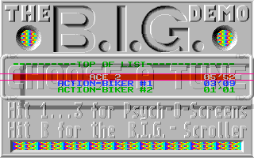
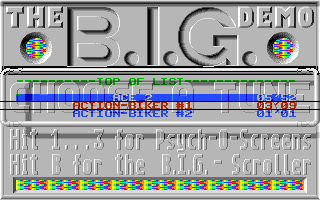
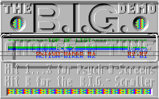
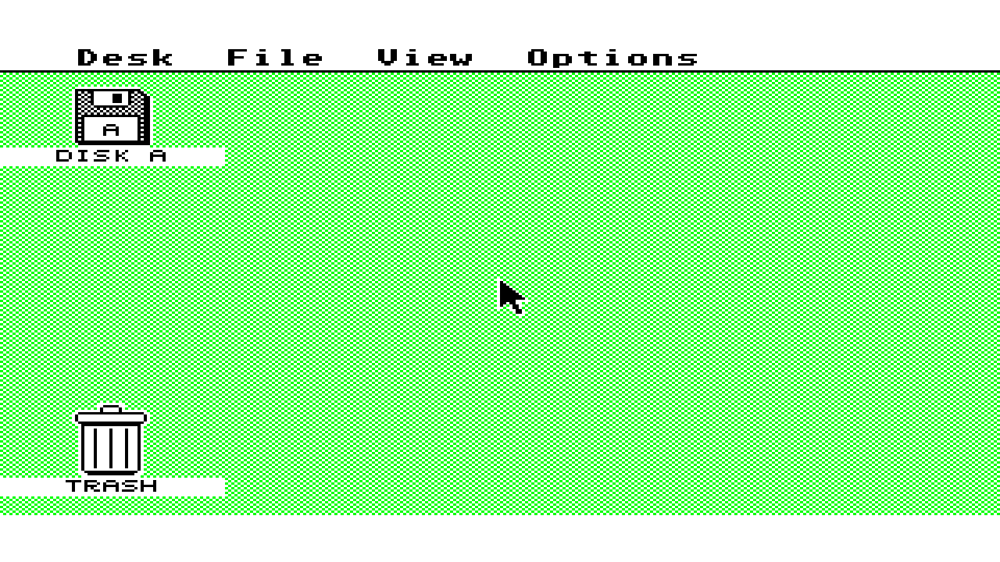

# Atari ST BIG menu flash investigation, 2026-10-09

This is host simulation evidence for [#621](https://github.com/DeanoC/fes/issues/621)
and [#634](https://github.com/DeanoC/fes/pull/634), stacked on #633 at base
`2e51b0085514cd779cf59736d664113346eebd04`. Production RTL, FPGA packages,
shared contracts and native image selection are unchanged. No kit was programmed
or claimed in this follow-up; the previously restored menu was left alone.

The normal callback-memory model reproduces rare settled-menu logo flashes.
They follow a late bottom-border sync switch and late VBL acknowledgement, with
all expected video reads completed and no capture underruns. This provides a
reproducible timing case without an FPGA route. It does not yet prove the
exclusive cause of the physical flashes or implement a production fix.

## Inputs and observations

All BIG runs use unchanged original TOS 1.00, SHA-256
`5771f9fd1391d3ae0b513ab3fd67aec30fb1843753e7e0345f92615e72c36797`,
and the original 409600-byte, 80-track, single-sided, ten-sector disk, SHA-256
`608c4beff1780552e8ae6ee5a1efff27198fb6a3ca6274597f1cb528c3970edb`.
ROM, disk, guest RAM and guest disassembly remain private. Published JSON records
source and executable digests and selected observations, without private paths.

The compared native logo crop is `(65,0,180,64)`. Its FNV-1a-64 expanded-RGB hash
is an equality diagnostic, not a cryptographic identity or compatibility oracle.
Startup frames are classified separately from settled-menu anomalies.

| Run | Exact diagnostic source | Complete window | Observation |
| --- | --- | --- | --- |
| Normal callbacks, 20 s | `c26fa9081f471fe96ad927df69c61da2bc7e66ac` | 699 captures at 6–20 s | Nine startup captures; 688/690 settled captures equal; frames 911/912 differ |
| CPU callback wait +40 clocks, 20 s | `b5e59598ef71c6dfdc022eef4005d6f0173b3408` | 500 captures at 10–20 s | 393 equal, 107 differ; timing sensitivity experiment |

Both completed runs have zero bus faults, no CPU halt and zero native capture
underruns. Normal CPU RAM callbacks take 8–14 system clocks and video callbacks
12–18. The sensitivity run changes only CPU callback waits to 48–54 clocks;
these independent callbacks do not model physical shared-memory arbitration.
Its outliers are not all asserted to share the normal run's exact mechanism.

Source-bound results: [normal](2026-10-09-atari-st-menu-flash/normal-menu-20.json)
and [extra wait](2026-10-09-atari-st-menu-flash/trace-menu-wait40.json).
The instrumented normal fixture also matched 124 status samples and sixteen
full native images from a frozen #633 baseline over the overlapping interval.
That baseline was stopped early; it is not a completed 30-second pass.

## Late border switch

In ordinary neighboring frames the PAL-to-NTSC write lands on native line 262,
before the bottom-border sample, and PAL returns early on line 263. In frame 910
the write lands at **line 263, horizontal phase 148**, after the bottom-opening
sample on line 262. PAL is restored at **frame 911, line 35, phase 28**. The
opposite sync mode therefore spans VBL and changes the next display start.
Horizontal phases are native eight-MHz ticks within a line.

VBL acknowledgements move from frame 910 line 0 to frame 911 line 50 and frame
912 line 70, then return to line 0 in frame 913. Both differing frames complete
all 16000 video reads, with the same bounded callback latency and no underruns.
The guest handler's Timer B data polling explains why missing the last display
event can hold it until the next display starts; this interpretation is supported
by the sync and interrupt traces, rather than a video-fetch failure.

## Completed shared-SDRAM reproduction

The fourteen-second run at exact diagnostic source
`ad3ad9bb9265bc760b00df7ebd9867097dd317f1` completed 731136000 system
clocks, 1039518699 independent pixel clocks, 839 HDMI frames and 698 native
captures. It uses production `st_memory.sv`, the SDRAM addon controller and the
existing digital SDRAM command/CAS/DDIO model. The original disk is preloaded
into its disjoint media buffer before reset release. This does not test physical
upload, analog SDRAM behavior or an FPGA artifact.

Of 399 complete captures at 6–14 seconds, 35 are startup captures and 362/364
settled captures match the canonical logo. Frames **685/686** differ. Both
complete 16000 video reads; their maximum CPU/video waits are 62/64 and 62/62
system clocks respectively. There are no bus faults, halt, native underruns or
indexed underruns. Whole-boot maximum CPU/video waits are 75/76 clocks.

The direct sync observation records the same late-switch mechanism as the
callback model: frame **684 line 263 phase 134** switches away from PAL; frame
**685 line 35 phase 39** restores it. VBL acknowledgement shifts to line 53 in
685 and line 65 in 686, returning to line 0 in 687. This reproduces the artifact
through actual shared-memory RTL, rather than requiring injected callback delay
or FPGA place and route. It supports investigating native CPU/peripheral timing;
it does not establish exclusive equivalence with the physical capture.

[Completed source-bound shared result](2026-10-09-atari-st-menu-flash/shared-menu-14.json).

## Reference and diskless regression

Hatari 2.5.0, binary SHA-256
`f69ad74331ec28b8121c94538231148fc150b0c7945340aa0ff1dca8c7793e0f`,
produced 1500 identical logo crops in each of wakeup states WS1 and WS3 at VBL
2000–3499. Both use ST, 512 KiB, 8 MHz 68000, CPU-exact and compatible modes,
no blitter, unchanged TOS/disk, read-only floppy, RGB low resolution, no TOS,
Timer D or fast-FDC patches, and sound disabled. The empty configuration is
overridden by these explicit command-line options. The screenshot crop
`(226,60,360,128)` covers the same logo area at doubled resolution.
[WS1 result](2026-10-09-atari-st-menu-flash/hatari-ws1.json),
[WS3 result](2026-10-09-atari-st-menu-flash/hatari-ws3.json).
This later reference window does not exclude an intentional startup-only effect.

The existing diskless EmuTOS shared-memory fixture completed eight seconds,
417792000 system clocks and 594018699 independent pixel clocks, with 479 HDMI
frames, no native or indexed underruns, no halt and four expected absent-hardware
startup faults. GEM is visible below. ROM SHA-256 is
`8fbbf8b44fc3e34281eaf8cda5265510e9af9ccda0e3e409111648060d244cfc`.
This local regression ran before the subsequent demo-only image-retention
change; it has no frozen full-source proof and is host-only evidence.
[Diskless result](2026-10-09-atari-st-menu-flash/diskless-emutos.json).

## Checks and next experiment

Four focused analysis/provenance tests cover repeated byte-lane palette writes,
cross-frame sync pairing, artifact tampering, incomplete captures and modified
compiled helper rejection. Parent consistency verifies generated consumers and
fixtures. Diagnostic drivers now participate in selected-revision source checks;
the shared fixture retains its diskless boot assertions.

`make check` passed (18 generated consumers, 34 fixture copies, zero copied
source pins), the four focused tests passed, and `git diff --check` passed.
CI at `f00e5b67444ed31a4a96663e292f37db6b24373d` passed after retrying an
unrelated Verilator internal crash in the unchanged Spectrum turbo fixture.
The Atari ST lane passed on the first attempt.

Earlier 30-second callback attempts and the 20-second shared attempt did not
finish within their wall-time budget; they are not completed passes. The latter
contains the same two rare shared-memory outliers at frames 685/686 in its
completed partial captures, but lacks a final source-bound proof. A separate
bounded capture supplies the completed shared-memory evidence below. The
earlier twelve-second shared run completed and showed only startup and canonical
logo captures; its shorter window missed the later event.

The next targeted timing experiment is MFP register access latency. FES currently
acknowledges these requests immediately through the peripheral path, while
[Hatari's pinned Timer B data read](https://github.com/hatari/hatari/blob/v2.5.0/src/mfp.c#L2468)
adds four CPU wait states. This is a concrete timing gap, not yet a demonstrated
fix for the flash. Calibrate both access completion and data sampling against
native CPU cycles, then rerun the original demo before changing production RTL.
Any resulting FPGA change requires fresh exact-artifact hardware qualification
and normal menu restoration. #621 remains open, including its wider demo/audio
acceptance; no new nextpnr defect is established by this simulation reproduction.
