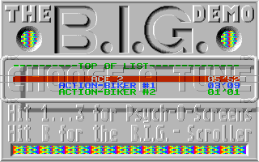

# Atari ST native raster and Timer B timing

Follow-up to [task #621](https://github.com/DeanoC/fes/issues/621) and
[PR #633](https://github.com/DeanoC/fes/pull/633), based on merged main
`0805d2b7e08f66127524353c4cbaf15d9daf180e`. Implementation source is
`e88ac743670ca05589993404e5fa235df512a431`; the
[evidence record](2026-10-09-atari-st-raster-timing/evidence.json) records
validation and its remaining work. Earlier FPGA/hardware records qualify
only their exact earlier packages.

## Timing change

Native HBL, VBL and display enable now share the CPU phase-2 enable.
Ordinary frames contain 313×512 PAL, 263×508 NTSC and 501×224 monochrome
CPU cycles. At the retained nominal 8 MHz, their rates are approximately
49.920/59.878/71.286 Hz. The MFP crystal remains independent at 2.4576 MHz.

The reduced GLUE model samples the live sync mode at the STF WS1 bottom-stop
position, cycle 502 of the last ordinary color line. Opposite sync extends
display enable through PAL line 309 or NTSC line 259; frame rollover clears
the opening. Timer B and the reduced shifter counter see the extra lines.
Both DE edges reach Timer B 24 CPU cycles after the video edge, with MFP
AER selecting start or end polarity. Pixel capture retains the video porch.
These timings follow Hatari 2.5.0's
[video timing table](https://github.com/hatari/hatari/blob/v2.5.0/src/video.c)
and [Timer B offset](https://github.com/hatari/hatari/blob/v2.5.0/src/includes/video.h).

The current output still crops to ordinary 320×200. This change does not
render the opened bottom region or implement horizontal/top border tricks,
all GLUE sampling positions, original crystal frequency, or cycle-exact
MMU/shifter arbitration. No shared ABI, socket layout, physical fence or
generated contract changes.

## Original BIG menu diagnosis

The unchanged 409,600-byte BIG disk has SHA-256
`608c4beff1780552e8ae6ee5a1efff27198fb6a3ca6274597f1cb528c3970edb`.
The independently supplied 192 KiB TOS 1.00 ROM has SHA-256
`5771f9fd1391d3ae0b513ab3fd67aec30fb1843753e7e0345f92615e72c36797`.
ROM, raw disk, raw RAM and guest disassembly remain private.

Independent Hatari with that disk/ROM reports bottom removal on consecutive
menu frames: sync switches at line 262 and returns at line 263, and raster
processing continues through line 305. Its earlier sixteen consecutive
static-logo crops are identical, recorded in the
[native palette comparison](2026-10-08-atari-st-native-palette/hatari-static-logo-comparison.json).

A coherent frame clock alone still leaves the raster handler blocked across
VBL because Timer B stops after 200 lines. Adding bottom opening restores
most VBL acknowledgements to line zero, but a longer capture catches
occasional delayed acknowledgements at line 71. The
[bottom-only trace](2026-10-09-atari-st-raster-timing/bottom-only-raster-excerpt.jsonl)
shows the sync return at cycle 502 before the missed opening. Its sixteen
logo crops contain two hashes; this candidate was not accepted as a flashing
fix. The missing 24-cycle Timer B delay advances the guest's bottom switch
relative to video. The current source corrects that delay rather than moving
the GLUE stop sample to accommodate the guest.

The corrected model's [comparison](2026-10-09-atari-st-raster-timing/menu-comparison.json)
contains one identical static-logo crop across sixteen completed native frames
after 6.5 simulated seconds. Its forty-one observed menu VBL acknowledgements
are all on line zero. The [corrected trace](2026-10-09-atari-st-raster-timing/delayed-raster-excerpt.jsonl)
can be compared with the bottom-only trace above. This establishes the bounded
model result, not physical FPGA acceptance or a synchronized whole-screen match.

The NTSC bottom extension uses the actual `VIDEO_HEIGHT_BOTTOM_60HZ=26`
definition in Hatari's header: 226 total DE lines through line 259. The timing
initializer's trailing comment says 263, which disagrees with its expression.
The current source and tests use the actual 26-line definition; the
qualifications below select that corrected commit.

## Digital checks

The focused [I/O tests](2026-10-09-atari-st-raster-timing/io-test.log) pass
6,528,377 assertions over 79,286,606 system clocks. They inspect real MFP
counts before and after both delayed DE polarities, exact ordinary frame
lengths, 200/400 events per frame, and positive/negative PAL/NTSC bottom
opening with next-frame clearing. Byte lanes, interrupt wiring, reset,
keyboard/audio and the independent timer clock also pass.

[Parent consistency](2026-10-09-atari-st-raster-timing/parent-check.log)
passes eighteen generated consumers and thirty-four fixtures. The media/memory
helpers and planner checks passed before the delay change; their relevant
source bytes are unchanged. The full [ST aggregate](2026-10-09-atari-st-raster-timing/st-aggregate.log)
also passes against the current source. The stock diskless [EmuTOS SDRAM/HDMI test](2026-10-09-atari-st-raster-timing/emutos-memory.log)
passes eight seconds with 479 complete frames, zero native/indexed underruns
and maximum CPU/video latency of 63/64 system clocks. It executes the real CPU
and chipset with physical SDRAM commands and independent 52.224/74.25 MHz
clocks; this remains a digital memory model.

The twelve-second [original BIG diagnostic](2026-10-09-atari-st-raster-timing/demo-proof.json)
selects B at eight seconds through HID/IKBD. All twenty-one captured inputs
match the committed implementation. Frozen source, executable, generated model,
microcode, ROM and disk remain unchanged throughout the run. It finishes with
598 complete native captures, zero underruns, no external bus faults and no
CPU halt. The menu has 32 RGB colors and the final B scroller has 39, including
visible rainbow bands. This diagnostic uses model RAM and a system-clock
consumer; it does not exercise the physical SDRAM arbiter or independent HDMI
clock crossing. Those paths are tested separately above.

FPGA qualification and any physical diagnostic remain pending in the evidence
record. The kit has not been changed during these builds; its normal menu
remains available.
