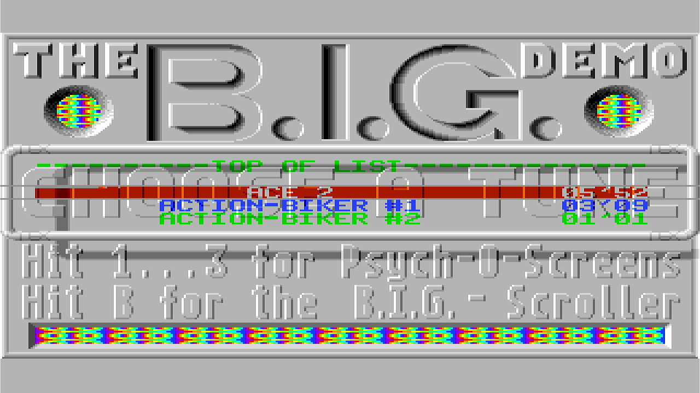
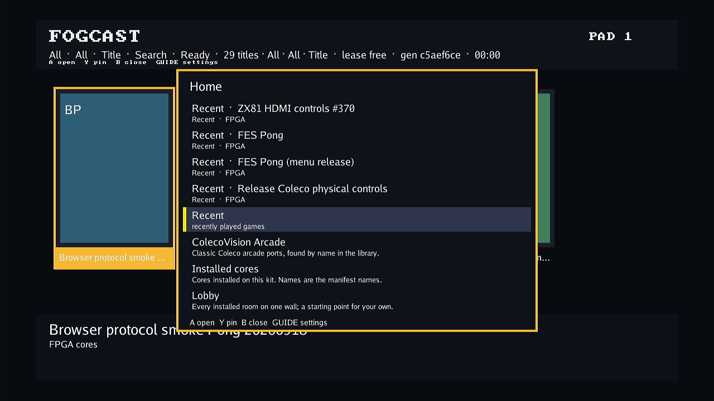

# Atari ST native raster and Timer B timing

Follow-up to [task #621](https://github.com/DeanoC/fes/issues/621) and
[PR #633](https://github.com/DeanoC/fes/pull/633), based on merged main
`0805d2b7e08f66127524353c4cbaf15d9daf180e`. The FPGA/hardware-qualified implementation source is
`cbfdfcf8334709d371540339f7b032ec593d0b8c`; the
[evidence record](2026-10-09-atari-st-raster-timing/evidence.json) records
validation and its remaining work. Earlier FPGA/hardware records qualify
only their exact earlier packages.

## Review follow-up: bottom pulse across HBL

Codex's [P2 review](https://github.com/DeanoC/fes/pull/633#discussion_r4226605030)
identified that the DE mode latch at HBL also selected the next line's length.
BIG restores sync on the following line, so its PAL pulse incorrectly shortened
that line to 508 CPU cycles, producing a 160252-cycle frame. The inverse NTSC
pulse added four cycles. The original test restored sync before HBL and missed it.

Color line length now samples sync separately at STF WS1 cycle 54
(`Line_Set_Pal` in Hatari 2.5.0 `Video_InitTimings`). DE porch sampling remains
at HBL. Regressions hold the opposite sync through HBL and restore at cycle 20
of the following line for PAL and NTSC; they check exact 160256/133604-cycle
frames, HBL counts, 247/226 Timer B events and ordinary timing after rollover.
The new regression fails against reviewed revision `9e5eaa48b1`.

This follow-up changes RTL behavior. All model captures, equivalence proofs,
FPGA timing/sealed packages and hardware captures below qualify their stated
earlier revisions; they do not qualify this follow-up. Fresh FPGA timing and
hardware validation remain pending. The follow-up uses host-only validation
and leaves the restored normal menu and kit untouched.

## Timing change

Native HBL, VBL and display enable now share the CPU phase-2 enable.
Ordinary frames contain 313×512 PAL, 263×508 NTSC and 501×224 monochrome
CPU cycles. At the retained nominal 8 MHz, their rates are approximately
49.920/59.878/71.286 Hz. The MFP crystal remains independent at 2.4576 MHz.

The reduced GLUE model samples the live sync mode at the STF WS1 bottom-stop
position, cycle 502 of the last ordinary color line. Opposite sync extends
display enable through PAL line 309 or NTSC line 259; frame rollover clears
the opening. Timer B and the reduced shifter counter see the extra lines.
Both DE edges reach Timer B 24 CPU cycles after the video edge, with MFP
AER selecting start or end polarity. Pixel capture retains the video porch.
These timings follow Hatari 2.5.0's
[video timing table](https://github.com/hatari/hatari/blob/v2.5.0/src/video.c)
and [Timer B offset](https://github.com/hatari/hatari/blob/v2.5.0/src/includes/video.h).

The current output still crops to ordinary 320×200. This change does not
render the opened bottom region or implement horizontal/top border tricks,
all GLUE sampling positions, original crystal frequency, or cycle-exact
MMU/shifter arbitration. No shared ABI, socket layout, physical fence or
generated contract changes.

## Original BIG menu diagnosis

The unchanged 409,600-byte BIG disk has SHA-256
`608c4beff1780552e8ae6ee5a1efff27198fb6a3ca6274597f1cb528c3970edb`.
The independently supplied 192 KiB TOS 1.00 ROM has SHA-256
`5771f9fd1391d3ae0b513ab3fd67aec30fb1843753e7e0345f92615e72c36797`.
ROM, raw disk, raw RAM and guest disassembly remain private.

Independent Hatari with that disk/ROM reports bottom removal on consecutive
menu frames: sync switches at line 262 and returns at line 263, and raster
processing continues through line 305. Its earlier sixteen consecutive
static-logo crops are identical, recorded in the
[native palette comparison](2026-10-08-atari-st-native-palette/hatari-static-logo-comparison.json).

A coherent frame clock alone still leaves the raster handler blocked across
VBL because Timer B stops after 200 lines. Adding bottom opening restores
most VBL acknowledgements to line zero, but a longer capture catches
occasional delayed acknowledgements at line 71. The
[bottom-only trace](2026-10-09-atari-st-raster-timing/bottom-only-raster-excerpt.jsonl)
shows the sync return at cycle 502 before the missed opening. Its sixteen
logo crops contain two hashes; this candidate was not accepted as a flashing
fix. The missing 24-cycle Timer B delay advances the guest's bottom switch
relative to video. The current source corrects that delay rather than moving
the GLUE stop sample to accommodate the guest.

The corrected model's [comparison](2026-10-09-atari-st-raster-timing/menu-comparison.json)
contains one identical static-logo crop across sixteen completed native frames
after 6.5 simulated seconds. Its forty-one observed menu VBL acknowledgements
are all on line zero. The [corrected trace](2026-10-09-atari-st-raster-timing/delayed-raster-excerpt.jsonl)
can be compared with the bottom-only trace above. This establishes the bounded
model result, not physical FPGA acceptance or a synchronized whole-screen match.

The NTSC bottom extension uses the actual `VIDEO_HEIGHT_BOTTOM_60HZ=26`
definition in Hatari's header: 226 total DE lines through line 259. The timing
initializer's trailing comment says 263, which disagrees with its expression.
The source and tests use the actual 26-line definition.

## Digital checks

The focused [I/O tests](2026-10-09-atari-st-raster-timing/io-test.log) pass
6,528,377 assertions over 79,286,606 system clocks. They inspect real MFP
counts before and after both delayed DE polarities, exact ordinary frame
lengths, 200/400 events per frame, and positive/negative PAL/NTSC bottom
opening with next-frame clearing. Byte lanes, interrupt wiring, reset,
keyboard/audio and the independent timer clock also pass.

[Parent consistency](2026-10-09-atari-st-raster-timing/parent-check.log)
passes eighteen generated consumers and thirty-four fixtures. The media/memory
helpers and planner checks passed before the delay change; their relevant
source bytes are unchanged. The full [ST aggregate](2026-10-09-atari-st-raster-timing/st-aggregate.log)
also passes against the current source. The stock diskless [EmuTOS SDRAM/HDMI test](2026-10-09-atari-st-raster-timing/emutos-memory.log)
passes eight seconds with 479 complete frames, zero native/indexed underruns
and maximum CPU/video latency of 63/64 system clocks. It executes the real CPU
and chipset with physical SDRAM commands and independent 52.224/74.25 MHz
clocks; this remains a digital memory model.

The twelve-second [original BIG diagnostic](2026-10-09-atari-st-raster-timing/demo-proof.json)
selects B at eight seconds through HID/IKBD. All twenty-one captured inputs
match `e88ac743670ca05589993404e5fa235df512a431`.
Only `st_io.sv` changes among those captured BIG inputs after that revision;
its constant-bound rewrite is formally equivalent as described below.
The separate SDRAM/HDMI EmuTOS model also uses `st_video.sv`; the renderer
rewrite is covered by its own proof below. Frozen source, executable, generated model,
microcode, ROM and disk remain unchanged throughout the run. It finishes with
598 complete native captures, zero underruns, no external bus faults and no
CPU halt. The menu has 32 RGB colors and the final B scroller has 39, including
visible rainbow bands. This diagnostic uses model RAM and a system-clock
consumer; it does not exercise the physical SDRAM arbiter or independent HDMI
clock crossing. Those paths are tested separately above.

## FPGA timing refinement

The preceding
`e88ac743` route's intermediate analogue signoff misses the system target:
46.60 MHz against 52.224 MHz. The critical path starts at `bottom_open`,
passes through the dynamic `display_top + display_height` addition and line
comparison, then reaches native RGB selection. The implementation now uses
constant endpoint comparisons for ordinary/opened PAL, NTSC and monochrome.

The [formal proof](2026-10-09-atari-st-raster-timing/qor-equivalence.json)
compares the exact previous and current `st_io` sources. Yosys proves all
768 state/output equivalence points with no unproven points for each of
`ENABLE_FLOPPY_WRITE=0` and `1`. Unchanged peripheral cells retain identical
connections; neither CPU nor renderer is rewritten. The archived
[Verilog input](2026-10-09-atari-st-raster-timing/qor-equivalence.sv) and
[scripts](2026-10-09-atari-st-raster-timing/qor-equivalence.ys) allow rerunning
that proof with the recorded Yosys binary. This proof preserves the previous
BIG/EmuTOS behavioral evidence; fresh physical qualification remains separate.

Four routes of the I/O-only refinement still fail final pixel and/or system
signoff. The pixel path includes a next-line addition followed by display
bounds and cache lookup selection. The renderer refinement replaces those
predicates and current-line RGB bounds with constant comparisons before mode
selection. The [renderer proof](2026-10-09-atari-st-raster-timing/renderer-equivalence.json)
proves all 493 physical-port and 438 cached-port state/output points, with
none unproven, between `27b85008` and `cbfdfcf83`. Pixel and lookup cycles are
unchanged, and the two proofs preserve the captured behavioral evidence.

The renderer-refined seed 4 route times out after 1,800 seconds while resolving
its final conflict; it has no final signoff result. Seed 5 passes final analogue
signoff at **74.67/52.84/193.54 MHz** against the pixel/system/audio constraints.
The [prepared receipt](2026-10-09-atari-st-raster-timing/prepared.json) binds all
selected modules to `cbfdfcf83`; archive, selection, provenance and video-index
hashes were rechecked before the kit load. Package
`63d21bcc703f00b3ebcb61de9a98869abccb091e7fe9d625060ae4dff18e280e`
and both exact-shell Direct/Scanlines parts are sealed. All 47 CI checks pass
on the subsequent evidence-only commit `c8467c818`.

## Bounded hardware diagnostic

The [hardware proof](2026-10-09-atari-st-raster-timing/hardware-proof.json)
records normal library Play on designated Kit A with unchanged TOS 1.00,
the original 409,600-byte 80×1×10 disk, and the prepared Direct part
`2a9c64d3070da8746c19681e7f6de5a9ac257cb55b5aa0e878fe912c867258c5`.
The active ROM link, shell, selected part and composition identities are checked.
Normal HID B selects the scroller; its rainbow bands remain visible. Scanlines
is sealed but is not separately launched.

Both four-second menu recordings use the same HDMI logo crop: x=260, y=60,
w=720, h=192, corresponding to native x=65, y=0, w=180, h=64. The
[comparison](2026-10-09-atari-st-raster-timing/hardware-logo-comparison.json)
uses decoded input frames with timestamp resampling disabled. Only initial
black frames are excluded; the rare new outlier is retained.

| Decoded logo evidence | Previous #630 package | Current package |
| --- | ---: | ---: |
| Nonblack input frames | 221 | 236 |
| Canonical logo frames | 111 | 235 |
| Noncanonical frames | 110 | 1 |
| Distinct crop hashes | 6 | 2 |

The canonical RGB crop hash is identical across both packages. Input frame 91
in the new recording changes grayscale bands in native rows 1, 5, 6 and 10–15.
**Menu flashing is substantially reduced, not completely eliminated.** The
[saved outlier](2026-10-09-atari-st-raster-timing/hardware-menu-outlier.png)
and [decoder](2026-10-09-atari-st-raster-timing/analyse_logo.py) keep that
observation reproducible. Earlier counts used FFmpeg's default timestamp
resampling; the revised baseline record now counts actual decoded inputs.

This uses temporary, previously qualified geometry host/runtime software:
image `0beed5b5a6ef41e2967b8d2a500ebea602d205b40562cafcd39e6f5d99448d9f`
and host source `4ab1d84b4967394d6f4edf4580e2f7dcb29cf096`. It is a bounded
exact-FPGA diagnostic, not full current appliance-image acceptance. Ten seconds
of stereo 48 kHz audio is nonzero without saturated samples; audio fidelity is
not asserted. Opened-border rendering, later sections and accurate audio remain
acceptance work on #621.

## Restoration

The original installed image
`8f148240b3d31736a09c97f3be99bde1c4bd51bd51aa23a88e9e5fa4a7f01877`
is rolled back and confirmed good. The normal populated 29-title menu is
visible with a free lease, target ready/idle, and normal host active/autostart
enabled. Owner configuration is unchanged. The stopped diagnostic container
and private credential copy are removed. As with the preceding diagnostic,
the older launcher uses a volatile remote-catalog invocation; no persistent
launcher configuration is changed.

The remaining rare palette anomaly needs memory/interrupt timing diagnosis.
The original BIG callback model normally returns CPU RAM requests after 8–14
system clocks, while the separate SDRAM/HDMI diagnostic observed up to 63.
That discrepancy is a hypothesis to test, not an established exclusive cause.

The private [wait-stress run](2026-10-09-atari-st-raster-timing/memory-wait-stress.json)
adds 40 system clocks to occasional CPU RAM requests after six seconds,
keeping display/DMA callbacks unchanged. It reuses the preserved `e88ac743`
model and records unchanged linked-object hashes; its helper changes are in
[this patch](2026-10-09-atari-st-raster-timing/memory-wait-stress.patch).
Eight seconds finish without faults, halt or capture underruns, and all
64 consecutive menu-logo crops match. This simple variable-latency model does
**not** reproduce the physical outlier. The next diagnostic must trace actual
shared-memory and interrupt/palette sequencing; no compiler defect or exclusive
memory cause is established by these recordings.
