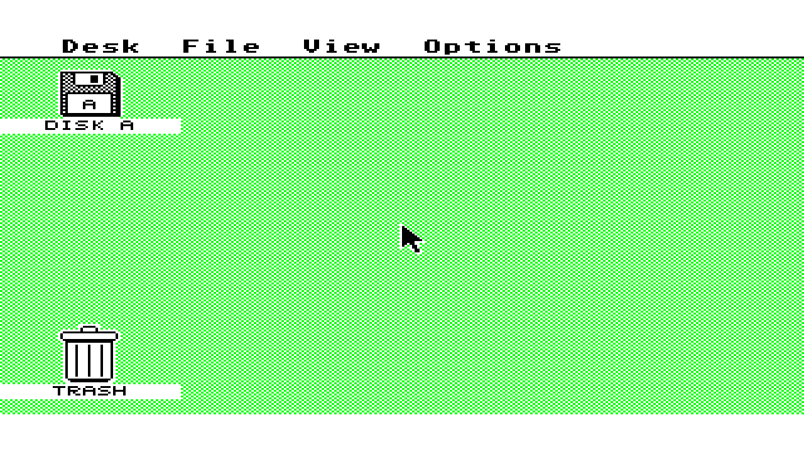

# Atari ST refresh-latency regression, 2026-10-09

Host-only evidence for [#636](https://github.com/DeanoC/fes/pull/636), a bounded
follow-up to [#621](https://github.com/DeanoC/fes/issues/621). Base
`2d576208eb20214d1ebd77c58d9cb3480cfce615`; implementation
`5a0174de05657e95a7a894cf8fd5ff291e76cd35`. This changes ST runtime refresh
recovery, not ordinary access/capture timing or arbitration. No kit was claimed,
programmed or interrupted; no new FPGA seal or hardware acceptance is claimed.

The shared addon controller retains its sixteen-count default and its existing
initialization sequence. Only `st_memory` selects four runtime counts at its
fixed 52.224 MHz. State transitions leave six chip clocks (114.9 ns) between
refresh and the next command, versus eighteen previously. The ISSI
[IS42S16320D manufacturer datasheet, Rev. B, page 19](https://media.digikey.com/pdf/Data%20Sheets/ISSI%20PDFs/IS42_45R_S_86400D_16320D_32160D.pdf)
specifies a refresh command period of 55/60/60 ns across speed grades. The
existing digital model conservatively requires five clocks; both profiles
pass that bound, including both controller chip-select refresh phases.

## Physical-command regression

`make -C sources/misteross sim-fes-atari-st-memory` builds and runs both
profiles with DQM delays of zero, one and two clocks. Each run passes 11,228
requests, including all byte masks, high rows, CPU/video/DMA/media contention,
held requests, cancellation, refresh and warm reset. The latency sweep varies
idle gaps across 4,096 alternating CPU writes/reads and checks physical data.

| Profile | Isolated CPU read | Isolated CPU write | Five-client maximum observed | Minimum refresh command gap |
| --- | --- | --- | --- | --- |
| Previous sixteen-count recovery | 13–50 clocks | 10–47 clocks | 102 clocks | 18 clocks |
| ST four-count recovery | 13–26 clocks | 10–23 clocks | 78 clocks | 6 clocks |

These are request-to-ready system clocks in the digital model, not 68000
instruction cycles or physical pad measurements. All three mask-delay fixtures
give the same ranges. Read/write minima remain unchanged. The regression
asserts those minima, refresh spacing, bounded tail latency and non-starvation.

`make -C sources/misteross sim-fes-ramtest` passes the original controller
profiles, byte-mask preflight, HPS DDR scans, holds/status and all five injected
mask faults, with and without IO output registers. Committed-source `make check`
passes 18 generated consumers, 34 fixtures and zero copied source pins.
`git diff --check` passes.

## Diskless assembled boot

`make -C sources/misteross sim-fes-atari-st-emutos-memory` passes eight
seconds with stock EmuTOS 1.4 US (SHA-256
`8fbbf8b44fc3e34281eaf8cda5265510e9af9ccda0e3e409111648060d244cfc`)
and no disk. The selected implementation, model/executable and source-scope
digests remain unchanged through the run. The test verifies physical RAM
validation and 512 KiB discovery, framebuffer base, running VBL/200 Hz timers,
concurrent CPU/video traffic and complete output frames. Final console evidence:

```text
assembled seconds=8 pc=fd3770 bus=fd3772 phystop=80000 screen=78000 memvalid=752019f3 hz200=1574 frclock=476 CPU R/W=938151/716362 video R=7648000 refreshes=1068525 faults=4 MFP/VBL=1763/476 native frames/skipped/underruns=478/0/0 indexed underruns=0
Stock EmuTOS assembled SDRAM/video boot PASS: 417792000 system clocks, 594018699 independent pixel clocks, 479 complete frames, 3 RGB colors; max CPU/video latency 39/40 clocks
```

The four bus faults are the stock firmware's existing absent-hardware probes;
the count remains four from the first checkpoint through completion. Native
and indexed video underrun counts are zero. This is a digital SDRAM/DDIO and
independent-clock video check, not electrical timing or physical kit acceptance.
The lossless capture below is bound by both image digests in the
[source-bound result](2026-10-09-atari-st-refresh-latency/result.json).
Private ROM and RAM bytes are excluded.




## Integration boundary

The parameter is internal RTL configuration. Shared ABI/schema, ROM, expansion
and video socket contracts, media admission and factory selection are unchanged.
The ordinary 13/10-clock minimum and contention remain; this does not establish
a fix for BIG menu flashes or original ST bus timing equivalence. Next measure
and reduce ordinary CPU RAM latency, then route/seal a new shell with matching
parts and repeat exact-artifact BIG and diskless acceptance, restoring the menu
after any hardware test. #621's border, later-section and audio acceptance
remains open.
