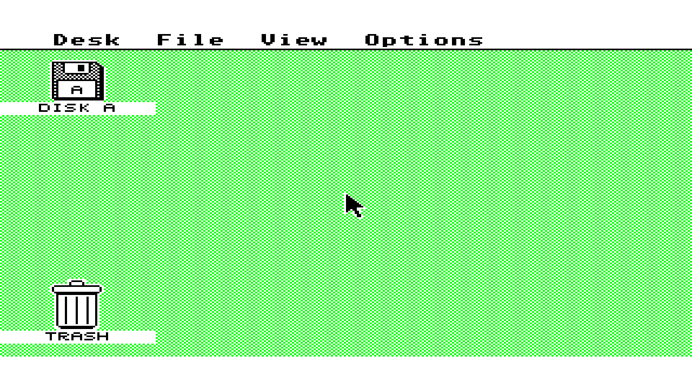
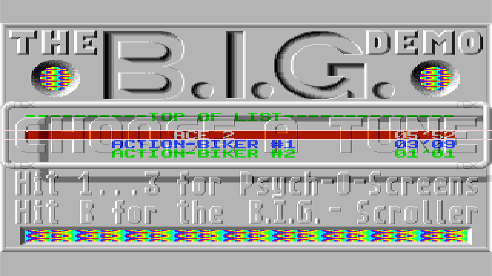

# Atari ST RAM completion regression, 2026-10-10

Evidence for [#637](https://github.com/DeanoC/fes/pull/637), a bounded follow-up
to [#621](https://github.com/DeanoC/fes/issues/621). Base
`dde3dbbd9df8625fc4c34201a7ca15533e6d3373`; implementation
`9cd33ef709733500080efccca3775bb63072b0de`.

The ST wrapper presents a valid idle grant to SDRAM on the arbitration edge.
Its controller completes at the existing read-capture or committed-write-hold
boundary, then drains the unchanged recovery states before accepting another
physical command. The CPU consumes captured data at acknowledgement and keeps
that word stable while its request remains held. Other clients retain their
registered completion boundary. The shared controller defaults to the previous
completion behavior; this is an opt-in internal RTL parameter, with no cache
or deferred write queue.

## Real 68000 timing

`make -C sources/misteross sim-fes-atari-st-ram-bus` runs original generated
firmware through the actual 68000, machine bus adapter, SDRAM wrapper and physical
command model. The firmware executes 512 unrolled byte reads followed by 512
unrolled byte writes, alternating addresses `0x600` and `0x601`. It checks both
physical byte lanes (`0x5a5a`) and a completion marker (`0xc0de`), with zero bus
faults. The fixture counts native CPU phi2 ticks between consecutive RAM bus
starts, rather than converting fabric clocks into nominal instruction cycles.

| Completion | Read histogram (cycles: count) | Write histogram (cycles: count) | Total read/write cycles over 511 intervals |
| --- | --- | --- | --- |
| Previous | 17:457, 18:54 | 18:507, 19:1, 20:3 | 8741 / 9205 |
| Early | 17:458, 18:53 | 17:453, 18:58 | 8740 / 8745 |

Writes improve mostly from 18 to 17 cycles. Reads remain mostly 17 cycles.
This does not achieve nominal 16-cycle RAM timing or establish a fix for BIG
menu flashing. The regression asserts bounded cycle totals as well as physical
data and transaction correctness. It requires no external ROM.

## Physical-command regression

`make -C sources/misteross sim-fes-atari-st-memory` passes 11,231 requests
for each of three completion/refresh profiles with each DQM delay (0/1/2).
Requests cover all byte masks, high rows, five-client contention, cancellation,
refresh, warm reset and invalid media bounds. A held CPU read stays stable
through refresh and while DMA writes and video reads a different word.

| Completion / refresh wait | Isolated CPU read | Isolated CPU write | Five-client maximum | Minimum refresh command gap |
| --- | --- | --- | --- | --- |
| Early / 4 | 10–23 clocks | 6–20 clocks | 64 clocks | 6 clocks |
| Previous / 4 | 13–24 clocks | 10–23 clocks | 79 clocks | 6 clocks |
| Previous / 16 | 13–47 clocks | 10–47 clocks | 103 clocks | 18 clocks |

These are request-to-ready system clocks at 52.224 MHz, including varied
refresh phase, not physical pad timing. All three mask-delay models give the
same ranges. The changed sweep and held-request scenario alter refresh phase,
so reference tail maxima differ slightly from the earlier #636 fixture.

`make -C sources/misteross sim-fes-ramtest` passes unchanged default and IO
output-register variants, byte-mask preflight, HPS DDR scans, hold/status and
all five injected mask faults. `make check` passes 18 generated consumers,
34 fixtures and zero copied source pins. `git diff --check` passes.

## Diskless assembled boot

`make -C sources/misteross sim-fes-atari-st-emutos-memory` passes eight
seconds with stock EmuTOS 1.4 US, SHA-256
`8fbbf8b44fc3e34281eaf8cda5265510e9af9ccda0e3e409111648060d244cfc`,
and no disk. Tracked source bytes match the implementation commit; selected
source, model and executable digests remain unchanged through completion.

```text
assembled seconds=8 pc=fd3700 bus=fd3700 phystop=80000 screen=78000 memvalid=752019f3 hz200=1574 frclock=476 CPU R/W=953707/727343 video R=7648000 refreshes=1068525 faults=4 MFP/VBL=1763/476 native frames/skipped/underruns=478/0/0 indexed underruns=0
Stock EmuTOS assembled SDRAM/video boot PASS: 417792000 system clocks, 594018699 independent pixel clocks, 479 complete frames, 3 RGB colors; max CPU/video latency 32/34 clocks
```

The four faults are stock absent-hardware startup probes; the count stays four
throughout. Native and indexed video underruns are zero. The fixture verifies
512 KiB RAM, framebuffer, VBL/200 Hz timers and concurrent CPU/video traffic.
This is a digital SDRAM/DDIO and independent-clock video check, separate from
pad timing and physical kit acceptance.




## Fresh FPGA and hardware classification

The fresh shell is sealed from implementation `9cd33ef7`, package
`0eb091445d299d7a1875ae3b47186f18214638cb09caf44671261afc5f35e72f`.
The first four placement attempts miss at least one constraint; seed 3 passes
all constraints without changing the source. Failed reports are retained as
unsealed diagnostics. The worst system paths in the failed attempts traverse
inherited native-video display-edge/cache/bit/palette selection; no compiler
defect is established.

| Clock | Required MHz | Achieved MHz |
| --- | --- | --- |
| Pixel | 74.250 | 76.092 |
| System | 52.225 | 53.422 |
| Audio | 12.288 | 142.248 |

The current locked toolchain uses nextpnr `3d4a5b352b4edb478b744b82cc61333353751a80`,
Mistral `7ed06e21c18b047ec5c6d6a7e85e5ea2c8827039`, and Yosys
`886afa63953e97407153e9f4aae25fcedb639696`. Electrical, resource,
ROM-map and frozen socket checks pass. Direct and Scanlines video parts are
built and validated for this exact shell, including CRAM containment. Their
part IDs and archive/report digests are included in the source-bound result.

The exact package and Direct part were exercised on designated Kit A through
the normal library Play path, with the existing renewable kit lease. A previously
qualified temporary geometry diagnostic image was used; this is bounded FPGA
hardware evidence, not acceptance of a new appliance image.

Original TOS 1.00 plus the original BIG disk reached the menu (20-second lossless
capture), and pressing B reached the scroller (four-second capture). Rainbow
palette bands are visible in the scroller. A separate firmware-only library entry
with stock EmuTOS reached GEM without any disk. Both launches verified the exact
package, ROM and composed Direct-part payload identities.




These captures establish scene reachability and visible rainbow output; they do
not establish that flashing artifacts, borders, all demo sections or audio are
correct. Scanlines was built and validated but not separately exercised here.

Cleanup restored the exact original installed image, verified the populated
normal menu visually, and confirmed the target idle with a free lease. The
normal host is active, autostart remains enabled, and the owner's configuration
is unchanged. Private firmware/disk bytes, host configuration, raw session
receipts and lossless video recordings remain outside the repository.

## Integration boundary

Shared ABI/schema, ROM, expansion and pluggable video contracts, media admission
and factory selection are unchanged. Source/model/executable and result digests
are in the [source-bound result](2026-10-10-atari-st-ram-latency/result.json).
Private ROM, disk and guest RAM bytes are excluded.

Ordinary read latency, BIG flashing, borders, later demo sections and audio
accuracy remain open under #621. Hardware evidence is bounded to the exact
artifacts and scenes recorded here and does not qualify a new appliance image.
